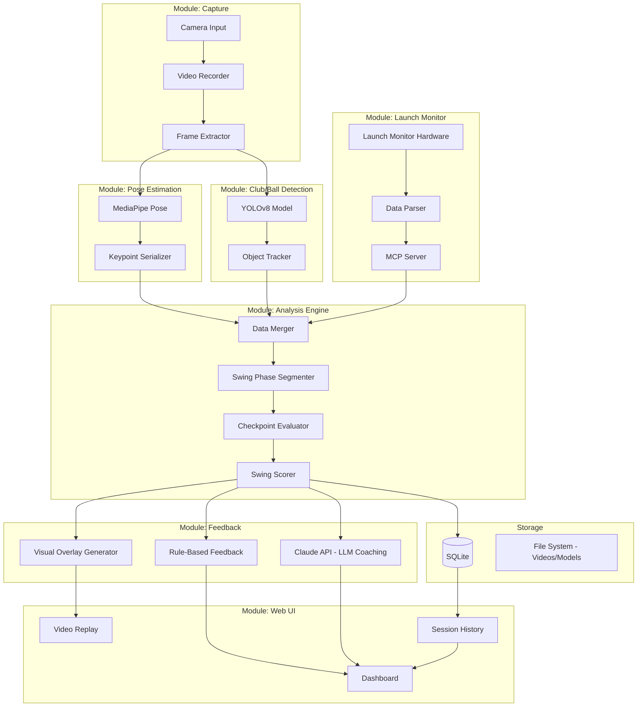
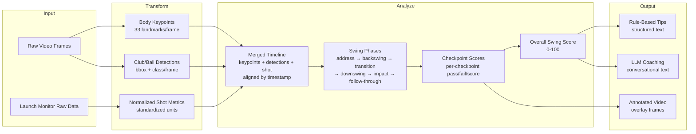
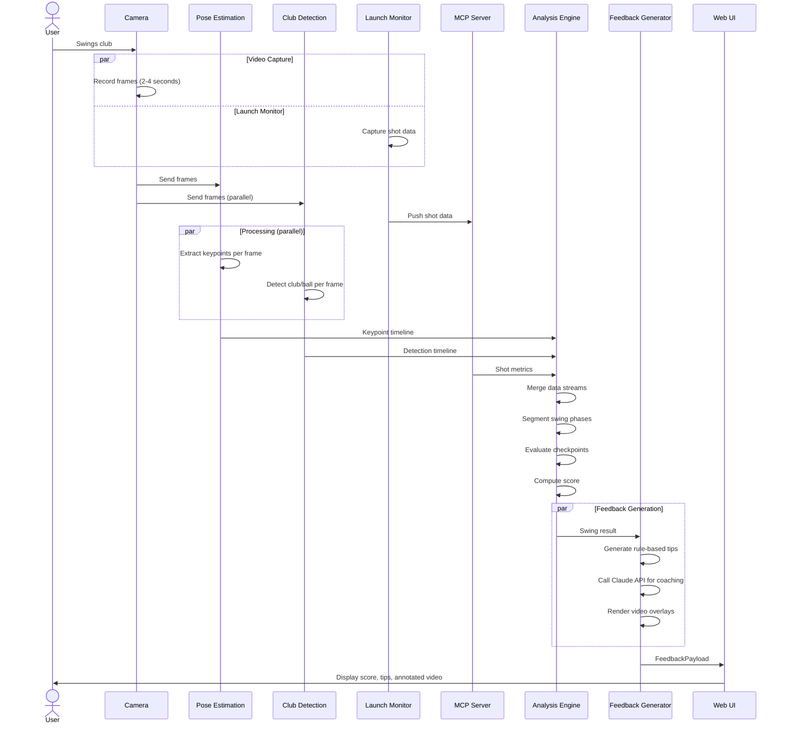
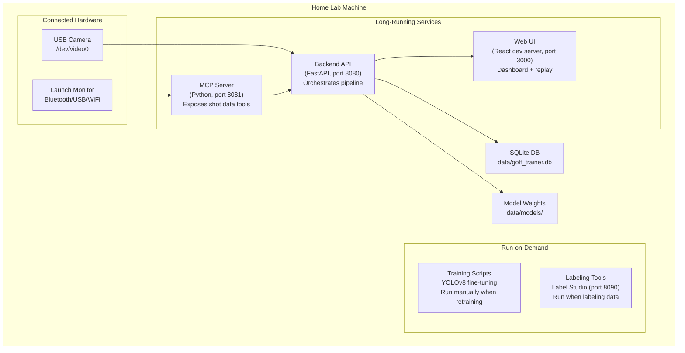

# Architecture Document: AI Golf Swing Trainer

## Last Updated: 2026-06-20

> ⚠️ **The diagrams below describe the PROPOSED / target design — not yet built.** As of
> 2026-06-20 only the scaffolding + `contracts/` seam + `MockShotDataSource` exist. For the
> current proposed runtime flow, decoupling seam, and build order (incorporating ADR-007 and
> ADR-008), see [FLOW.md](FLOW.md). Update both as milestones land.

---

## 1. Component Diagram

Shows the major modules, what each owns, and the interfaces between them.



### Interface Contracts (key data shapes)

| Interface | From → To | Data Shape |
|-----------|-----------|------------|
| Keypoints | Pose → Analysis | `List[FrameKeypoints]` — 33 landmarks per frame with x, y, z, visibility |
| Detections | Detection → Analysis | `List[FrameDetections]` — bounding boxes + class (club_head, ball) per frame |
| Shot Data | MCP → Analysis | `ShotData` — club_speed, ball_speed, launch_angle, spin_rate, club_face_angle, club_path, smash_factor |
| Swing Result | Analysis → Feedback | `SwingResult` — phase_timestamps, checkpoint_scores, overall_score, merged keypoint+detection+shot data |
| Feedback | Feedback → UI | `FeedbackPayload` — score, list of tips (text), overlay frames, LLM coaching response |

---

## 2. Data Flow Diagram

Traces how data transforms from raw input to user-facing output.



### Storage Points

| What Gets Stored | Where | Why |
|-----------------|-------|-----|
| Raw video files | `data/raw/sessions/{session_id}/` | Replay, reprocessing |
| Keypoint data | SQLite `keypoints` table | Avoid recomputing pose |
| Shot data | SQLite `shots` table | History, trends |
| Swing results | SQLite `swing_results` table | Progress tracking |
| Trained models | `data/models/` | Versioned model weights |

---

## 3. Sequence Diagram

Shows the order of operations for a single swing event.



### Timing Expectations

| Step | Expected Duration |
|------|------------------|
| Video capture | 2-4 seconds (swing duration) |
| Pose estimation | 1-3 seconds (depends on frame count + GPU) |
| Club detection | 1-2 seconds |
| Analysis | <0.5 seconds |
| Rule-based feedback | <0.1 seconds |
| LLM coaching call | 2-5 seconds |
| **Total latency** | **~5-15 seconds from swing to feedback** |

---

## 4. Deployment / Physical View

What runs where and how to start it.



### Startup Sequence

```bash
# 1. Start MCP server (launch monitor data)
cd src/mcp_server && python server.py

# 2. Start backend API (orchestrates everything)
cd src/ && uvicorn api:app --port 8080

# 3. Start web UI
cd src/ui && npm start

# 4. (Optional) Start Label Studio for data labeling
label-studio start --port 8090
```
