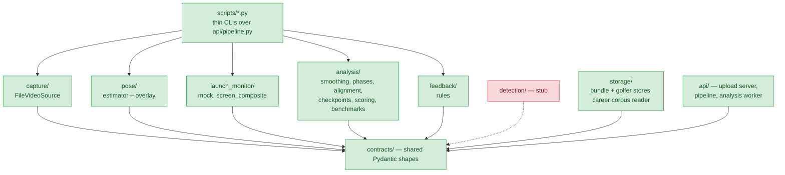
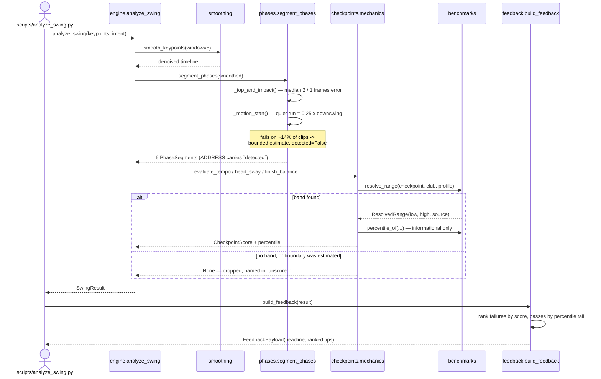

# Architecture — the system AS BUILT

> **Tier: AS-BUILT.** This document describes what actually exists and runs, reviewed
> **2026-08-11**. Everything here has been executed. For the *target* design — the full
> component/deployment picture, the build order, and the parts not yet written — see
> [FLOW.md](FLOW.md).
>
> Keeping the two apart is deliberate: this file changes every working session, FLOW.md
> changes every few months. A previous single-file version drifted five months out of date
> because a status banner and a diagram disagreed about which one they described.

---

## 1. What runs today

Two independent pipelines. Neither is joined to the other yet — that join is M7 Phase 4.


```mermaid
flowchart LR
    MOV["swing .mov<br/>data/raw"] --> RP["scripts/run_pose.py<br/>MediaPipe lite, Tasks API"]
    RP --> KP[("keypoints.json<br/>data/processed")]
    RP --> SKEL["skeleton overlay .mp4"]

    KP --> AS["scripts/analyze_swing.py"]
    AS --> SM["smoothing<br/>visibility-weighted moving avg"]
    SM --> PH["phases<br/>address / top / impact"]
    PH --> CK["5 checkpoints<br/>tempo, head_sway, finish_balance<br/>hip_sway, hip_shift_at_top"]
    CK --> BR[("ranges.json<br/>golfdb_v1.json")]
    CK --> SC["scoring<br/>FundamentalsPolicy"]
    SC --> TIP["ranked tips + headline<br/>+ tour percentiles"]
    AS -.->|"--overlay"| OV["annotated .mp4<br/>ADDRESS/TOP/IMPACT + score HUD"]

    IMG["HD Golf SHOT DATA<br/>screen photo"] --> IS["screen/importer.py<br/>rectify, OCR, parse, validate"]
    IS --> SD[("parsed shot store<br/>data/processed/shots")]
    SD --> SRC["lookup by image sha256<br/>no extras needed"]

    BUN["swing bundle<br/>2 clips + shot photo"] --> AB["scripts/analyze_bundle.py"]
    AB --> SEL["select_swing<br/>which descent is the swing"]
    SEL --> ASB["analyze_swing_bundle<br/>face-on scored, DTL anchors only"]
    SRC --> ASB
    ASB --> AS
    ASB --> ALN["align_swings + pair_frames"]
    ALN --> SBS["aligned.mp4<br/>banners land together"]
    ASB --> JSON["analysis.json<br/>SwingBundleResult"]
    TIP --> JSON

    classDef built fill:#d4edda,stroke:#28a745,color:#155724;
    classDef gap fill:#fff3cd,stroke:#ffc107,color:#856404;
    class RP,AS,SM,PH,CK,SC,TIP,IS,SRC,SD,BUN,AB,SEL,ASB,ALN,SBS,JSON built;
    class OV gap;
```

**Reading it:** both pipelines are complete and, since M7 Phase 4, joined. `analyze_bundle.py`
is the entry point that runs the lot offline — pose per view, OCR (only if the photo isn't
already in the store), scoring, ranked tips, alignment — and writes `analysis.json` plus
`aligned.mp4` beside the clips. `SwingResult.shot` is populated at last.

**Analysis now auto-triggers** (M7 Phase 5): when an upload completes a swing's third role, an
in-process worker runs that same pipeline off the event loop and the results page has something
to render. A partial bundle waits for an explicit "Analyze anyway" rather than a timeout.

One deliberate boundary remains: the shot is **attached and displayed, never scored** — outcome
checkpoints need per-club benchmark bands `ranges.json` does not have (ADR-009). `detection/`
(YOLOv8) and SQLite are not in the running path at all.

### The commands, precisely

```bash
# Pose (needs the `vision` extra)
python scripts/run_pose.py <video-file>

# Analysis (base install; --overlay needs `vision`)
python scripts/analyze_swing.py <keypoints.json> [--overlay <video>]

# Shot ingestion (needs the `ocr` extra)
python scripts/import_shot_screens.py [paths...] [--session ID] [--device PROFILE]
                                      [--out DIR] [--min-confidence F] [--force] [--dry-run]

# Two-view alignment (base install; `vision` only to render)
python scripts/align_swings.py <a.keypoints.json> <b.keypoints.json> [--video-a F] [--video-b F]
                               [--out MP4] [--list-swings] [--auto-window] [--window-a A:B]

# The whole use case, offline (`vision`; `ocr` only for a photo not already in the shot store)
python scripts/analyze_bundle.py <SESSION/SWING | swing-dir> [--list-swings] [--no-auto-window]
                                 [--window-face-on A:B] [--window-dtl A:B] [--no-video]
                                 [--force-pose] [--force-ocr] [--skip-ocr] [--club C] [--tau L:H]
#   exit 0 clean · 1 result produced but something is flagged · 2 no result

# Career mode: who has hit what, across every session (base install)
python scripts/backfill_golfer.py --name NAME [--handedness right|left] [--session ID] [--dry-run]
python scripts/career_corpus.py [--name NAME | --player-id ID] [--verbose]
#   the honest n: distinct swings after deduping re-uploads, and the sample size per metric
python scripts/career_baseline.py [--name NAME | --player-id ID] [--verbose]
#   what that n buys: per-metric center / spread / trend, each withheld below its own floor
python scripts/career_dispersion.py [--name NAME | --player-id ID] [--verbose]
#   what the numbers are evidence for: a repeatable miss (look before the swing) against a
#   scattered one (look at timing). Both findings withheld until the baseline's floors clear

# Bring stored analyses up to the current engine (`vision` only with --video)
python scripts/reanalyze.py [SESSION/SWING ...] [--all] [--player ID] [--dry-run] [--video]
                            [--coaching] [--verbose]
#   default targets: never analyzed, inputs re-uploaded since, or analysis_version < current
#   pose and shots are cached, so an unchanged bundle re-runs in seconds
```

One long-running service: the FastAPI upload server (`scripts/run_server.py`, M7 Phase 5),
which also carries the background analysis worker and serves the upload and results pages. The
MCP server (M3, `scripts/run_mcp_server.py`) is not a service in the same sense — it speaks
stdio, so the MCP client launches it per connection and there is no port to bind. No React UI
(M5); the two static pages under `api/static/` are what stands in for it.

Offline reference-data tooling (`scripts/golfdb/`, the `research` extra) is a separate
concern from the runtime: `fetch` → `ingest_labels` → `extract_pose` → `derive_pose_metrics`
→ `derive_reference`, plus the `bakeoff` / `tune_*` / `spot_check` harnesses. It produces the
committed benchmark aggregates and never runs in production. See [data/README.md](../data/README.md).

---

## 2. Module dependency — the seam, as built

The rule that keeps modules independent: **everything depends on `contracts/`, and modules
never import each other** (ADR-008).


```mermaid
flowchart TD
    C["contracts/ — shared Pydantic shapes"]

    CAP["capture/<br/>FileVideoSource"] --> C
    POSE["pose/<br/>estimator + overlay"] --> C
    LMM["launch_monitor/<br/>mock, screen, composite"] --> C
    ANA["analysis/<br/>smoothing, phases, alignment,<br/>checkpoints, scoring, benchmarks"] --> C
    FB["feedback/<br/>rules"] --> C
    DET["detection/ — stub"] -.-> C
    STO["storage/<br/>bundle + golfer stores,<br/>career corpus reader"] --> C
    API["api/ — upload server,<br/>pipeline, analysis worker"] --> C

    CLI["scripts/*.py<br/>thin CLIs over api/pipeline.py"] --> CAP
    CLI --> POSE
    CLI --> ANA
    CLI --> FB
    CLI --> LMM

    classDef built fill:#d4edda,stroke:#28a745,color:#155724;
    classDef stub fill:#f8d7da,stroke:#dc3545,color:#721c24;
    class C,CAP,POSE,LMM,ANA,FB,CLI,STO,API built;
    class DET stub;
```

`storage/` and `api/` were stubs when this diagram was first drawn and are not any more —
M7 Phases 3 and 5 built the bundle store, the upload server and the background worker. `detection/`
is the last real stub, gated on M1.5.

**One edge here breaks the rule, knowingly:** `storage/corpus.py` imports `api.state` for
`load_analysis` / `load_state`, the tolerant readers for the two artifacts an analysis run leaves
behind. `mcp/query.py` does the same. The alternative was a second copy of a tolerant reader, and a
second copy is one that drifts; the clean fix is moving those two functions down into
`storage/analysis_io.py`.

**The load-bearing consequence:** because consumers depend on the contract rather than the
producer, the entire analysis core installs and tests with **no ML dependencies at all**. It
is pure-Python/stdlib by rule (ADR-008), which is why the test suite runs on
`pip install -e '.[dev]'`. It is also what let a shot source nobody planned for — OCR of a
simulator screen (ADR-014) — arrive as one new adapter rather than a rewrite.

`api/` is now the orchestrator it was always meant to be: the bundle pipeline lives in
`api/pipeline.py`, and `scripts/analyze_bundle.py` is a presentation layer over it (M7 Phase 5).
The worker and the CLI therefore run the *same* code, so a phone's results page and a terminal
cannot disagree. `pipeline.py` imports no web framework, which is what lets the CLI keep working
on a `vision`-only install — pinned by `tests/api/test_pipeline_imports.py`.

### Interface contracts (key data shapes)

| Interface | From → To | Data Shape | Built? |
|-----------|-----------|------------|--------|
| Keypoints | Pose → Analysis | `List[FrameKeypoints]` — 33 landmarks per frame with x, y, z, visibility | ✅ |
| Detections | Detection → Analysis | `List[FrameDetections]` — bounding boxes + class (club_head, ball) per frame | contract only |
| Shot Data | Launch monitor → Analysis | `ShotData` — club_speed, ball_speed, launch_angle, spin_rate, club_face_angle, club_path, smash_factor, distances, plus `provenance` (confidence + audit trail) for sources that *infer* metrics rather than receive them (ADR-014) | ✅ produced, not consumed |
| Swing Result | Analysis → Feedback | `SwingResult` — phases, checkpoint scores with tour percentiles, mechanics/outcome/overall scores, `unscored` names, judged `intent` | ✅ (`outcome_score` always `None`) |
| Feedback | Feedback → UI | `FeedbackPayload` — overall score, ranked tips with severity, headline | ✅ produced and rendered by `api/static/results.html` |
| Reference | Benchmarks → Analysis | `ranges.json` bands + `golfdb_v1.json` distributions, both with provenance | ✅ |
| Career corpus | Storage → Analysis | `CareerCorpus` — one golfer's distinct swings with their `Measurement`s, the honest per-metric `n`, and every excluded swing with its reason | ✅ produced, not yet consumed (career mode step 4) |

---

## 3. Analysis internals — one `analyze_swing` call

The part with the most engineering in it. Pure functions on contracts, no I/O.


```mermaid
sequenceDiagram
    actor Caller as scripts/analyze_swing.py
    participant Eng as engine.analyze_swing
    participant Sm as smoothing
    participant Ph as phases.segment_phases
    participant Chk as checkpoints.mechanics
    participant Bench as benchmarks
    participant FB as feedback.build_feedback

    Caller->>Eng: analyze_swing(keypoints, intent)
    Eng->>Sm: smooth_keypoints(window=5)
    Sm-->>Eng: denoised timeline
    Eng->>Ph: segment_phases(smoothed)
    Ph->>Ph: _top_and_impact() — median 2 / 1 frames error
    Ph->>Ph: _motion_start() — quiet run = 0.25 x downswing
    Note over Ph: fails on ~14% of clips -><br/>bounded estimate, detected=False
    Ph-->>Eng: 6 PhaseSegments (ADDRESS carries `detected`)

    Eng->>Chk: evaluate_tempo / head_sway / finish_balance
    Chk->>Bench: resolve_range(checkpoint, club, profile)
    alt band found
        Bench-->>Chk: ResolvedRange(low, high, source)
        Chk->>Bench: percentile_of(...) — informational only
        Chk-->>Eng: CheckpointScore + percentile
    else no band, or boundary was estimated
        Chk-->>Eng: None — dropped, named in `unscored`
    end
    Eng-->>Caller: SwingResult
    Caller->>FB: build_feedback(result)
    FB->>FB: rank failures by score, passes by percentile tail
    FB-->>Caller: FeedbackPayload(headline, ranked tips)
```

**Two rules worth knowing before changing anything here:**

1. **A missing benchmark yields no score, never a wrong one** (ADR-010 §2). Checkpoints drop
   out and are named in `SwingResult.unscored`; `overall_score` is a mean over survivors and
   is deliberately *not* penalised.
2. **Percentiles never touch the scoring path** (ADR-010 addendum, 2026-08-04). They are
   informational, drawn from the same stratum the band was cut from. A test blinds the
   evaluators to the distributions and asserts `score`/`passed` do not move.

### What is measured, and what the numbers mean

Five checkpoints, all from a single face-on camera, all with bands derived from GolfDB tour
swings rather than eyeballed. Current values live in
`src/golf_coach/analysis/benchmarks/ranges.json` — **read them there, not from a doc**, since
they have been re-derived three times and each `source` string carries full provenance.

| Checkpoint | What it measures | Band | Band source |
|---|---|---|---|
| `tempo` | backswing : downswing duration ratio | two-sided | p10–p90 of 1,399 tour swings, 246 golfers |
| `head_sway` | lateral head travel to impact, shoulder-width normalized | one-sided | p90 of 458 face-on tour swings, 122 golfers |
| `finish_balance` | post-impact settle, shoulder-width normalized | one-sided | p90 of 458 face-on tour swings, 122 golfers |
| `hip_sway` | lateral hip travel to impact, shoulder-width normalized | **two-sided** | p10–p90 of 458 face-on tour swings, 122 golfers |
| `hip_shift_at_top` | lateral hip travel to the top, shoulder-width normalized | one-sided | p90 of 458 face-on tour swings, 122 golfers |

**Two of the five are two-sided, and that is a measured choice rather than a default.** `hip_sway`
is not "less is better": the tour p10 is 0.14, so 90% of tour swings move the hips *further* than
that, and too little lateral movement fails just as too much does. `hip_shift_at_top` is one-sided
for a different reason again — not because less is better, but because its p10 (0.015) sits below
the pipeline's own measurement error (0.053), so a lower edge would split golfers this instrument
cannot tell apart. The rule is in the ADR-010 addendum of 2026-08-12: assert a band edge only where
it clears the instrument. Consumers must read `one_sided` before calling a low number good.

Phase-instant accuracy against 461 hand-annotated clips: **top 2 frames, impact 1 frame,
address 7 frames** (median). Address is the known weak instant — see
[M4_ADDRESS_DETECTION.md](M4_ADDRESS_DETECTION.md).

Deferred by physics, not by schedule: spine tilt and forward bend foreshorten to ≈0 face-on;
hip rotation, X-factor and kinematic sequence need 3D; swing plane and club path need
detection (M2); face angle and ball flight need the launch monitor. See ADR-011 and
[FLOW.md](FLOW.md).

---

## 4. Storage — what is actually persisted

**No database exists.** `storage/` is flat files and nothing else; `data/golf_trainer.db` is
gitignored and never created. Everything persists as files:

| What | Where | Status |
|---|---|---|
| Raw video | `data/raw/` | ✅ manual drop |
| Keypoints | `data/processed/<clip>.keypoints.json` | ✅ written by `run_pose.py` |
| ↳ *its format* | `{"clip": {fps, width, height, frame_count, source_sha256}, "frames": [...]}` | ✅ read/written via `storage/keypoints_io.py`, which also accepts the bare-array shape everything written before M7 Phase 1 uses |
| Overlays | `data/processed/<clip>.overlay.mp4`, `.analysis.mp4` | ✅ |
| Parsed shots | `data/processed/shots/` (content-addressed) | ✅ written by `import_shot_screens.py` and by `analyze_bundle.py` |
| Swing bundles | `data/processed/sessions/<session>/<swing>/` + `manifest.json` | ✅ written by the upload route (M7 Phase 3/5) |
| ↳ *who swung it* | `player_id` on `SwingManifest`, stamped **write-once** from the session cursor | ✅ career mode step 1 — never sent by the uploading phone, because two phones would have to type matching names |
| ↳ *analysis artifacts* | `analysis.json`, `aligned.mp4`, `<role>.keypoints.json` in the same directory | ✅ written by `api/pipeline.py`, from the worker or the CLI; `analysis.json` is a `SwingBundleResult` with the heavy streams excluded (the keypoints sit beside it) |
| ↳ *analysis state* | `analysis.state.json` in the same directory | ✅ `AnalysisState` — queued/running/done/failed, the role→sha256 map the result was computed from (so a re-upload invalidates it), and a denormalised score/headline so the 5 s status poll never parses `analysis.json`. The terminal status is written by `pipeline.record_state` as part of writing `analysis.json`, because a denormalised copy must be written by whatever writes the original; the worker owns only `queued`/`running`/crash |
| ↳ *golfer cursor* | `session.json` in the **session** directory | ✅ `storage/session_meta.py` — who the *next* swing belongs to; the record of who actually swung lives on each manifest, so a buddy taking a few swings mid-session rewrites nobody's history |
| Golfer registry | `data/processed/golfers/<player_id>.golfer.json` | ✅ `storage/golfer_store.py` — one file per golfer, name + handedness. Beside `sessions/`, not inside: a golfer outlives any one session, and that outliving is the point |
| Reference corpus | `data/reference/golfdb/` | ✅ gitignored for licensing (ADR-012) |
| Benchmark aggregates | `src/golf_coach/analysis/benchmarks/*.json` | ✅ committed |
| Swing results, sessions, trends | SQLite `swings` / `shots` tables | ❌ never built — M7 Phase 3 shipped **trimmed**, as flat files, and nothing has needed a database since |

The `swings.jsonl` Tier-2 shape in the reference pipeline was deliberately built as the shape
the future SQLite `swings` table will take, so that migration is a load rather than a design.

**Swing identity is assigned server-side** by `storage/bundle_store.py` (M7 Phase 3): each upload
declares only its *role*, and the store slots it into the newest swing in the session lacking that
role. Two people holding two phones cannot be trusted to type matching swing numbers. Content
addressing makes a retried or double-tapped upload a no-op rather than a phantom swing.
`scripts/analyze_swing.py`'s filename-stem identity survives only on the standalone single-clip
path, which no longer feeds anything that stores a result.

### One golfer across sessions — the career corpus

`storage/corpus.py` is a **derived** view, persisted nowhere: `read_corpus(sessions_dir,
player_id)` re-reads the manifests and `analysis.json` files on every call. Cheap at this scale,
and it means the corpus can never disagree with the files it describes.

Its job is the honest `n`. Four swing directories currently hold **two** swings — the same three
files were re-uploaded three times while the upload path was being tested — so swings are deduped
on the face-on clip's sha256 and launch-monitor metrics on the shot photo's, giving a per-metric
sample count rather than a directory count. Both hashes are already on the manifest, so nothing is
re-read to compute them. Counting directories instead would repeat one swing's numbers three times,
which drives the variance toward zero — and per-golfer *variance* is the entire reason career mode
exists (a tight spread points at a static cause, a wide one at timing).

Every swing that contributes no sample is named with a reason (`ExclusionReason`: unattributed,
no face-on clip, duplicate, not analyzed, stale, outdated). Read it with `python
scripts/career_corpus.py`.

Three pure consumers sit on top of it, all in `analysis/` and none doing any I/O.
`analysis/baseline.py` turns the corpus into a `PersonalBaseline`: per-metric center, spread and
trend, each **withheld below its own floor** — and withheld means the field is `None`, not
populated-beside-a-flag, so there is no number a forgetful consumer can render.
`analysis/dispersion.py` reads that guarded shape and answers what the numbers are *evidence for*:
a **bias** (the center is further from the target than measurement error explains) and a
**scatter** (the spread is larger than it explains), which together separate a cause that is fixed
before the swing from one that happens during it. `analysis/comparison.py` answers the third
question — where that center sits in the tour population — read off the mean's 95% CI rather than
the mean, so a center near an edge reports `straddles` instead of a placement that flips on the
next swing. All three consume the guarded baseline rather than the raw values, precisely so that a
sealed statistic is absent from their input instead of merely unused, and they share one guard
(`analysis.baseline.refuse`) rather than copies of the same floors.

**Only `comparison.py` imports `benchmarks`, and that is the whole reason it is a separate module.**
Comparing a golfer to the tour population is real and is what step 6 built, but keeping it out of
`baseline.py` and `dispersion.py` is what stops a personal statistic quietly becoming a change to
how a swing is scored (ADR-010 §2). The boundary moved out by one layer rather than dissolving, and
a test parses those two files' source to keep it there — a runtime `sys.modules` check cannot see
the property, because `analysis/__init__.py` imports `engine`, which reads the bands.

Three of the eight metrics are refused the tour join outright, for two different reasons. The two
launch-monitor metrics have no population at all: every distribution here comes from GolfDB, which
is pose estimated from broadcast video and holds no ball flight. `head_hip_offset_impact_norm` is
the interesting one — it *has* a stored distribution and may not be placed in it, because its sign
is camera-relative and that population mixes both handednesses. A personal corpus is single-handed
by construction, which is why the one metric a personal baseline can interpret is the one metric
the tour band cannot. The spread is never compared to the tour spread either: `Distribution.sd` is
between-player variation and a personal `sd` is within-player repeatability, so the comparison
would flatter every golfer alive.

**Career mode has three surfaces and one route under two of them.** `mcp/career.py` flattens all of
it for `get_golfer_profile` / `get_shot_trends` / `compare_sessions`, because a model reads a flat
payload better. `GET /api/golfers/{id}/career` serves the contracts unflattened, and both the career
page (`static/career.html`) and the swing page's "Against your own history" block read that one
route — so the number rendered in one place cannot disagree with the number rendered in the other.
`storage.corpus.narrow_to` is what makes a window or a two-session comparison honest: it recomputes
`metric_counts` alongside the filtered swings, so the printed `n` always describes the values under
it, and the per-session mean then faces the same CENTER floor the pooled mean faces.

**`stale` and `outdated` are two different axes and both are load-bearing.** `stale` means the
*bytes* moved — a clip was re-uploaded, so `AnalysisState.matches` fails. `outdated` means the
*code* moved: `SwingBundleResult.analysis_version` is below `contracts.swing.ANALYSIS_VERSION`, so
the numbers were produced by an engine that has since changed what they mean. Nothing could see
the second axis before the stamp existed, because a re-analysis does not change the inputs — and
mixing two engine generations in a per-golfer spread manufactures variance out of a code change,
which is the duplicate-counting error in reverse. `scripts/reanalyze.py` repairs both.

The version field defaults to **0**, not to the current version, which is the whole reason it
works on artifacts written before it existed: a default of "current" would make every legacy file
claim to be up to date, and that wrong answer is indistinguishable from a right one.

---

## 5. Verification posture — how this project knows it works

Worth stating explicitly, because it is unusual and it is the main reason the pose-only work
is trustworthy without hardware.

- **Base-install test suite** — 426 passed as of 2026-08-11 (OCR integration tests run here
  because `paddleocr` is installed in this venv; they skip on a base install). Check `WORKLOG.md`
  for the current count rather than trusting this line.
- **Ground truth from a public corpus** — phase instants and benchmark bands are validated
  against 461 hand-annotated GolfDB face-on clips, which found and fixed a systematic
  top-detection defect no amount of self-consistency checking would have caught (ADR-012).
- **Annotated overlays as the human check** — `--overlay` stamps detected instants on the
  video so a person can see whether they landed on the right moments. This located the
  motion-start error that unit tests passed straight through.
- **Rejected alternatives stay runnable** — `scripts/golfdb/tune_*.py` keep every losing
  candidate rule as a named row, including deliberate no-pose baselines that any future
  candidate must beat.
- **Not measured:** end-to-end wall-clock latency. The target is <15s swing-to-feedback
  (charter), but nothing has been benchmarked, and there is no UI to measure to. Any timing
  table you find in [FLOW.md](FLOW.md) is an estimate, not a measurement.
