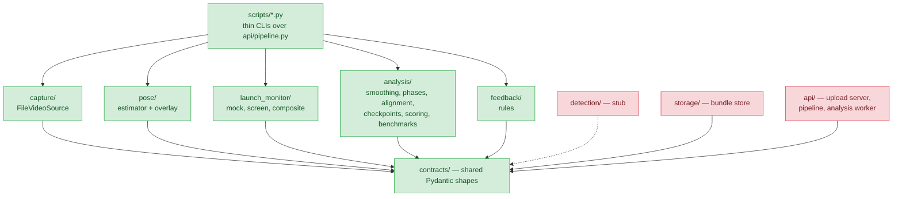
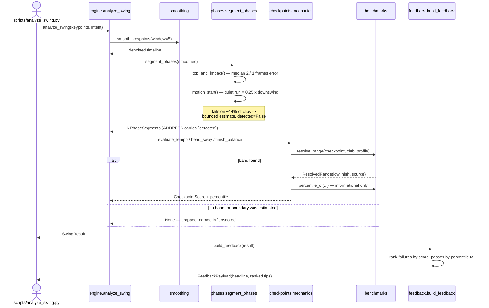

# Architecture — the system AS BUILT

> **Tier: AS-BUILT.** This document describes what actually exists and runs, reviewed
> **2026-08-05**. Everything here has been executed. For the *target* design — the full
> component/deployment picture, the build order, and the parts not yet written — see
> [FLOW.md](FLOW.md).
>
> Keeping the two apart is deliberate: this file changes every working session, FLOW.md
> changes every few months. A previous single-file version drifted five months out of date
> because a status banner and a diagram disagreed about which one they described.

---

## 1. What runs today

Two independent pipelines. Neither is joined to the other yet — that join is M7 Phase 4.


```mermaid
flowchart LR
    MOV["swing .mov<br/>data/raw"] --> RP["scripts/run_pose.py<br/>MediaPipe lite, Tasks API"]
    RP --> KP[("keypoints.json<br/>data/processed")]
    RP --> SKEL["skeleton overlay .mp4"]

    KP --> AS["scripts/analyze_swing.py"]
    AS --> SM["smoothing<br/>visibility-weighted moving avg"]
    SM --> PH["phases<br/>address / top / impact"]
    PH --> CK["3 checkpoints<br/>tempo, head_sway, finish_balance"]
    CK --> BR[("ranges.json<br/>golfdb_v1.json")]
    CK --> SC["scoring<br/>FundamentalsPolicy"]
    SC --> TIP["ranked tips + headline<br/>+ tour percentiles"]
    AS -.->|"--overlay"| OV["annotated .mp4<br/>ADDRESS/TOP/IMPACT + score HUD"]

    IMG["HD Golf SHOT DATA<br/>screen photo"] --> IS["screen/importer.py<br/>rectify, OCR, parse, validate"]
    IS --> SD[("parsed shot store<br/>data/processed/shots")]
    SD --> SRC["lookup by image sha256<br/>no extras needed"]

    BUN["swing bundle<br/>2 clips + shot photo"] --> AB["scripts/analyze_bundle.py"]
    AB --> SEL["select_swing<br/>which descent is the swing"]
    SEL --> ASB["analyze_swing_bundle<br/>face-on scored, DTL anchors only"]
    SRC --> ASB
    ASB --> AS
    ASB --> ALN["align_swings + pair_frames"]
    ALN --> SBS["aligned.mp4<br/>banners land together"]
    ASB --> JSON["analysis.json<br/>SwingBundleResult"]
    TIP --> JSON

    classDef built fill:#d4edda,stroke:#28a745,color:#155724;
    classDef gap fill:#fff3cd,stroke:#ffc107,color:#856404;
    class RP,AS,SM,PH,CK,SC,TIP,IS,SRC,SD,BUN,AB,SEL,ASB,ALN,SBS,JSON built;
    class OV gap;
```

**Reading it:** both pipelines are complete and, since M7 Phase 4, joined. `analyze_bundle.py`
is the entry point that runs the lot offline — pose per view, OCR (only if the photo isn't
already in the store), scoring, ranked tips, alignment — and writes `analysis.json` plus
`aligned.mp4` beside the clips. `SwingResult.shot` is populated at last.

**Analysis now auto-triggers** (M7 Phase 5): when an upload completes a swing's third role, an
in-process worker runs that same pipeline off the event loop and the results page has something
to render. A partial bundle waits for an explicit "Analyze anyway" rather than a timeout.

One deliberate boundary remains: the shot is **attached and displayed, never scored** — outcome
checkpoints need per-club benchmark bands `ranges.json` does not have (ADR-009). `detection/`
(YOLOv8) and SQLite are not in the running path at all.

### The commands, precisely

```bash
# Pose (needs the `vision` extra)
python scripts/run_pose.py <video-file>

# Analysis (base install; --overlay needs `vision`)
python scripts/analyze_swing.py <keypoints.json> [--overlay <video>]

# Shot ingestion (needs the `ocr` extra)
python scripts/import_shot_screens.py [paths...] [--session ID] [--device PROFILE]
                                      [--out DIR] [--min-confidence F] [--force] [--dry-run]

# Two-view alignment (base install; `vision` only to render)
python scripts/align_swings.py <a.keypoints.json> <b.keypoints.json> [--video-a F] [--video-b F]
                               [--out MP4] [--list-swings] [--auto-window] [--window-a A:B]

# The whole use case, offline (`vision`; `ocr` only for a photo not already in the shot store)
python scripts/analyze_bundle.py <SESSION/SWING | swing-dir> [--list-swings] [--no-auto-window]
                                 [--window-face-on A:B] [--window-dtl A:B] [--no-video]
                                 [--force-pose] [--force-ocr] [--skip-ocr] [--club C] [--tau L:H]
#   exit 0 clean · 1 result produced but something is flagged · 2 no result
```

One long-running service: the FastAPI upload server (`scripts/run_server.py`, M7 Phase 5),
which also carries the background analysis worker and serves the upload and results pages. No
MCP server (M3) — `scripts/run_mcp_server.py` raises `NotImplementedError` — and no React UI
(M5); the two static pages under `api/static/` are what stands in for it.

Offline reference-data tooling (`scripts/golfdb/`, the `research` extra) is a separate
concern from the runtime: `fetch` → `ingest_labels` → `extract_pose` → `derive_pose_metrics`
→ `derive_reference`, plus the `bakeoff` / `tune_*` / `spot_check` harnesses. It produces the
committed benchmark aggregates and never runs in production. See [data/README.md](../data/README.md).

---

## 2. Module dependency — the seam, as built

The rule that keeps modules independent: **everything depends on `contracts/`, and modules
never import each other** (ADR-008).


```mermaid
flowchart TD
    C["contracts/ — shared Pydantic shapes"]

    CAP["capture/<br/>FileVideoSource"] --> C
    POSE["pose/<br/>estimator + overlay"] --> C
    LMM["launch_monitor/<br/>mock, screen, composite"] --> C
    ANA["analysis/<br/>smoothing, phases, alignment,<br/>checkpoints, scoring, benchmarks"] --> C
    FB["feedback/<br/>rules"] --> C
    DET["detection/ — stub"] -.-> C
    STO["storage/ — bundle store"] --> C
    API["api/ — upload server,<br/>pipeline, analysis worker"] --> C

    CLI["scripts/*.py<br/>thin CLIs over api/pipeline.py"] --> CAP
    CLI --> POSE
    CLI --> ANA
    CLI --> FB
    CLI --> LMM

    classDef built fill:#d4edda,stroke:#28a745,color:#155724;
    classDef stub fill:#f8d7da,stroke:#dc3545,color:#721c24;
    class C,CAP,POSE,LMM,ANA,FB,CLI built;
    class DET,STO,API stub;
```

**The load-bearing consequence:** because consumers depend on the contract rather than the
producer, the entire analysis core installs and tests with **no ML dependencies at all**. It
is pure-Python/stdlib by rule (ADR-008), which is why the test suite runs on
`pip install -e '.[dev]'`. It is also what let a shot source nobody planned for — OCR of a
simulator screen (ADR-014) — arrive as one new adapter rather than a rewrite.

`api/` is now the orchestrator it was always meant to be: the bundle pipeline lives in
`api/pipeline.py`, and `scripts/analyze_bundle.py` is a presentation layer over it (M7 Phase 5).
The worker and the CLI therefore run the *same* code, so a phone's results page and a terminal
cannot disagree. `pipeline.py` imports no web framework, which is what lets the CLI keep working
on a `vision`-only install — pinned by `tests/api/test_pipeline_imports.py`.

### Interface contracts (key data shapes)

| Interface | From → To | Data Shape | Built? |
|-----------|-----------|------------|--------|
| Keypoints | Pose → Analysis | `List[FrameKeypoints]` — 33 landmarks per frame with x, y, z, visibility | ✅ |
| Detections | Detection → Analysis | `List[FrameDetections]` — bounding boxes + class (club_head, ball) per frame | contract only |
| Shot Data | Launch monitor → Analysis | `ShotData` — club_speed, ball_speed, launch_angle, spin_rate, club_face_angle, club_path, smash_factor, distances, plus `provenance` (confidence + audit trail) for sources that *infer* metrics rather than receive them (ADR-014) | ✅ produced, not consumed |
| Swing Result | Analysis → Feedback | `SwingResult` — phases, checkpoint scores with tour percentiles, mechanics/outcome/overall scores, `unscored` names, judged `intent` | ✅ (`outcome_score` always `None`) |
| Feedback | Feedback → UI | `FeedbackPayload` — overall score, ranked tips with severity, headline | ✅ produced and rendered by `api/static/results.html` |
| Reference | Benchmarks → Analysis | `ranges.json` bands + `golfdb_v1.json` distributions, both with provenance | ✅ |

---

## 3. Analysis internals — one `analyze_swing` call

The part with the most engineering in it. Pure functions on contracts, no I/O.


```mermaid
sequenceDiagram
    actor Caller as scripts/analyze_swing.py
    participant Eng as engine.analyze_swing
    participant Sm as smoothing
    participant Ph as phases.segment_phases
    participant Chk as checkpoints.mechanics
    participant Bench as benchmarks
    participant FB as feedback.build_feedback

    Caller->>Eng: analyze_swing(keypoints, intent)
    Eng->>Sm: smooth_keypoints(window=5)
    Sm-->>Eng: denoised timeline
    Eng->>Ph: segment_phases(smoothed)
    Ph->>Ph: _top_and_impact() — median 2 / 1 frames error
    Ph->>Ph: _motion_start() — quiet run = 0.25 x downswing
    Note over Ph: fails on ~14% of clips -><br/>bounded estimate, detected=False
    Ph-->>Eng: 6 PhaseSegments (ADDRESS carries `detected`)

    Eng->>Chk: evaluate_tempo / head_sway / finish_balance
    Chk->>Bench: resolve_range(checkpoint, club, profile)
    alt band found
        Bench-->>Chk: ResolvedRange(low, high, source)
        Chk->>Bench: percentile_of(...) — informational only
        Chk-->>Eng: CheckpointScore + percentile
    else no band, or boundary was estimated
        Chk-->>Eng: None — dropped, named in `unscored`
    end
    Eng-->>Caller: SwingResult
    Caller->>FB: build_feedback(result)
    FB->>FB: rank failures by score, passes by percentile tail
    FB-->>Caller: FeedbackPayload(headline, ranked tips)
```

**Two rules worth knowing before changing anything here:**

1. **A missing benchmark yields no score, never a wrong one** (ADR-010 §2). Checkpoints drop
   out and are named in `SwingResult.unscored`; `overall_score` is a mean over survivors and
   is deliberately *not* penalised.
2. **Percentiles never touch the scoring path** (ADR-010 addendum, 2026-08-04). They are
   informational, drawn from the same stratum the band was cut from. A test blinds the
   evaluators to the distributions and asserts `score`/`passed` do not move.

### What is measured, and what the numbers mean

Three checkpoints, all from a single face-on camera, all with bands derived from GolfDB tour
swings rather than eyeballed. Current values live in
`src/golf_coach/analysis/benchmarks/ranges.json` — **read them there, not from a doc**, since
they have been re-derived three times and each `source` string carries full provenance.

| Checkpoint | What it measures | Band source |
|---|---|---|
| `tempo` | backswing : downswing duration ratio | p10–p90 of 1,399 tour swings, 246 golfers |
| `head_sway` | lateral head travel to impact, shoulder-width normalized | p90 of 458 face-on tour swings, 122 golfers |
| `finish_balance` | post-impact settle, shoulder-width normalized | p90 of 458 face-on tour swings, 122 golfers |

Phase-instant accuracy against 461 hand-annotated clips: **top 2 frames, impact 1 frame,
address 7 frames** (median). Address is the known weak instant — see
[M4_ADDRESS_DETECTION.md](M4_ADDRESS_DETECTION.md).

Deferred by physics, not by schedule: spine tilt and forward bend foreshorten to ≈0 face-on;
hip rotation, X-factor and kinematic sequence need 3D; swing plane and club path need
detection (M2); face angle and ball flight need the launch monitor. See ADR-011 and
[FLOW.md](FLOW.md).

---

## 4. Storage — what is actually persisted

**No database exists.** `storage/` is flat files and nothing else; `data/golf_trainer.db` is
gitignored and never created. Everything persists as files:

| What | Where | Status |
|---|---|---|
| Raw video | `data/raw/` | ✅ manual drop |
| Keypoints | `data/processed/<clip>.keypoints.json` | ✅ written by `run_pose.py` |
| ↳ *its format* | `{"clip": {fps, width, height, frame_count, source_sha256}, "frames": [...]}` | ✅ read/written via `storage/keypoints_io.py`, which also accepts the bare-array shape everything written before M7 Phase 1 uses |
| Overlays | `data/processed/<clip>.overlay.mp4`, `.analysis.mp4` | ✅ |
| Parsed shots | `data/processed/shots/` (content-addressed) | ✅ written by `import_shot_screens.py` and by `analyze_bundle.py` |
| Swing bundles | `data/processed/sessions/<session>/<swing>/` + `manifest.json` | ✅ written by the upload route (M7 Phase 3/5) |
| ↳ *analysis artifacts* | `analysis.json`, `aligned.mp4`, `<role>.keypoints.json` in the same directory | ✅ written by `api/pipeline.py`, from the worker or the CLI; `analysis.json` is a `SwingBundleResult` with the heavy streams excluded (the keypoints sit beside it) |
| ↳ *worker state* | `analysis.state.json` in the same directory | ✅ `AnalysisState` — queued/running/done/failed, the role→sha256 map the result was computed from (so a re-upload invalidates it), and a denormalised score/headline so the 5 s status poll never parses `analysis.json` |
| Reference corpus | `data/reference/golfdb/` | ✅ gitignored for licensing (ADR-012) |
| Benchmark aggregates | `src/golf_coach/analysis/benchmarks/*.json` | ✅ committed |
| Swing results, sessions, trends | SQLite `swings` / `shots` tables | ❌ designed only — M7 Phase 3 |

The `swings.jsonl` Tier-2 shape in the reference pipeline was deliberately built as the shape
the future SQLite `swings` table will take, so that migration is a load rather than a design.

**Swing identity today is the filename stem** (`scripts/analyze_swing.py:164`). There is no
session registry. M7 Phase 3 replaces this with a store that assigns identity server-side.

---

## 5. Verification posture — how this project knows it works

Worth stating explicitly, because it is unusual and it is the main reason the pose-only work
is trustworthy without hardware.

- **Base-install test suite** — 141 passed / 4 skipped as of 2026-08-04 (the skips are OCR
  integration tests needing `paddleocr`). Check `WORKLOG.md` for the current count rather than
  trusting this line.
- **Ground truth from a public corpus** — phase instants and benchmark bands are validated
  against 461 hand-annotated GolfDB face-on clips, which found and fixed a systematic
  top-detection defect no amount of self-consistency checking would have caught (ADR-012).
- **Annotated overlays as the human check** — `--overlay` stamps detected instants on the
  video so a person can see whether they landed on the right moments. This located the
  motion-start error that unit tests passed straight through.
- **Rejected alternatives stay runnable** — `scripts/golfdb/tune_*.py` keep every losing
  candidate rule as a named row, including deliberate no-pose baselines that any future
  candidate must beat.
- **Not measured:** end-to-end wall-clock latency. The target is <15s swing-to-feedback
  (charter), but nothing has been benchmarked, and there is no UI to measure to. Any timing
  table you find in [FLOW.md](FLOW.md) is an estimate, not a measurement.
