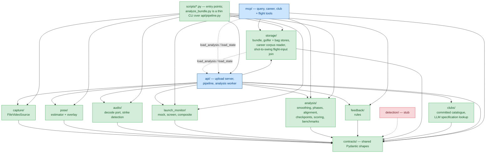
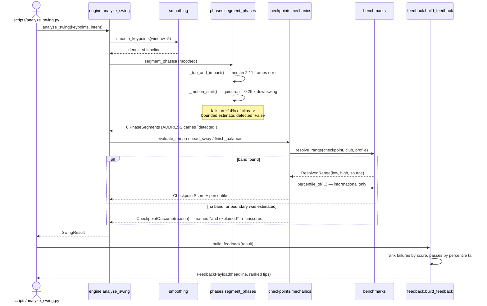

# Architecture — the system AS BUILT

> **Tier: AS-BUILT.** This document describes what actually exists and runs, reviewed
> **2026-09-02**. Everything here has been executed. For the *target* design — the full
> component/deployment picture, the build order, and the parts not yet written — see
> [FLOW.md](FLOW.md).
>
> Keeping the two apart is deliberate: this file changes every working session, FLOW.md
> changes every few months. A previous single-file version drifted five months out of date
> because a status banner and a diagram disagreed about which one they described.

---

## 1. What runs today

Two independent pipelines. Neither is joined to the other yet — that join is M7 Phase 4.


```mermaid
flowchart LR
    MOV["swing .mov<br/>data/raw"] --> RP["scripts/run_pose.py<br/>MediaPipe, Tasks API"]
    RP --> KP[("keypoints.json<br/>data/processed")]
    RP --> SKEL["skeleton overlay .mp4"]

    KP --> AS["scripts/analyze_swing.py"]
    AS --> SM["smoothing<br/>visibility-weighted moving avg"]
    SM --> PH["phases<br/>address / top / impact"]
    PH --> CK["6 checkpoints<br/>tempo, head_sway, finish_balance<br/>hip_sway, hip_shift_at_top<br/>head_stays_back"]
    CK --> BR[("ranges.json<br/>golfdb_v1.json")]
    CK --> SC["scoring<br/>FundamentalsPolicy"]
    SC --> TIP["ranked tips + headline<br/>+ tour percentiles"]
    AS -.->|"--overlay"| OV["annotated .mp4<br/>ADDRESS/TOP/IMPACT + score HUD"]

    IMG["HD Golf SHOT DATA<br/>screen photo"] --> IS["screen/importer.py<br/>rectify, OCR, parse, validate"]
    IS --> SD[("parsed shot store<br/>data/processed/shots")]
    SD --> SRC["lookup by image sha256<br/>no extras needed"]

    BUN["swing bundle<br/>2 clips + shot photo"] --> AB["scripts/analyze_bundle.py"]
    BUN --> AUD["audio_for per view<br/>decode 48kHz mono, find strikes"]
    AUD --> STR[("strike frames<br/>per clip, own numbering")]
    STR --> SEL
    AB --> SEL["select_swing<br/>which descent is the swing"]
    SEL --> ASB["analyze_swing_bundle<br/>face-on scored, DTL anchors only"]
    STR --> ASB
    SRC --> ASB
    ASB --> AS
    ASB --> ALN["align_swings + pair_frames"]
    ALN --> SBS["aligned.mp4<br/>banners land together"]
    ASB --> JSON["analysis.json<br/>SwingBundleResult"]
    TIP --> JSON

    classDef built fill:#d4edda,stroke:#28a745,color:#155724;
    classDef gap fill:#fff3cd,stroke:#ffc107,color:#856404;
    class RP,AS,SM,PH,CK,SC,TIP,IS,SRC,SD,BUN,AB,SEL,ASB,ALN,SBS,JSON,AUD,STR built;
    class OV gap;
```

**Reading it:** both pipelines are complete and, since M7 Phase 4, joined. `analyze_bundle.py`
is the entry point that runs the lot offline — pose per view, OCR (only if the photo isn't
already in the store), scoring, ranked tips, alignment — and writes `analysis.json` plus
`aligned.mp4` beside the clips. `SwingResult.shot` is populated at last.

**Analysis now auto-triggers** (M7 Phase 5): when an upload completes a swing's third role, an
in-process worker runs that same pipeline off the event loop and the results page has something
to render. A partial bundle waits for an explicit "Analyze anyway" rather than a timeout.

**Both phones hear the ball** (M11, ADR-025), and that is the newest edge in the diagram. Each
clip's audio is decoded once, the ball strike is found in it, and the result reaches the analysis
core as **frame indices in that clip's own numbering** — never a waveform. Turning a sample index
into a frame index is arithmetic with one trap in it, and `audio_for` measures its way out: a
container can present its video later than its audio, so the same call that decodes the clip also
probes the presentation time of its first video frame and records it as
`AudioClipMetadata.video_start_s` (M11 P10). Four of the 30 clips on disk need it, at 105-125 ms. Those indices do three
things: they overrule the duration band when `select_swing` picks which descent is the swing, they
pin each view's impact anchor to a heard event so the pair reports `AlignmentQuality.SYNCHRONIZED`,
and — because two impacts pinned to one sound make the two downswings measurements of one interval
in real time — they make a disagreement about the *top* decidable. A `tempo` timed from a top the
other view contradicts is withdrawn rather than shipped (`unscored.CROSS_VIEW_CONTRADICTED`). A
bundle whose clips carry no usable audio, or where only one did, behaves exactly as it did before.

One deliberate boundary remains: the shot is **attached and displayed, never scored** — outcome
checkpoints need per-club benchmark bands `ranges.json` does not have (ADR-009). `detection/`
(YOLOv8) and SQLite are not in the running path at all.

### The commands, precisely

```bash
# Pose (needs the `vision` extra)
python scripts/run_pose.py <video-file>

# Analysis (base install; --overlay needs `vision`)
python scripts/analyze_swing.py <keypoints.json> [--overlay <video>]

# Shot ingestion (needs the `ocr` extra)
python scripts/import_shot_screens.py [paths...] [--session ID] [--device PROFILE]
                                      [--out DIR] [--min-confidence F] [--force] [--dry-run]

# Two-view alignment (base install; `vision` only to render)
python scripts/align_swings.py <a.keypoints.json> <b.keypoints.json> [--video-a F] [--video-b F]
                               [--out MP4] [--list-swings] [--auto-window] [--window-a A:B]

# The whole use case, offline (`vision`; `ocr` only for a photo not already in the shot store;
# `audio` to hear the ball strike — without it every clip falls back to the pre-M11 pose anchors
# and says so in the notes, which is a degradation and never an error)
python scripts/analyze_bundle.py <SESSION/SWING | swing-dir> [--list-swings] [--no-auto-window]
                                 [--window-face-on A:B] [--window-dtl A:B] [--no-video]
                                 [--force-pose] [--force-ocr] [--skip-ocr] [--club C] [--tau L:H]
#   exit 0 clean · 1 result produced but something is flagged · 2 no result

# Career mode: who has hit what, across every session (base install)
python scripts/backfill_golfer.py --name NAME [--handedness right|left] [--session ID] [--dry-run]
python scripts/career_corpus.py [--name NAME | --player-id ID] [--verbose]
#   the honest n: distinct swings after deduping re-uploads, and the sample size per metric
python scripts/career_baseline.py [--name NAME | --player-id ID] [--verbose]
#   what that n buys: per-metric center / spread / trend, each withheld below its own floor
python scripts/career_dispersion.py [--name NAME | --player-id ID] [--verbose]
#   what the numbers are evidence for: a repeatable miss (look before the swing) against a
#   scattered one (look at timing). Both findings withheld until the baseline's floors clear
python scripts/club_profile.py [--name NAME | --player-id ID] [--club CLUB] [--verbose]
#   the same question narrowed to one club: how far this golfer hits it, and where the
#   history refuses to say. --club takes a name a human would type ('7i', 'seven iron')

# Follow-up questions about a swing (needs the `llm` extra and a key — ADR-020)
python scripts/ask_swing.py <SESSION/SWING> "<question>"
python scripts/ask_swing.py --resume <CONVERSATION-ID> "<question>"
python scripts/ask_swing.py [--list | --show <CONVERSATION-ID>]
#   seeds from the swing's stored analysis, then looks anything else up through the same
#   eleven tools the MCP server offers — called in-process, not over stdio
#   exit 0 answered · 1 answered with something flagged · 2 no answer

# Bring stored analyses up to the current engine (`vision` only with --video)
python scripts/reanalyze.py [SESSION/SWING ...] [--all] [--player ID] [--dry-run] [--video]
                            [--coaching] [--verbose]
#   default targets: never analyzed, inputs re-uploaded since, or analysis_version < current
#   pose and shots are cached, so an unchanged bundle re-runs in seconds

# Ball flight, typed or read off disk (base install — M15 P7 and P10, ADR-027)
python scripts/simulate_flight.py --ball-speed MPH --launch-angle DEG --spin RPM
                                  [--launch-direction D] [--spin-axis A] [--altitude M]
                                  [--step S] [--points N] [--verbose]
python scripts/simulate_flight.py --gate [--altitude M] [--verbose]
python scripts/simulate_flight.py --shots [--altitude M] [--step S]
python scripts/simulate_flight.py --shot SHOT-ID [--points N] [--altitude M]
#   four modes, one at a time: a what-if you type, the validation gate, the whole shot store, one
#   stored shot in full
#   --shots joins each parsed shot to the swing it arrived with — that is where the club is — and
#   flies what it can; the refusals are the output, each with its reason and the case behind it
#   every carry prints with its clamp and with the gate's inverted ordering beside it
#   exit 0 a ball flew · 2 none did (a launch angle at the horizontal rolls; roll is out of scope)
#   over stored shots a refusal is a finding, so --shots exits 0; only an unknown --shot id is 2
```

One long-running service: the FastAPI upload server (`scripts/run_server.py`, M7 Phase 5),
which also carries the background analysis worker and serves the upload and results pages. The
MCP server (M3, `scripts/run_mcp_server.py`) is not a service in the same sense — it speaks
stdio, so the MCP client launches it per connection and there is no port to bind. Its tools are
`contracts/tool_descriptions.py::TOOL_DESCRIPTIONS`, six of them offered on any server and five
more once a golfer registry is configured; `simulate_flight` (M15 P17) is in the first group,
because a shot whose screen printed its own spin borrows nothing from a bag. No React UI
(M5); the static pages under `api/static/` — upload, library, results, career, flight — are what
stands in for it. The last is the only one that *draws*: `flight.html` projects the simulated
polyline onto a canvas in three views — a perspective tracer from behind the ball looking down the
target line, then a side elevation and a plan view — with the plan view's offline axis stretched by
a printed factor and the part of the path that read a held coefficient row dashed rather than
solid (M15 P15, P19). Only the two orthographic panels may be read off; the tracer's caption says
so, and it is the only animated thing anywhere in `api/static/`. What the launch monitor printed is drawn beside it — a hollow ring for the carry
it measured, a rule for where that carry falls in the plan view — and every simulated number the
screen printed a counterpart for carries the sentence saying whether the gap between them is an
error at all (M15 P16).

### The routes, precisely

The upload server's whole surface, from `api/app.py`. Every one is gated by the same shared-secret
dependency except the static mount, which is deliberately open because the page has to load before
anyone can type the secret into it. `tests/test_docs_truth.py` asserts this table names every route
the module declares, so a new endpoint fails the suite until it is listed here.

| Method | Route | What it is for |
|---|---|---|
| `POST` | `/api/uploads` | The only write a phone makes: one file with its role, slotted into a swing server-side. Refuses a 409 when the session cursor names no club (M9 P6). `?swing_id=` aims it at one swing instead, which is what makes a bad file *replaceable* rather than the start of a new swing |
| `GET` | `/api/sessions/current` | Which session today's uploads land in |
| `GET` | `/api/golfers` | Every known golfer — what lets the page tell a returning name from a new one |
| `GET` | `/api/clubs` | The club vocabulary and its categories, so the picker renders in one round trip (M9 P7) |
| `POST` | `/api/clubs/lookup` | What a named club *is* — catalogue first, a model on a miss, one call for a whole set. **Writes nothing**: saving is the bag route below, and the golfer confirming is what turns a proposal into a declaration (M12 P5, ADR-026 §5) |
| `GET` `POST` | `/api/sessions/current/golfer` | The golfer cursor: who the *next* swing belongs to |
| `GET` `POST` | `/api/sessions/current/club` | The club cursor: what the *next* swing was hit with (M9 P4) |
| `GET` | `/api/golfers/{player_id}/career` | One golfer against their own history, plus their tempo and the metronome fitted to it — the route both the career page and the swing page read, so the two cannot disagree |
| `GET` | `/api/golfers/{player_id}/bag` | Every club this golfer has hit or declared, with what each one's history says or refuses (M9 P19) |
| `POST` `DELETE` | `/api/golfers/{player_id}/bag/{club}` | Declare or edit one slot, carrying the whole `ClubSpec`; removing retires it to the append-only shelf rather than deleting it. Confirming here is also what teaches the club catalogue (M9 P19, M12 P5, ADR-024, ADR-026) |
| `GET` | `/api/sessions` | Every session that holds a swing, newest first, with each swing's row. The library page's one round trip, and the only route that *enumerates* — before it, a swing outside today's session was reachable only by typing its results URL by hand |
| `GET` | `/api/sessions/{session_id}` | A session's swings and their analysis state — the 5 s status poll |
| `GET` | `/api/sessions/{session_id}/swings/{swing_id}` | One swing's stored result, plus the tempo plan derived at read time |
| `GET` | `/api/sessions/{session_id}/swings/{swing_id}/flight` | The simulated ball flight for that swing's shot — the path, the six `flight_*` numbers, what the launch monitor printed beside them, and the caveats none of it may be read without. **Flown at read time**, because `analysis.json` stores the numbers and not the path, and because the bag is editable: declaring a 3 wood's loft turns a refusal into a flight with no re-analysis. A shot the model cannot fly is a 200 carrying its reason — ten of the thirteen on disk are — and only a swing with no shot screen, or one never parsed, is a 404 (M15 P14) |
| `DELETE` | `/api/sessions/{session_id}/swings/{swing_id}` | Remove one swing and its directory. The undo for a *phantom* — a corrective re-upload cannot replace a role a swing already has, so it opens a new swing, and a phantom missing both clips then swallows the next real shot's footage. Refused with 409 while a run is queued or in flight |
| `POST` | `/api/sessions/{session_id}/swings/{swing_id}/golfer` | Re-attribute one swing; the repair path for a misfiled golfer |
| `POST` | `/api/sessions/{session_id}/swings/{swing_id}/club` | Retag one swing. The club's **only** repair path, and deliberately per-swing — a session holds many clubs, so there is no bulk backfill (M9 P6, ADR-024 §5) |
| `POST` | `/api/sessions/{session_id}/swings/{swing_id}/analyze` | The "Analyze anyway" override, for a bundle that will never be complete |
| `POST` | `/api/sessions/{session_id}/swings/{swing_id}/ask` | A follow-up question, continuing a conversation if one is given (ADR-020) |
| `GET` | `/api/sessions/{session_id}/swings/{swing_id}/conversation` | That swing's most recent conversation, rendered for display |
| `GET` | `/api/conversations/{conversation_id}` | One conversation by id, rendered for display |
| `GET` | `/api/sessions/{session_id}/swings/{swing_id}/video/{name}` | The aligned render, or one raw view when there was no second angle to align to |

Offline reference-data tooling (`scripts/golfdb/`, the `research` extra) is a separate
concern from the runtime: `fetch` → `ingest_labels` → `extract_pose` → `derive_pose_metrics`
→ `derive_reference`, plus the `bakeoff` / `tune_*` / `spot_check` harnesses. It produces the
committed benchmark aggregates and never runs in production. See [data/README.md](../data/README.md).

---

## 2. Module dependency — the seam, as built

The rule that keeps modules independent: **everything depends on `contracts/`, and modules
never import each other** (ADR-008).


```mermaid
flowchart TD
    C["contracts/ — shared Pydantic shapes"]

    CAP["capture/<br/>FileVideoSource"] --> C
    POSE["pose/<br/>estimator + overlay"] --> C
    AUD["audio/<br/>decode port, strike detection"] --> C
    LMM["launch_monitor/<br/>mock, screen, composite"] --> C
    ANA["analysis/<br/>smoothing, phases, alignment,<br/>checkpoints, scoring, benchmarks"] --> C
    FB["feedback/<br/>rules"] --> C
    DET["detection/ — stub"] -.-> C
    STO["storage/<br/>bundle, golfer + bag stores,<br/>career corpus reader,<br/>shot-to-swing flight-input join"] --> C
    CLB["clubs/<br/>committed catalogue,<br/>LLM specification lookup"] --> C

    API["api/ — upload server,<br/>pipeline, analysis worker"] --> C
    MCP["mcp/ — query, career, club + flight tools"] --> C

    API --> CAP
    API --> POSE
    API --> AUD
    API --> ANA
    API --> FB
    API --> LMM
    API --> STO
    API --> CLB

    MCP --> ANA
    MCP --> STO
    MCP --> LMM

    STO -. "load_analysis / load_state" .-> API
    MCP -. "load_analysis / load_state" .-> API

    CLI["scripts/*.py — entry points;<br/>analyze_bundle.py is a thin CLI over api/pipeline.py"] --> API
    CLI --> CAP
    CLI --> POSE
    CLI --> AUD
    CLI --> ANA
    CLI --> FB
    CLI --> LMM
    CLI --> STO

    classDef built fill:#d4edda,stroke:#28a745,color:#155724;
    classDef stub fill:#f8d7da,stroke:#dc3545,color:#721c24;
    classDef shell fill:#cce5ff,stroke:#004085,color:#004085;
    class C,CAP,POSE,AUD,LMM,ANA,FB,CLI,STO,CLB built;
    class API,MCP shell;
    class DET stub;
```

Read it as three layers: `contracts/` at the bottom, the modules depending on it and on nothing
else, and **two imperative shells** — `api/` and `mcp/` — reaching down across them. The earlier
version of this diagram drew every module with a single edge to `contracts/` and omitted `mcp/`
altogether, which made the shells invisible and the one rule-breaking edge below unfindable.

`storage/` and `api/` were stubs when this diagram was first drawn and are not any more —
M7 Phases 3 and 5 built the bundle store, the upload server and the background worker. `detection/`
is the last real stub, gated on M1.5.

**`audio/` is the newest module and it is deliberately shaped exactly like `pose/`** (M11,
ADR-025): an I/O-edge adapter behind an extra (`audio`, on `imageio-ffmpeg`), producing a contract
shape, imported by the shells and by nothing in `analysis/`. The core receives **frame indices**
and never a waveform, which is what keeps it stdlib-only and keeps a base install passing every
analysis test. `tests/api/test_pipeline_imports.py` now holds `imageio_ffmpeg` alongside `fastapi`
and `anthropic` for exactly that reason.

**`clubs/` is newer still (M12, ADR-026), and it is the first module that answers a question about
the *equipment* rather than the swing.** Two modules and they are a cache and its miss path:
`catalogue.py` reads `club_catalogue.json`, a committed dictionary of specifications with
provenance per row — ADR-022's shape, the same one `ranges.json` and `golfdb_v1.json` take — and
`lookup.py` asks `claude-opus-5` what a named club is when the catalogue misses. It is the second
consumer of the `llm` extra after `feedback/coach.py` and deliberately mirrors its structure
without importing it: `anthropic` is imported inside a function, a `client=` seam lets tests assert
request and parse shape with no network, and an expected failure returns a note rather than
raising. ADR-008 forbids the shared copy, so what is duplicated is prose and the cost of drift is a
differently-worded sentence rather than a wrong number. `tests/api/test_pipeline_imports.py` holds
a pin for it beside the others.

**Nothing in `clubs/` writes.** A lookup returns a proposal; `api/app.py` composes it with
`BagStore`, the golfer confirms it, and *that* is the write — which is also what teaches the
catalogue, so the second lookup of a confirmed club is a dictionary read and not an API call
(ADR-026 §5, §7).

**The dotted edges upward break the rule, knowingly:** `storage/corpus.py` and `mcp/query.py` both
import `api.state` for `load_analysis` / `load_state`, the tolerant readers for the two artifacts
an analysis run leaves behind. The alternative was a second copy of a tolerant reader, and a second
copy is one that drifts; the clean fix is moving those two functions down into
`storage/analysis_io.py`. Recorded in ADR-008's addenda, and in `docs/REFACTOR_LEDGER.md` so it is
not re-raised.

Not drawn, because they are not runtime edges: `pose/` and `detection/` annotate with
`capture.source.Frame` under `if TYPE_CHECKING:`. `Frame` holds a numpy image and so cannot live
in `contracts/`; keeping the import type-only is what lets those modules be imported without the
ML stack, pinned by `tests/api/test_pipeline_imports.py`.

**The load-bearing consequence:** because consumers depend on the contract rather than the
producer, the entire analysis core installs and tests with **no ML dependencies at all**. It
is pure-Python/stdlib by rule (ADR-008), which is why the test suite runs on
`pip install -e '.[dev]'`. It is also what let a shot source nobody planned for — OCR of a
simulator screen (ADR-014) — arrive as one new adapter rather than a rewrite.

`api/` is now the orchestrator it was always meant to be: the bundle pipeline lives in
`api/pipeline.py`, and `scripts/analyze_bundle.py` is a presentation layer over it (M7 Phase 5).
The worker and the CLI therefore run the *same* code, so a phone's results page and a terminal
cannot disagree. `pipeline.py` imports no web framework, which is what lets the CLI keep working
on a `vision`-only install — pinned by `tests/api/test_pipeline_imports.py`.

### Interface contracts (key data shapes)

| Interface | From → To | Data Shape | Built? |
|-----------|-----------|------------|--------|
| Keypoints | Pose → Analysis | `List[FrameKeypoints]` — 33 landmarks per frame with x, y, z, visibility | ✅ |
| Detections | Detection → Analysis | `List[FrameDetections]` — bounding boxes + class (club_head, ball) per frame | contract only |
| Ball strikes | Audio → Analysis | `list[int]` — the frames a strike was heard on, in each clip's **own** numbering, decoded from `AudioFile` by `audio/impact.py` and passed to `analyze_swing_bundle` as `face_on_strikes` / `down_the_line_strikes`. Indices rather than a waveform is the whole seam: `analysis/` stays stdlib-only (ADR-025). The sample→frame conversion happens in `api/pipeline.py` and subtracts the clip's `video_start_s`, because a sample index is a time on the container's presentation clock and a frame index is not | ✅ |
| Shot Data | Launch monitor → Analysis | `ShotData` — club_speed, ball_speed, launch_angle, spin_rate, club_face_angle, club_path, smash_factor, distances, plus `provenance` (confidence + audit trail) for sources that *infer* metrics rather than receive them (ADR-014) | ✅ produced, not consumed |
| Swing Result | Analysis → Feedback | `SwingResult` — phases, checkpoint scores with tour percentiles, mechanics/outcome/overall scores, `unscored` entries carrying a reason, judged `intent` | ✅ (`outcome_score` always `None`) |
| Feedback | Feedback → UI | `FeedbackPayload` — overall score, ranked tips with severity, headline | ✅ produced and rendered by `api/static/results.html` |
| Reference | Benchmarks → Analysis | `ranges.json` bands + `golfdb_v1.json` distributions, both with provenance | ✅ |
| Career corpus | Storage → Analysis | `CareerCorpus` — one golfer's distinct swings with their `Measurement`s, the honest per-metric `n`, and every excluded swing with its reason | ✅ produced, not yet consumed (career mode step 4) |
| Bag profile | Storage → Analysis → UI/MCP | `BagProfile` / `ClubProfile` — the same corpus narrowed to one club, with `n_swings` and `n_shots` deliberately kept apart, because a clip filmed without a screen photo is history that carries no distance (M9 P14) | ✅ built and read by three surfaces: the CLI, the bag page and two MCP tools |
| Club specification | Clubs → Storage → UI/MCP | `ClubSpec` — one slot of one manufacturer's model, as published: loft, lie, length, head, shaft and grip, keyed `(make, model, model_year, club)`. `BagEntry` **inherits** it, so a bag entry *is* a specification rather than five fields beside one (M12 P2). Every field is optional and a refusal stays `None` — blank renders blank and never zero, which is ADR-010 §2 at the lookup boundary (ADR-026 §6) | ✅ produced by `clubs/`, stored by `storage/bag_store.py`, rendered by the bag page |

---

## 3. Analysis internals — one `analyze_swing` call

The part with the most engineering in it. Pure functions on contracts, no I/O.


```mermaid
sequenceDiagram
    actor Caller as scripts/analyze_swing.py
    participant Eng as engine.analyze_swing
    participant Sm as smoothing
    participant Ph as phases.segment_phases
    participant Chk as checkpoints.mechanics
    participant Bench as benchmarks
    participant FB as feedback.build_feedback

    Caller->>Eng: analyze_swing(keypoints, intent)
    Eng->>Sm: smooth_keypoints(window=5)
    Sm-->>Eng: denoised timeline
    Eng->>Ph: segment_phases(smoothed)
    Ph->>Ph: _top_and_impact() — median 2 / 1 frames error
    Ph->>Ph: _motion_start() — quiet run = 0.25 x downswing
    Note over Ph: fails on ~14% of clips -><br/>bounded estimate, detected=False
    Ph-->>Eng: 6 PhaseSegments (ADDRESS carries `detected`)

    Eng->>Chk: evaluate_tempo / head_sway / finish_balance
    Chk->>Bench: resolve_range(checkpoint, club, profile)
    alt band found
        Bench-->>Chk: ResolvedRange(low, high, source)
        Chk->>Bench: percentile_of(...) — informational only
        Chk-->>Eng: CheckpointScore + percentile
    else no band, or boundary was estimated
        Chk-->>Eng: CheckpointOutcome(reason) — named *and explained* in `unscored`
    end
    Eng-->>Caller: SwingResult
    Caller->>FB: build_feedback(result)
    FB->>FB: rank failures by score, passes by percentile tail
    FB-->>Caller: FeedbackPayload(headline, ranked tips)
```

**Two rules worth knowing before changing anything here:**

1. **A missing benchmark yields no score, never a wrong one** (ADR-010 §2). Checkpoints drop
   out and are named in `SwingResult.unscored`; `overall_score` is a mean over survivors and
   is deliberately *not* penalised. Each entry carries **why** it dropped
   (`contracts/unscored.py`), which is what lets `feedback` tell a golfer whose clip was
   unreadable to shoot it again and a golfer whose swing measured fine to pick a golfer instead
   — read `refilming_helps`, never the checkpoint name (ADR-010 addendum, 2026-08-19).
2. **Percentiles never touch the scoring path** (ADR-010 addendum, 2026-08-04). They are
   informational, drawn from the same stratum the band was cut from. A test blinds the
   evaluators to the distributions and asserts `score`/`passed` do not move.
3. **One finding reaches back into a score after `analyze_swing` has returned, and only one**
   (M11 P8, ADR-025). The sequence above is a single clip and nothing in it can see a wrong phase
   instant — `phases.py` reports a late top as detected and is not wrong to. `analyze_swing_bundle`
   can, once *both* clips are anchored on a ball strike they both heard: the two downswings then
   measure one interval in real time, the shorter one is the late top, and the checkpoints timed
   from it (`contracts.checkpoints.CONTRADICTED_BY_A_LATE_TOP`, currently `tempo` alone) are
   **withdrawn** into `unscored` with reason `CROSS_VIEW_CONTRADICTED`. Withdrawn, not restated:
   the alignment knows what the ratio reads on the corrected top, but a score whose number came
   from the warp and whose band came from the engine is the wrong-score rule 1 refuses. This is
   the *only* path by which the second camera reaches `overall_score`, and it does so by removing
   a number rather than contributing one.

### What is measured, and what the numbers mean

Six checkpoints, all from a single face-on camera, all with bands derived from GolfDB tour
swings rather than eyeballed. Which ones ship is declared in
`src/golf_coach/contracts/checkpoints.py` (`CHECKPOINT_REGISTRY`) — the engine walks it, and
`contracts/caveats.py` builds the text it hands a model out of the same tuple. Current band values
live in `src/golf_coach/analysis/benchmarks/ranges.json` — **read them there, not from a doc**,
since they have been re-derived three times and each `source` string carries full provenance.

| Checkpoint | What it measures | Band | Band source |
|---|---|---|---|
| `tempo` | backswing : downswing duration ratio | two-sided | p10–p90 of 1,399 tour swings, 246 golfers |
| `head_sway` | lateral head travel to impact, shoulder-width normalized | one-sided | p90 of 458 face-on tour swings, 122 golfers |
| `finish_balance` | post-impact settle, shoulder-width normalized | one-sided | p90 of 458 face-on tour swings, 122 golfers |
| `hip_sway` | lateral hip travel to impact, shoulder-width normalized | **two-sided** | p10–p90 of 458 face-on tour swings, 122 golfers |
| `hip_shift_at_top` | lateral hip travel to the top, shoulder-width normalized | one-sided | p90 of 458 face-on tour swings, 122 golfers |
| `head_stays_back` | head-behind-hips separation gained, address to impact | **two-sided**, signed | p10–p90 of 458 face-on tour swings, 122 golfers |

**Three of the six are two-sided, and that is a measured choice rather than a default.** `hip_sway`
is not "less is better": the tour p10 is 0.14, so 90% of tour swings move the hips *further* than
that, and too little lateral movement fails just as too much does. `hip_shift_at_top` is one-sided
for a different reason again — not because less is better, but because its p10 (0.015) sits below
the pipeline's own measurement error (0.053), so a lower edge would split golfers this instrument
cannot tell apart. The rule is in the ADR-010 addendum of 2026-08-12: assert a band edge only where
it clears the instrument. Consumers must read `one_sided` before calling a low number good.

`head_stays_back` is the odd one: its band is **negative** on both edges, because the quantity is
signed in a right-handed camera frame. It is also the only checkpoint that needs to know *who*
swung — a face-on camera sees a left-handed swing mirrored — so a swing with no golfer attributed
carries it in `unscored` with reason `NO_HANDEDNESS` rather than scored on a guess.

Phase-instant accuracy against 461 hand-annotated clips: **top 2 frames, impact 1 frame,
address 7 frames** (median). Address is the known weak instant — see
[M4_ADDRESS_DETECTION.md](M4_ADDRESS_DETECTION.md).

### Where the swing sits in the tour population — recorded, spoken, never scored

Alongside the checkpoints, the engine records **population placements**: how unusual the six
metrics are *as a combination*, and how far the motion sits from the tour shape both inside the
fitted subspace and off it. Which ones ship is declared in
`src/golf_coach/contracts/placements.py` (`POPULATION_PLACEMENT_REGISTRY`) — `analysis/engine.py`
takes each name and unit from it, `contracts/caveats.py` builds its warning prose from the same
tuple, and `benchmarks/trajectory.py` keys its two committed artifacts on its view strings. Do not
write the list or its size into a sentence; derive it.

They ride on `SwingResult.measurements`, never on `checkpoint_scores`, so **no placement can move
`overall_score`** — the same firewall §3's rule 2 puts around percentiles, for a stronger reason:
the corpus behind them is entirely tour professionals, so they know the shape of swings that work
and nothing about swings that do not. *Unusual is not bad.*

What is new as of 2026-08-17 is not the numbers but the **policy for saying them**, which
[ADR-022's third addendum](decisions/022-learned-artifacts-as-committed-data.md) states in full: a
placement is context and never a headline, it earns a clause only when it sharpens a finding
already being named, and an uncalibrated one is labelled on the line that carries it. Two of them
are residuals whose exceedance rate was never validated — `PlacementSpec.calibrated` is the field
that says which, and `tests/test_docs_truth.py` fails if the prose and the flag disagree.

Both consumers of that prose get it from one place: `feedback/coach.py` renders the placements into
the coaching brief, and `mcp/query.py` ships them as `SwingView.population` — one of the two parts
of `measurements` that keep their `detail` string, because for a placement that string is not
provenance but meaning.

The other is `SwingView.simulated`, and it is the same split made for the opposite reason (M15
P17). A `model:`-sourced measurement — ADR-027's ball flight is the only family today — loses more
than meaning when it is flattened to a float: it loses the fact that **nothing measured it**, and
lands in a payload whose field description opens *"quantities measured off this swing"*. Membership
is decided by `Measurement.source` through `contracts.career.MODEL_SOURCE_PREFIX` rather than by a
name prefix, so a second model's numbers are split out the day they exist rather than the day
someone notices.

Deferred by physics, not by schedule: spine tilt and forward bend foreshorten to ≈0 face-on;
hip rotation, X-factor and kinematic sequence need 3D; swing plane and club path need
detection (M2); face angle and ball flight need the launch monitor. See ADR-011 and
[FLOW.md](FLOW.md).

### The tempo trainer — the one output that asks for a swing back

Everything above judges a swing that already happened. `analysis/tempo_trainer.py` is the
exception: `build_tempo_plan(phases)` turns the tour's own durations into a beat sequence a
golfer swings *to*, because "Tempo too quick" is the one verdict on the panel with no next move
attached to it ([ADR-023](decisions/023-tempo-training-and-absolute-swing-durations.md)).

It is **derived at read time, not stored**. `api/state.py::resolve_tempo_plan` builds it from the
stored `phases` and `api/app.py::swing_detail` sends it beside the result — so it works on swings
analyzed before it existed, and `SwingResult` did not change shape. The results page decides
whether to show it, because the page holds the verdict; the server decides what the beats are,
because a page recomputing them would print a tempo nobody is hearing.

**Two scopes, one builder, and no anchor guard.** `build_career_tempo(corpus)` fits the same
trainer to a whole golfer rather than one swing, and rides on the career route (ADR-023's second
addendum). It layers what it knows by what the layer is allowed to assert: the per-swing readings
are measurements and print at any `n`; the typical values are `PersonalBaseline`'s guarded means
and are `None` until `CENTER` lifts; the target is a `TempoPlan` whose `anchor` degrades career
mean → latest swing → tour median, and both rungs now select on the same `downswing_ms` the builder
fits to. Both scopes go through `build_tempo_plan_for`, so there is exactly one place an anchor is
chosen and a pace is fitted.

**Nothing stands between a measured downswing and the target built on it.** The p10–p90 check that
used to hand back the tour median for an out-of-range anchor is *deleted*, not swapped onto the
other half (M13 P2): under this anchor the downswing is the given and never the fault, so refusing
one would mean prescribing a stranger's swing. What replaced it is a statement and an offer —
`downswing_in_tour_range` says the anchor sits outside the reference range, `in_range_pace` carries
the nearest edge as a pace, and the golfer opts in or does not. The anchor is still read back off
the built plan rather than decided beside it; that read-back can no longer fire, and stays because
it is what stops a second copy of the anchor rule appearing one layer up.

On the client, the metronome itself is `api/static/tempo.js`, one `<script src>` shared by the
results and career pages; each page keeps its own framing prose, since the two are answering
different questions.

**Two beat patterns ship and neither is a rendering of the other.** No single pulse marks both the
top and impact — the intervals differ by ~3.4x — so `GRID` snaps the backswing to a whole number of
downswing-length ticks (steady and loopable, ratio rounded) and `CUES` plays three tones at the
exact medians (true ratio, silent through the backswing). They carry different durations and
different ratios, which is why those sit on `BeatPattern` rather than on `TempoPlan`.

**The target follows the golfer, via their own downswing.** Swing speed does change swing duration
— LPGA against PGA, driver only, the backswing runs 1001 ms against 834 and the downswing 267
against 234 — so a single tour-median target would hand a slower golfer a faster golfer's swing.
Club is *not* that axis (between-club sd 6.9 ms): a longer club lengthens the lever rather than
speeding the rotation. Anchoring to a measured half captures the effect with no club-head speed
involved, which is necessary as well as convenient — every stored shot reads a smash factor below
1.0, so no usable speed exists. **Which half was reversed on 2026-09-02** (M13, ADR-023's third
addendum, reversing its 2026-08-20 one): the downswing is what a golfer *feels* — it is how hard
they swung — and the backswing is what they can deliberately change, so `anchor_downswing_ms` is
read off the swing and `anchor_backswing_ms` is prescribed from it at the tour ratio. The ratio
always stays the tour's; only the anchor's length moves. `TempoPlan.anchored` says whether a
measurement or the tour median was used.

**The tempo verdict prescribes the same backswing, and derives it separately.** `evaluate_tempo`
prints *"your downswing was 384 ms; at the tour ratio that wants a 1044-1808 ms backswing, and
yours was 868"* — both edges are the resolved band times the observed downswing, so the printed
backswing sits inside the printed range exactly when the ratio passes. It does not read a
`TempoPlan`: `checkpoints/` may not, the plan is built at read time and the verdict is stored, and
the two would then have to agree about a swing analysed months apart. They agree anyway because
both multiply the golfer's own downswing by a tour ratio — the plan by the median of the two
duration rows, the verdict by the `tempo_ratio` band's two edges, which today bracket it.

**The fit rides on `TempoPlan.pace`, not on the beats.** `pace` is `anchor_downswing_ms` over the
tour median downswing; patterns are always the tour reference and a renderer multiplies by it — one
place applies it, and the page's pace slider opens at that value rather than a neutral 100%, so the
control shows the fitted decision and dragging it overrides cleanly. Its range is
`phases.POSSIBLE_DOWNSWING_S` over that median, rounded outward: every downswing the segmenter
admits on its own can be opened on, so a fitted pace is shown rather than clamped. The constant is
public for exactly that pin, and `wire()` still clamps as a backstop, because the matching route
admits a descent outside the band when the other view vouches for it (M13 P3). See ADR-023's
addenda.

The targets come from two distribution rows added to `golfdb_v1.json` — `backswing_ms` and
`downswing_ms`, the halves `tempo_ratio` was always built from and then divided away. Both are also
recorded on `SwingResult.measurements` and **judged by nothing**: no band, no checkpoint, no
placement, because tempo is scored once already. Read the numbers from the artifact, not from here.
Those two rows carry their own `Distribution.provenance`, because their inclusion rule is not the
one the file's `dataset` block describes.

### What the launch monitor contributes — measured, and judged by no band

The other half of `measurements` comes off the shot rather than the pose.
`analysis/shot_measure.py`'s `SHOT_MEASUREMENTS` is the registry — read the membership there, not
from here — and M9 more than tripled it, because the tag it needed finally exists.

**A distance is only poolable once a swing says which club hit it.** A carry averaged over a driver
and a sand wedge is not a noisy estimate of something real, it is the mean of two different
questions, which is why `carry_distance_yds` sat unregistered through M6.5 despite being the most
obviously useful number the HD Golf screen prints. `SwingManifest.club` (M9 P4) is what unblocked
it, and the distances, the two launch conditions and the start-line projection followed in P8–P10.

**None of them is scored.** No band exists for how far a golfer *should* hit a club, and
[ADR-010](decisions/010-benchmark-ranges.md) has gated per-club bands twice and cut none — so every
one of these rides on `measurements` and reaches no `checkpoint_scores` entry. `overall_score` is
byte-identical on every stored swing across all four bumps that added them (`7 -> 8` through
`9 -> 10`; the reasoning is on `ANALYSIS_VERSION` in `contracts/swing.py`).

**A dispersion target is not a band, and the distinction is the whole point.** Career mode's
`METRIC_TARGETS` (`contracts/dispersion.py`) gives the two lateral degrees and
`start_line_offline_yds` a target of `0.0` — straight is straight **by geometry**, not by a
population — so a repeatable miss can be told from a scattered one. The distances get no target at
all, and that absence is deliberate: it is the one thing here no measurement can supply.

### What a model contributes — simulated, and named apart from everything measured

A third family joined `measurements` in M15 P11: the ball's simulated flight.
`analysis/flight_measure.py`'s `FLIGHT_MEASUREMENTS` is the registry — read the membership there —
and it is the first entry in `measurements` that is not a reading of anything. Its
`Measurement.source` says so: `model:flight_v1`, versioned with the coefficient artifact it
evaluates, beside `pose:face_on`, `launch_monitor:*` and `population:golfdb`.

**Every name is prefixed `flight_`, and that prefix is load-bearing.** `analysis/baseline.py`'s
`pooled_samples` groups by name, so a simulated carry sharing `carry_distance_yds` would build a
personal mean over a mixture of a measurement and a model output — the hazard
[ADR-027](decisions/027-ball-flight-simulation.md) §Decision 6 exists to prevent, and the same one
ADR-022 met when the down-the-line trajectory model needed its own names.

**A flight dedupes on the shot photo, not on the swing.** `contracts/career.py`'s
`KNOWN_SOURCE_PREFIXES` is where a provenance is registered and `CorpusSwing.artifact_key` is the
single definition of the rule; M15 P12 mapped `model:` onto the **shot photo's** identity, because
the integrator is fed that tile's launch conditions and nothing the body did — so two swings
sharing one photo are one flight, and a parse flagged under ADR-014 takes the flight down with it.
`population:golfdb` is still unregistered, by decision rather than by omission: see the note beside
that tuple, and ADR-022's fourth addendum.

**On the corpus as it stands that key is unobservable, and a reader should know it before trusting
it.** M15 P13 put every stored swing on `ANALYSIS_VERSION` 15, and no two *distinct* swings in it
share a shot photo — the only repeated photo sits under three directories `read_corpus` already
collapses as re-uploads of one clip — so `model:{photo}` and the `swing:{ref}` fallback partition
this corpus identically and the honest `n` would be the same either way. What the registration buys
today is the other half: `artifact_key` returns `None` for a parse flagged under ADR-014, and the
fallback has no such rule. `scripts/career_corpus.py` prints the per-metric `n` this all feeds.

**Two of the six record conditionally, and both conditions are the same rule.** One provenance per
name: `flight_landing_offline_yds` is withheld unless the spin axis resolved, because a flight drawn
in the vertical plane lands at `carry × sin(start line)` and that is `start_line_offline_yds`
already; and `flight_spin_rpm` records only a *solved* spin, because a printed one is the launch
monitor's reading rather than the model's output. The flight is simulated either way.

**Which printed number a simulated one may be set beside is decided once**, in
`analysis/flight_measure.py`'s `compare_to_printed` — the flight route serves it as `comparison`
and `scripts/simulate_flight.py --shot` prints the same rows, so the page derives no pairing of its
own. There are two pairs and neither is a validation: the carry is a check only where the screen
printed the *spin* (elsewhere the printed carry is the spin solve's own input and the flight
reproduces it by construction), and the two offlines are where the ball started against where it
finished. The other four simulated numbers have no printed counterpart at all. Each row carries
`comparable` and a `reading` that says which kind of non-check it is, because two numbers side by
side without that sentence read as a validation (M15 P16, ADR-027's 2026-09-06e addendum).

**A refused flight is reported and never coached.** `SwingResult.unscored` carries it — one entry
for the flight, a second for a refused axis — with a reason from
`contracts/unscored.py`'s `INFERENCE_REASONS`, none of which `refilming_helps`. Nothing here is a
checkpoint: no band, no `ranges.json` row, no `CHECKPOINT_REGISTRY` entry, no `METRIC_TARGETS` row,
and no effect on `overall_score`. `feedback/rules.py` therefore skips these entries when building
tips, because "not included in the score" is false for a quantity that was never in it.

**The loft it needs comes from the shell, like handedness.** `api/pipeline.py::_loft_for` reads the
golfer's bag through `storage/flight_inputs.py::loft_for_club` and passes a number into
`analyze_swing`; `analysis` never opens a bag file (ADR-008). Loft picks the branch of the spin
solve and nothing else — it is not an input to ball flight.

**Which means a stored flight can disagree with a live one, and both are honest.** Those two inputs
live in artifacts a golfer edits — the bag and the golfer registry — while `analysis.json` records
what they said when the engine ran. `GET .../flight` re-resolves them per request (`api/flight_view.py`),
so declaring a club's loft makes the page draw a flight the corpus still counts as `no_club_loft`
until someone re-analyses. Nothing on disk can see the gap: `is_outdated` compares engine versions
and `AnalysisState.inputs` hashes the uploads, neither of which moved. The stored answer is what
every count reads; the live one is what the viewer draws. M15 P14 and ADR-027's 2026-09-06c
addendum.


---

## 4. Storage — what is actually persisted

**No database exists.** `storage/` is flat files and nothing else; `data/golf_trainer.db` is
gitignored and never created. Everything persists as files:

| What | Where | Status |
|---|---|---|
| Raw video | `data/raw/` | ✅ manual drop |
| Keypoints | `data/processed/<clip>.keypoints.json` | ✅ written by `run_pose.py` |
| ↳ *its format* | `{"clip": {fps, width, height, frame_count, source_sha256}, "frames": [...]}` | ✅ read/written via `storage/keypoints_io.py`, which also accepts the bare-array shape everything written before M7 Phase 1 uses |
| Overlays | `data/processed/<clip>.overlay.mp4`, `.analysis.mp4` | ✅ |
| Parsed shots | `data/processed/shots/` (content-addressed) | ✅ written by `import_shot_screens.py` and by `analyze_bundle.py` |
| Swing bundles | `data/processed/sessions/<session>/<swing>/` + `manifest.json` | ✅ written by the upload route (M7 Phase 3/5) |
| ↳ *who swung it, and with what* | `player_id` and `club` on `SwingManifest`, both stamped from the session cursor at swing creation | ✅ `player_id` is **write-once** (career mode step 1); `club` is required — an upload against a cursor naming no club is refused with a 409 (M9 P4–P6). Neither is sent by the uploading phone: two phones would have to type matching names, and a free-text club turns a typo into a tag |
| ↳ *analysis artifacts* | `analysis.json`, `aligned.mp4`, `<role>.keypoints.json`, `<role>.audio.json` in the same directory | ✅ written by `api/pipeline.py`, from the worker or the CLI; `analysis.json` is a `SwingBundleResult` with the heavy streams excluded (the keypoints sit beside it). The two caches are keyed on the clip's sha256; `<role>.audio.json` also carries `detector_version` and is re-detected when `AUDIO_DETECTOR_VERSION` moves, because a changed detector is invisible to a content hash |
| ↳ *analysis state* | `analysis.state.json` in the same directory | ✅ `AnalysisState` — queued/running/done/failed, the role→sha256 map the result was computed from (so a re-upload invalidates it), and a denormalised score/headline so the 5 s status poll never parses `analysis.json`. The terminal status is written by `pipeline.record_state` as part of writing `analysis.json`, because a denormalised copy must be written by whatever writes the original; the worker owns only `queued`/`running`/crash |
| ↳ *session cursor* | `session.json` in the **session** directory | ✅ `storage/session_meta.py` — **two** cursors, `player_id` and `club` (M9 P4): who the *next* swing belongs to and what it will be hit with. Both are pointers, never records — what actually happened lives on each manifest, so a buddy taking a few swings mid-session rewrites nobody's history and changing clubs mid-bucket rewrites no swing's tag. The club moves far more often, which is why the upload page keeps its picker open and the per-swing repair collapses behind a control |
| Golfer registry | `data/processed/golfers/<player_id>.golfer.json` | ✅ `storage/golfer_store.py` — one file per golfer, name + handedness. Beside `sessions/`, not inside: a golfer outlives any one session, and that outliving is the point |
| ↳ *their bag* | `data/processed/golfers/<player_id>.bag.json` | ✅ `storage/bag_store.py` (M9 P3, ADR-024) — the declared bag: which physical club fills each slot, carrying the whole `ClubSpec` since M12 P2 — loft, lie, length, head, shaft and grip, not the five free-text fields M9 shipped. Shares the directory with the golfer record and is kept apart by the suffix, since `list_all` globs `*.golfer.json`. Declared rather than derived, because "clubs used" is derivable from shot history and "clubs owned" is not. **Nothing deletes a club**: a replaced or removed one moves to an append-only `retired` shelf, so a loft measured once is never measured twice |
| Conversations | `data/processed/conversations/<conversation-id>.json` | ✅ `storage/transcript_store.py` (ADR-020) — one follow-up conversation per file, holding the model's own content blocks **verbatim**, thinking blocks included. Not a rendering: they are replayed to the API on the next turn, and thinking blocks are only legal replayed unchanged and only into the model that produced them, which is why `model` is recorded beside them. Beside `sessions/` for `golfers/`'s reason — a conversation seeded from one swing is asking about another by its second turn |
| Reference corpus | `data/reference/golfdb/` | ✅ gitignored for licensing (ADR-012) |
| Benchmark aggregates | `src/golf_coach/analysis/benchmarks/*.json` | ✅ committed |
| Club catalogue | `src/golf_coach/clubs/club_catalogue.json` | ✅ committed (M12 P3, ADR-026 §7) — every specification a golfer has confirmed, keyed so "T150", "T-150" and "t 150" are one club, with provenance per row. Package data rather than `data/`, for `ranges.json`'s reason: it is the same fact for every golfer. Written by the bag save route, never seeded; a miss costs an API call and never a wrong answer |
| Swing results, sessions, trends | SQLite `swings` / `shots` tables | ❌ never built — M7 Phase 3 shipped **trimmed**, as flat files, and nothing has needed a database since |

The `swings.jsonl` Tier-2 shape in the reference pipeline was deliberately built as the shape
the future SQLite `swings` table will take, so that migration is a load rather than a design.

**Swing identity is assigned server-side** by `storage/bundle_store.py` (M7 Phase 3): each upload
declares only its *role*, and the store slots it into the newest swing in the session lacking that
role. Two people holding two phones cannot be trusted to type matching swing numbers. Content
addressing makes a retried or double-tapped upload a no-op rather than a phantom swing.
`scripts/analyze_swing.py`'s filename-stem identity survives only on the standalone single-clip
path, which no longer feeds anything that stores a result.

### One golfer across sessions — the career corpus

`storage/corpus.py` is a **derived** view, persisted nowhere: `read_corpus(sessions_dir,
player_id)` re-reads the manifests and `analysis.json` files on every call. Cheap at this scale,
and it means the corpus can never disagree with the files it describes.

Its job is the honest `n`. Four swing directories currently hold **two** swings — the same three
files were re-uploaded three times while the upload path was being tested — so swings are deduped
on the face-on clip's sha256 and launch-monitor metrics on the shot photo's, giving a per-metric
sample count rather than a directory count. Both hashes are already on the manifest, so nothing is
re-read to compute them. Counting directories instead would repeat one swing's numbers three times,
which drives the variance toward zero — and per-golfer *variance* is the entire reason career mode
exists (a tight spread points at a static cause, a wide one at timing).

Every swing that contributes no sample is named with a reason (`ExclusionReason`: unattributed,
no face-on clip, duplicate, not analyzed, stale, outdated). Read it with `python
scripts/career_corpus.py`.

Three pure consumers sit on top of it, all in `analysis/` and none doing any I/O.
`analysis/baseline.py` turns the corpus into a `PersonalBaseline`: per-metric center, spread and
trend, each **withheld below its own floor** — and withheld means the field is `None`, not
populated-beside-a-flag, so there is no number a forgetful consumer can render.
`analysis/dispersion.py` reads that guarded shape and answers what the numbers are *evidence for*:
a **bias** (the center is further from the target than measurement error explains) and a
**scatter** (the spread is larger than it explains), which together separate a cause that is fixed
before the swing from one that happens during it. `analysis/comparison.py` answers the third
question — where that center sits in the tour population — read off the mean's 95% CI rather than
the mean, so a center near an edge reports `straddles` instead of a placement that flips on the
next swing. All three consume the guarded baseline rather than the raw values, precisely so that a
sealed statistic is absent from their input instead of merely unused, and they share one guard
(`analysis.baseline.refuse`) rather than copies of the same floors.

**Only `comparison.py` imports `benchmarks`, and that is the whole reason it is a separate module.**
Comparing a golfer to the tour population is real and is what step 6 built, but keeping it out of
`baseline.py` and `dispersion.py` is what stops a personal statistic quietly becoming a change to
how a swing is scored (ADR-010 §2). The boundary moved out by one layer rather than dissolving, and
a test parses those two files' source to keep it there — a runtime `sys.modules` check cannot see
the property, because `analysis/__init__.py` imports `engine`, which reads the bands.

**Most of the metrics in `METRIC_TARGETS` are refused the tour join outright, for three different
reasons** — the count is deliberately not written here, because membership is derived and a
sentence stating it goes stale the next time a metric is added. The **launch-monitor** metrics have
no population at all: every distribution here comes from GolfDB, which is pose estimated from
broadcast video and holds no ball flight, so a reference would have to be *acquired* rather than
derived (`NO_LAUNCH_MONITOR_POPULATION`, keyed on `Measurement.source` so a metric added tomorrow
inherits the right sentence instead of the generic one). M14's **hand** metrics are a different
absence and say so in different words: they are measured, over the same GolfDB corpus, and simply
have no distribution cut yet — a row that could exist rather than a corpus that does not
(`NO_POPULATION`). `head_hip_offset_impact_norm` is the interesting one — it *has* a stored
distribution and may not be placed in it, because its sign is camera-relative and that population
mixes both handednesses (`TOUR_COMPARISON_BLOCKED`, which is why it refuses by a different route
and before `load_distribution` is even consulted). A personal corpus is single-handed by
construction, which is why the one metric a personal baseline can interpret is the one metric the
tour band cannot. The spread is never compared to the tour spread either: `Distribution.sd` is
between-player variation and a personal `sd` is within-player repeatability, so the comparison
would flatter every golfer alive.

**Career mode has three surfaces and one route under two of them.** `mcp/career.py` flattens all of
it for `get_golfer_profile` / `get_shot_trends` / `compare_sessions`, because a model reads a flat
payload better. `GET /api/golfers/{id}/career` serves the contracts unflattened, and both the career
page (`static/career.html`) and the swing page's "Against your own history" block read that one
route — so the number rendered in one place cannot disagree with the number rendered in the other.
`storage.corpus.narrow_to` is what makes a window or a two-session comparison honest: it recomputes
`metric_counts` alongside the filtered swings, so the printed `n` always describes the values under
it, and the per-session mean then faces the same CENTER floor the pooled mean faces.

**M9 added one clause to that filter and got a milestone out of it.** `narrow_to(club=...)` (M9
P13) narrows the same corpus to one club, and because it recomputes the counts like every other
narrowing, the whole career pipeline — baseline, dispersion, tour comparison — produces per-club
answers with nothing new having learned the rules. `analysis/club_profile.py` builds `BagProfile` /
`ClubProfile` on top of it, and **three surfaces read that one builder**: `scripts/club_profile.py`,
the bag section of `static/career.html` over `GET /api/golfers/{id}/bag`, and `mcp/club.py`'s two
tools. Same discipline as the career route: one builder, so no two surfaces can print different
numbers for one club.

**"No numbers" has five spellings and they need five different answers** (M9 P18): no club tagged
at all, a club whose figures are withheld for sample size, a club never hit and not in the bag, a
club declared today, and swings that carried no measurement. Only the second sends a golfer to the
bay; the first sends them to the retag control and the rest mean nothing is wrong. `mcp/club.py`
names one constant per silence rather than reusing the refusal sentence, which is the same failure
mode `unscored`'s `refilming_helps` exists to prevent one layer down.

**`stale` and `outdated` are two different axes and both are load-bearing.** `stale` means the
*bytes* moved — a clip was re-uploaded, so `AnalysisState.matches` fails. `outdated` means the
*code* moved: `SwingBundleResult.analysis_version` is below `contracts.swing.ANALYSIS_VERSION`, so
the numbers were produced by an engine that has since changed what they mean. Nothing could see
the second axis before the stamp existed, because a re-analysis does not change the inputs — and
mixing two engine generations in a per-golfer spread manufactures variance out of a code change,
which is the duplicate-counting error in reverse. `scripts/reanalyze.py` repairs both.

The version field defaults to **0**, not to the current version, which is the whole reason it
works on artifacts written before it existed: a default of "current" would make every legacy file
claim to be up to date, and that wrong answer is indistinguishable from a right one.

---

## 5. Verification posture — how this project knows it works

Worth stating explicitly, because it is unusual and it is the main reason the pose-only work
is trustworthy without hardware.

- **Base-install test suite** — OCR integration tests run here because `paddleocr` is installed
  in this venv; they skip on a base install. The count deliberately isn't written down: it moves
  every session and no reader can act on the digits. `WORKLOG.md`'s top entry has it.
- **Ground truth from a public corpus** — phase instants and benchmark bands are validated
  against 461 hand-annotated GolfDB face-on clips, which found and fixed a systematic
  top-detection defect no amount of self-consistency checking would have caught (ADR-012).
- **Annotated overlays as the human check** — `--overlay` stamps detected instants on the
  video so a person can see whether they landed on the right moments. This located the
  motion-start error that unit tests passed straight through.
- **Rejected alternatives stay runnable** — `scripts/golfdb/tune_*.py` keep every losing
  candidate rule as a named row, including deliberate no-pose baselines that any future
  candidate must beat.
- **Not measured:** end-to-end wall-clock latency. The target is <15s swing-to-feedback
  (charter), but nothing has been benchmarked, and there is no UI to measure to. Any timing
  table you find in [FLOW.md](FLOW.md) is an estimate, not a measurement.
