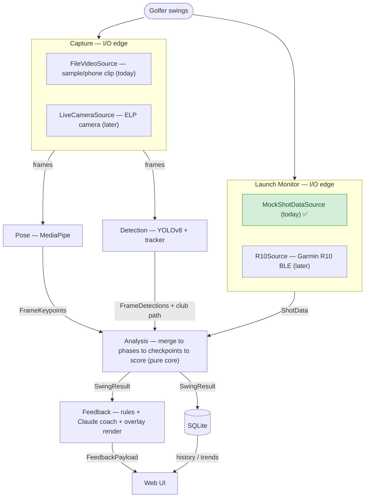
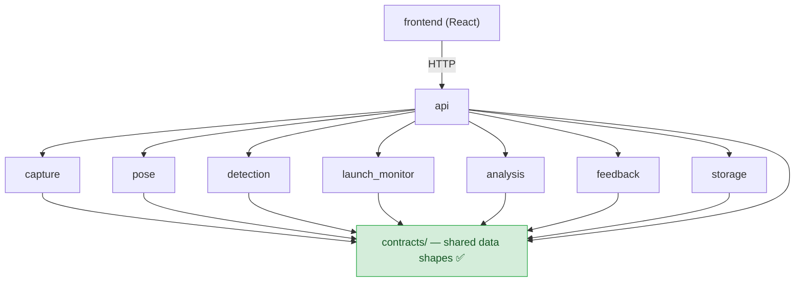
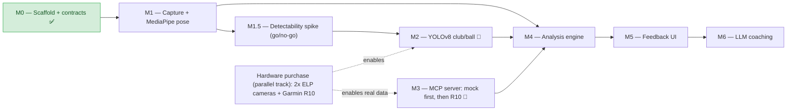
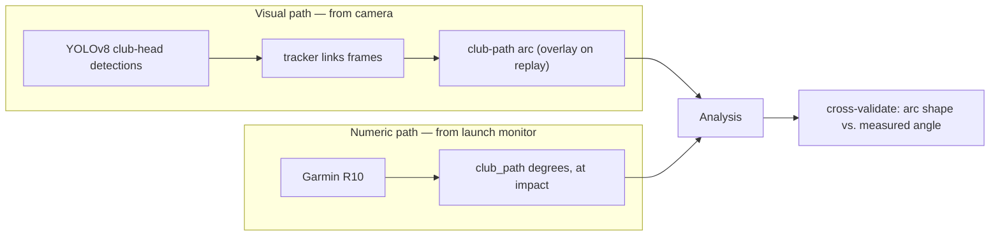

# Project Flow (PROPOSED)

> ⚠️ **PROPOSED FLOW — not yet built.** These diagrams describe the *intended* end-to-end
> design and build order as of **2026-06-20**, incorporating the decoupling decisions in
> ADR-007 and the structure in ADR-008. Today only the scaffolding + the `contracts/` seam
> + the `MockShotDataSource` actually exist (marked ✅ below); everything else is a stub
> (`NotImplementedError`). Treat this as the map, not the territory. Update it as milestones
> land and reality diverges from the plan.

This document complements [ARCHITECTURE.md](ARCHITECTURE.md), which holds the original
detailed component/sequence diagrams. This one focuses on the **runtime flow**, the
**decoupling seam**, and the **build order** as they stand after the latest decisions.

---

## 1. Runtime data flow — one swing through the pipeline (PROPOSED)

How data transforms from a swing to feedback. Each labeled arrow is a **contract** (a typed
data shape in `golf_coach.contracts`). Input sources are **swappable adapters** — mock today,
real hardware later — so the rest of the pipeline is identical either way.

**Reading it:** the two camera adapters (`File`/`Live`) and two launch-monitor adapters
(`Mock`/`R10`) are interchangeable behind their ports. Pose and Detection run in parallel
on the same frames. Analysis is the convergence point and the only place the streams meet.
✅ = exists today.

---

## 2. The decoupling seam — who depends on what (PROPOSED)

The rule that keeps modules independent: **everything depends on `contracts/`, and modules
never import each other.** The `api` module is the only orchestrator; the React `frontend`
talks to it over HTTP. No import cycles, ever (ADR-008).

**Why it matters:** because consumers depend on the contract (not the producer), you can
build `analysis` against *mock* `FrameKeypoints` before `pose` exists, and run the MCP
server against `MockShotDataSource` before buying the R10.

---

## 3. Build order & hardware gates (PROPOSED)

The milestone sequence from ROADMAP.md. 🔧 = needs hardware to *fully* complete; everything
else (most of the project) runs on sample video + simulated data. Hardware is purchased on
a **parallel track** so it arrives before the milestones that need it (ADR-007).

**Critical path note:** M3 starts *now* against mock `ShotData` and only the real-data
swap needs the R10. The only milestone truly blocked on hardware is M2 (sharp club-head
frames), and even its scaffolding/labeling workflow can be prepared earlier.

---

## 4. "Swing path" comes from two sources (PROPOSED)

A recurring point of confusion: the swing/club path is represented **two ways**, and they
cross-check each other (see ROADMAP M2/M3).

**MediaPipe's contribution:** the wrist landmarks give the *hand* path every frame, so when
the club-head detection drops out at impact (the hard zone), hand position + shaft angle can
help bridge the gap — that's the "fusion" fallback the M1.5 spike will evaluate.
