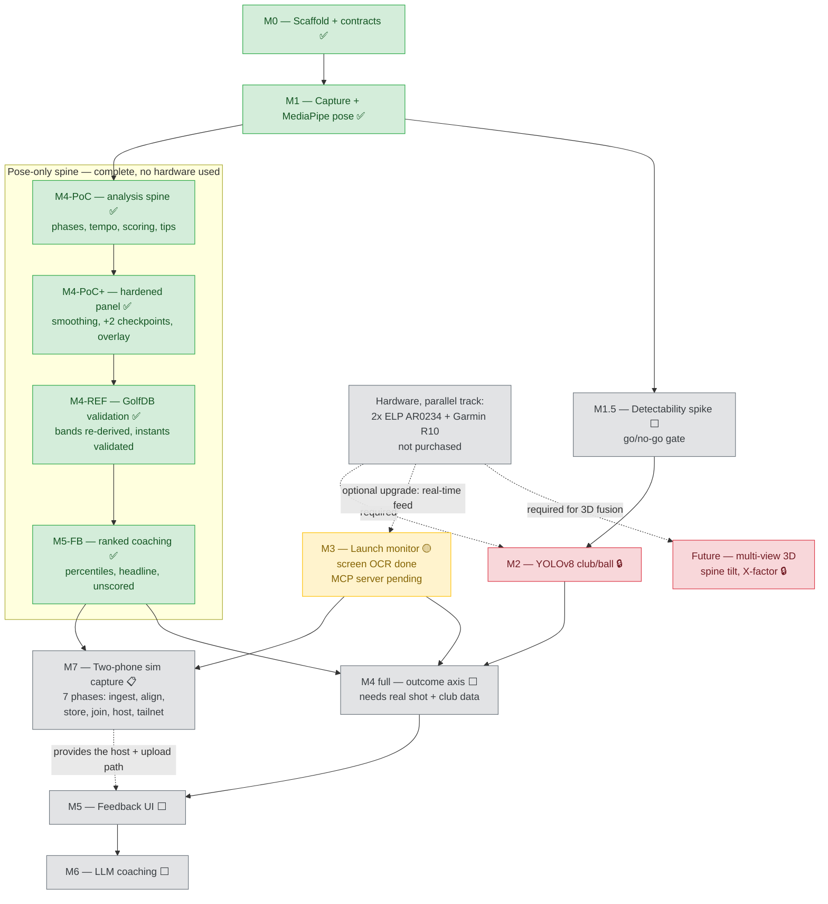
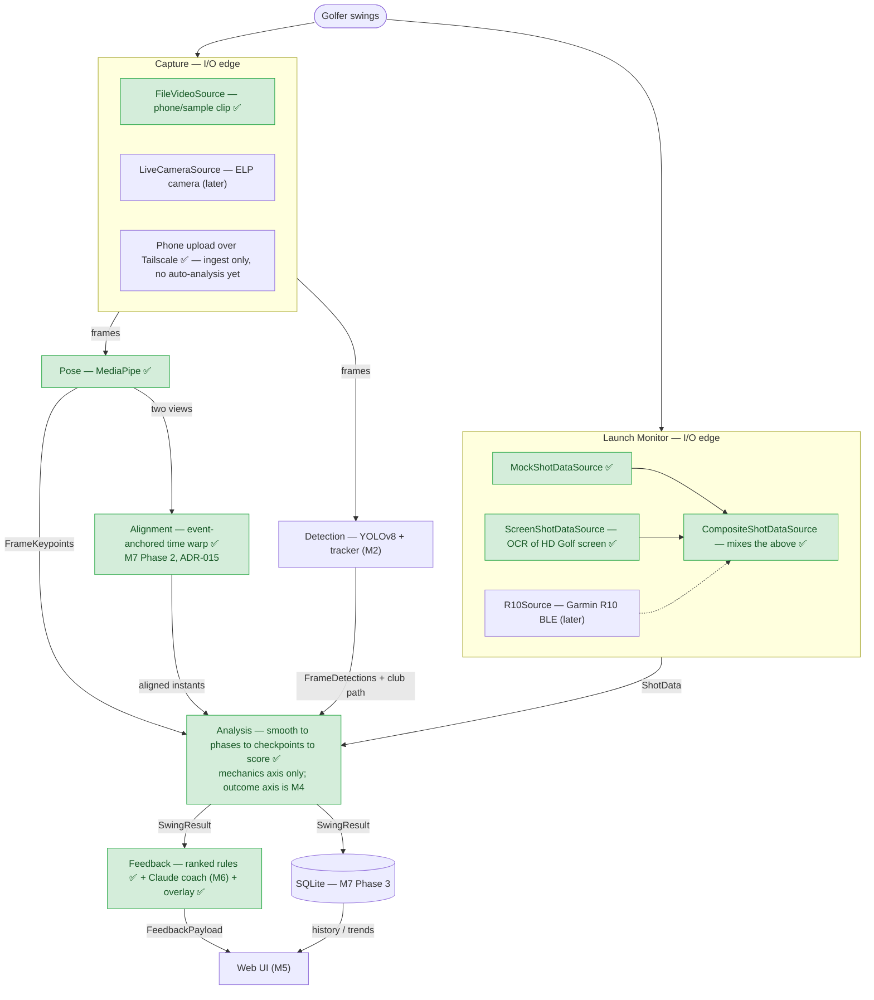
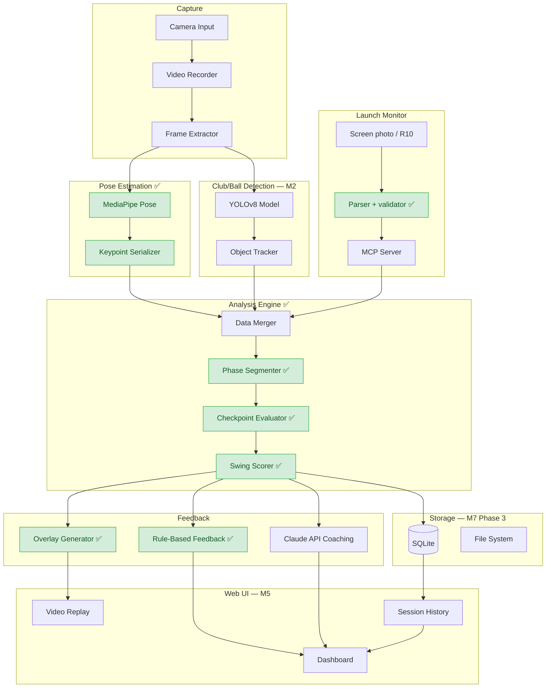
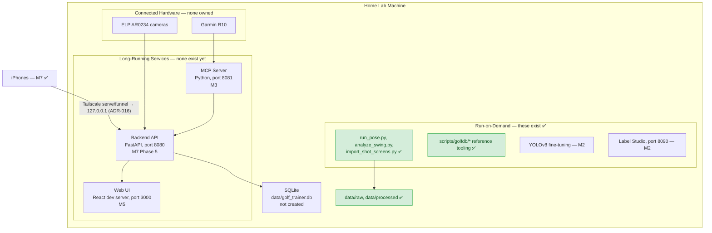
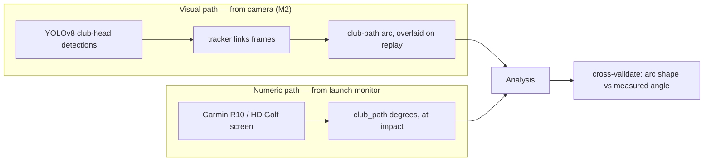

# Project Flow — the TARGET design and build order

> **Tier: TARGET / PROPOSED.** This document describes where the system is *going* — the full
> component picture, the deployment shape, and the milestone sequence. Much of it is not built.
> Last reviewed **2026-08-05**.
>
> For what actually runs today, see **[ARCHITECTURE.md](ARCHITECTURE.md)**. Rather than repeat
> a status claim in prose (which is how this file previously came to contradict its own
> diagram), **the ✅ markers in the diagrams below are the single source of truth for what
> exists.** If a marker and a sentence disagree, the marker is right and the sentence is a bug.

---

## 1. Milestone status map

Where the project is, what is blocked on what, and why. This replaces a build-order diagram
that predated five completed milestones.

```mermaid
flowchart TD
    M0["M0 — Scaffold + contracts ✅"] --> M1["M1 — Capture + MediaPipe pose ✅"]

    subgraph SPINE["Pose-only spine — complete, no hardware used"]
        M4P["M4-PoC — analysis spine ✅<br/>phases, tempo, scoring, tips"]
        M4PP["M4-PoC+ — hardened panel ✅<br/>smoothing, +2 checkpoints, overlay"]
        M4R["M4-REF — GolfDB validation ✅<br/>bands re-derived, instants validated"]
        M5F["M5-FB — ranked coaching ✅<br/>percentiles, headline, unscored"]
        M4P --> M4PP --> M4R --> M5F
    end

    M1 --> M4P

    M3["M3 — Launch monitor 🟡<br/>screen OCR done<br/>MCP server pending"]

    M15["M1.5 — Detectability spike ⬜<br/>go/no-go gate"]
    M2["M2 — YOLOv8 club/ball 🔒"]
    M1 --> M15 --> M2

    M7["M7 — Two-phone sim capture 📋<br/>7 phases: ingest, align,<br/>store, join, host, tailnet"]
    M5F --> M7
    M3 --> M7

    M4F["M4 full — outcome axis ⬜<br/>needs real shot + club data"]
    M2 --> M4F
    M3 --> M4F
    M5F --> M4F

    M5U["M5 — Feedback UI ⬜"]
    M6["M6 — LLM coaching ⬜"]
    M4F --> M5U --> M6
    M7 -.->|"provides the host + upload path"| M5U

    HW["Hardware, parallel track:<br/>2x ELP AR0234 + Garmin R10<br/>not purchased"]
    HW -.->|"required"| M2
    HW -.->|"optional upgrade: real-time feed"| M3
    HW -.->|"required for 3D fusion"| FUT["Future — multi-view 3D<br/>spine tilt, X-factor 🔒"]

    classDef done fill:#d4edda,stroke:#28a745,color:#155724;
    classDef wip fill:#fff3cd,stroke:#ffc107,color:#856404;
    classDef blocked fill:#f8d7da,stroke:#dc3545,color:#721c24;
    classDef planned fill:#e2e3e5,stroke:#6c757d,color:#383d41;
    class M0,M1,M4P,M4PP,M4R,M5F done;
    class M3 wip;
    class M2,FUT blocked;
    class M15,M4F,M5U,M6,M7,HW planned;
```

**Critical path note:** the only milestone truly blocked on a purchase is **M2** — sharp
club-head frames need a global-shutter camera plus a fast shutter and bright light (ADR-003
addendum). M3 stopped being hardware-blocked when shot data started coming from photos of the
HD Golf screen (ADR-014); an R10 would only upgrade that to a real-time feed. Everything in
the completed spine ran on phone video and a public reference corpus.

**Sequencing reality:** M1.5 is the oldest unstarted item in the project. It has been
deferrable precisely because the pose-only spine kept producing value without it — but M2, the
full M4 outcome axis, and every club-derived metric sit behind it.

---

## 2. Runtime data flow — one swing, target state

Each labeled arrow is a **contract** (a typed shape in `golf_coach.contracts`). Input sources
are **swappable adapters**, so the rest of the pipeline is identical whether the data came from
a phone clip or real hardware.

```mermaid
flowchart TD
    User([Golfer swings])

    subgraph CAP["Capture — I/O edge"]
        FSRC["FileVideoSource — phone/sample clip ✅"]
        CSRC["LiveCameraSource — ELP camera (later)"]
        UPL["Phone upload over Tailscale ✅ — ingest only, no auto-analysis yet"]
    end

    subgraph LM["Launch Monitor — I/O edge"]
        MOCK["MockShotDataSource ✅"]
        SCR["ScreenShotDataSource — OCR of HD Golf screen ✅"]
        R10["R10Source — Garmin R10 BLE (later)"]
        COMP["CompositeShotDataSource — mixes the above ✅"]
        MOCK --> COMP
        SCR --> COMP
        R10 -.-> COMP
    end

    POSE["Pose — MediaPipe ✅"]
    DET["Detection — YOLOv8 + tracker (M2)"]
    ALIGN["Alignment — event-anchored time warp ✅<br/>M7 Phase 2, ADR-015"]
    ANA["Analysis — smooth to phases to checkpoints to score ✅<br/>mechanics axis only; outcome axis is M4"]
    FB["Feedback — ranked rules ✅ + Claude coach (M6) + overlay ✅"]
    UI["Web UI (M5)"]
    DB[(SQLite — M7 Phase 3)]

    User --> CAP
    User --> LM
    CAP -->|frames| POSE
    CAP -->|frames| DET
    POSE -->|FrameKeypoints| ANA
    POSE -->|two views| ALIGN
    ALIGN -->|aligned instants| ANA
    DET -->|FrameDetections + club path| ANA
    LM -->|ShotData| ANA
    ANA -->|SwingResult| FB
    ANA -->|SwingResult| DB
    FB -->|FeedbackPayload| UI
    DB -->|history / trends| UI

    classDef built fill:#d4edda,stroke:#28a745,color:#155724;
    class FSRC,MOCK,SCR,COMP,POSE,ALIGN,ANA,FB built;
```

**Reading it:** Pose and Detection run in parallel on the same frames. Analysis is the
convergence point and the only place the streams meet — which is why it could be built,
validated and hardened while two of its three input streams did not exist. The `Composite`
adapter means it is *adapters*, plural: a session can mix screen-parsed and live shots without
any consumer knowing (ADR-014).

**The gap that matters most right now:** `ShotData` is produced and stored, but nothing sets
`SwingResult.shot`. The two streams above meet on paper and not yet in code (M7 Phase 4).

---

## 3. Component view — target

The fuller module breakdown, including the pieces not yet written.

```mermaid
graph TB
    subgraph Capture ["Capture"]
        CAM[Camera Input]
        VID[Video Recorder]
        FRAME[Frame Extractor]
    end
    subgraph Pose ["Pose Estimation ✅"]
        MP[MediaPipe Pose]
        KP[Keypoint Serializer]
    end
    subgraph Detection ["Club/Ball Detection — M2"]
        YOLO[YOLOv8 Model]
        TRACK[Object Tracker]
    end
    subgraph LaunchMonitor ["Launch Monitor"]
        LM_HW[Screen photo / R10]
        LM_PARSE["Parser + validator ✅"]
        MCP[MCP Server]
    end
    subgraph Analysis ["Analysis Engine ✅"]
        MERGE[Data Merger]
        PHASE["Phase Segmenter ✅"]
        CHECK["Checkpoint Evaluator ✅"]
        SCORE["Swing Scorer ✅"]
    end
    subgraph Feedback ["Feedback"]
        RULE["Rule-Based Feedback ✅"]
        LLM[Claude API Coaching]
        OVERLAY["Overlay Generator ✅"]
    end
    subgraph UI ["Web UI — M5"]
        DASH[Dashboard]
        REPLAY[Video Replay]
        HISTORY[Session History]
    end
    subgraph Storage ["Storage — M7 Phase 3"]
        DB[(SQLite)]
        FS[File System]
    end

    CAM --> VID --> FRAME
    FRAME --> MP --> KP
    FRAME --> YOLO --> TRACK
    LM_HW --> LM_PARSE --> MCP
    KP --> MERGE
    TRACK --> MERGE
    MCP --> MERGE
    MERGE --> PHASE --> CHECK --> SCORE
    SCORE --> RULE --> DASH
    SCORE --> LLM --> DASH
    SCORE --> OVERLAY --> REPLAY
    SCORE --> DB
    DB --> HISTORY --> DASH

    classDef built fill:#d4edda,stroke:#28a745,color:#155724;
    class MP,KP,LM_PARSE,PHASE,CHECK,SCORE,RULE,OVERLAY built;
```

Note `MERGE` — the data merger — is deliberately **not** built. Pose-only is one stream, so
there is nothing to align (YAGNI, per the M4-PoC guardrails). It becomes real when M2 or M3
delivers a second stream into analysis.

---

## 4. Deployment — target

```mermaid
graph TB
    subgraph HomeLab ["Home Lab Machine"]
        subgraph Services ["Long-Running Services — none exist yet"]
            MCP_SRV["MCP Server<br/>Python, port 8081<br/>M3"]
            API["Backend API<br/>FastAPI, port 8080<br/>M7 Phase 5"]
            WEB["Web UI<br/>React dev server, port 3000<br/>M5"]
        end
        subgraph Scripts ["Run-on-Demand — these exist ✅"]
            CLIS["run_pose.py, analyze_swing.py,<br/>import_shot_screens.py ✅"]
            RESEARCH["scripts/golfdb/* reference tooling ✅"]
            TRAIN["YOLOv8 fine-tuning — M2"]
            LABEL["Label Studio, port 8090 — M2"]
        end
        subgraph HW ["Connected Hardware — none owned"]
            CAM_HW["ELP AR0234 cameras"]
            LM_HW2["Garmin R10"]
        end
        DB_FILE["SQLite<br/>data/golf_trainer.db<br/>not created"]
        FILES["data/raw, data/processed ✅"]
    end

    PHONE["iPhones — M7 ✅"] -->|"Tailscale serve/funnel → 127.0.0.1 (ADR-016)"| API
    CAM_HW --> API
    LM_HW2 --> MCP_SRV
    MCP_SRV --> API
    API --> DB_FILE
    API --> WEB
    CLIS --> FILES

    classDef built fill:#d4edda,stroke:#28a745,color:#155724;
    class CLIS,RESEARCH,FILES built;
```

Ports are configured in `src/golf_coach/config.py` (`api_port` 8080, `mcp_port` 8081) but
nothing binds them yet. **There is no startup sequence** — see
[ARCHITECTURE.md](ARCHITECTURE.md) §1 for the CLI commands that do exist.

### Timing expectations — estimates, never measured

| Step | Estimated |
|------|-----------|
| Video capture | 2-4 s (swing duration) |
| Pose estimation | 1-3 s (frame count + GPU dependent) |
| Club detection | 1-2 s |
| Analysis | <0.5 s |
| Rule-based feedback | <0.1 s |
| LLM coaching call | 2-5 s |
| **Total latency target** | **~5-15 s swing to feedback** |

These are the original 2026-03-16 planning estimates and **nothing here has been benchmarked**.
Treat the 15-second charter criterion as an untested target.

---

## 5. The decoupling seam — why this order was possible

**Everything depends on `contracts/`, and modules never import each other.** The `api` module
is the intended orchestrator (today `scripts/` fills that role); the React `frontend` talks to
it over HTTP. No import cycles, ever (ADR-008).

The as-built version of this graph, marking which modules are real, is in
[ARCHITECTURE.md](ARCHITECTURE.md) §2.

**Why it matters, concretely:** the analysis engine was built, validated against 461 tour
swings, and hardened across four iterations while club detection and the launch monitor *did
not exist*. Consumers depend on the contract, not the producer. It is also what let a shot
source nobody had planned for — OCR of a simulator screen (ADR-014) — arrive as one new adapter
rather than a rewrite.

---

## 6. "Swing path" comes from two sources

A recurring point of confusion: the swing/club path is represented **two ways**, and they
cross-check each other. Neither exists yet — both are gated on M2 / hardware.

```mermaid
flowchart LR
    subgraph Visual["Visual path — from camera (M2)"]
        Y["YOLOv8 club-head detections"] --> T["tracker links frames"] --> ARC["club-path arc, overlaid on replay"]
    end
    subgraph Numeric["Numeric path — from launch monitor"]
        R["Garmin R10 / HD Golf screen"] --> CP["club_path degrees, at impact"]
    end
    ARC --> ANA["Analysis"]
    CP --> ANA
    ANA --> X["cross-validate: arc shape vs measured angle"]
```

**MediaPipe's contribution:** the wrist landmarks give the *hand* path every frame, so when the
club-head detection drops out at impact (the hard zone), hand position + shaft angle can help
bridge the gap — the "fusion" fallback the M1.5 spike will evaluate.

Note that `club_path` is already being parsed today from the HD Golf screen, so the numeric
half of this cross-check is available before M2 lands.
