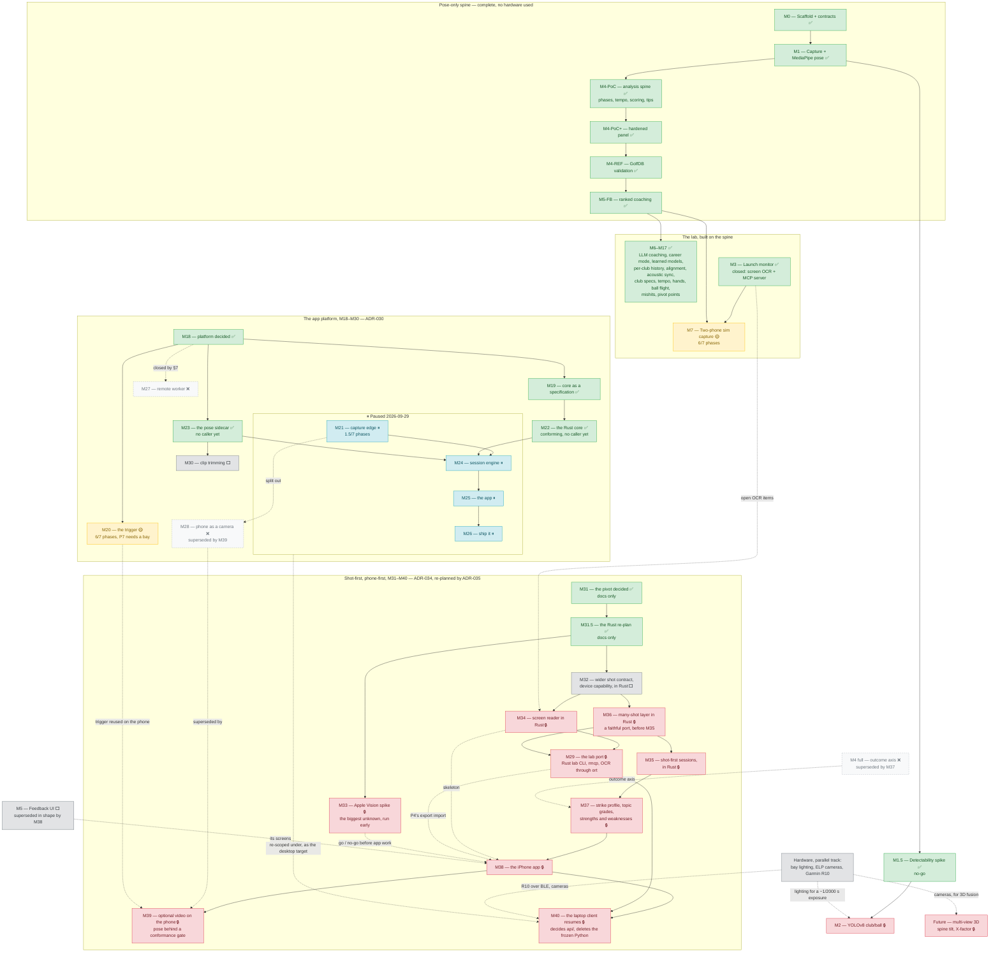
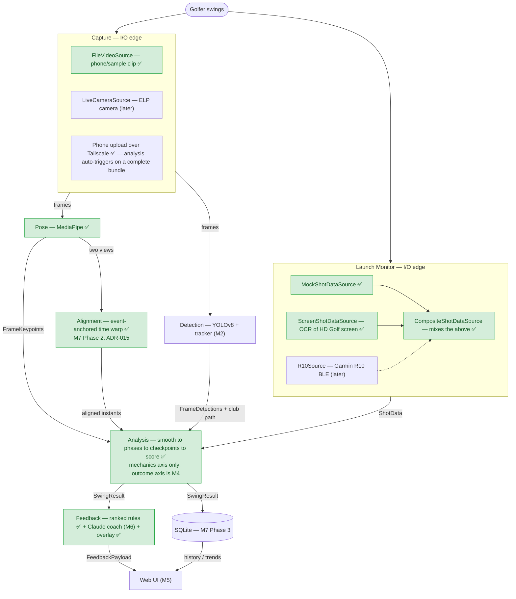
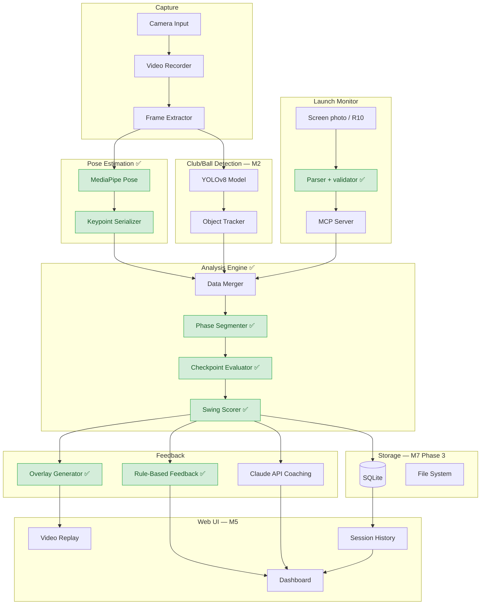
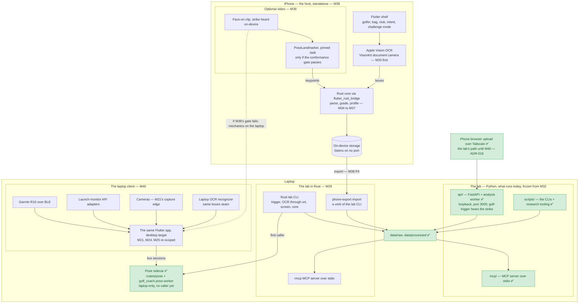
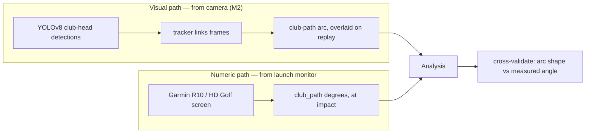

# Project Flow — the TARGET design and build order

> **Tier: TARGET / PROPOSED.** This document describes where the system is *going* — the full
> component picture, the deployment shape, and the milestone sequence. Much of it is not built.
> Last reviewed **2026-09-30**, after the pivot of 2026-09-29
> ([ADR-034](decisions/034-shot-first-phone-first.md)) and the Rust re-plan of 2026-09-30
> ([ADR-035](decisions/035-rust-everywhere-python-where-required.md)): §1 and §4 are redrawn for both, and §2
> and §3 are still the pre-pivot target and say so.
>
> For what actually runs today, see **[ARCHITECTURE.md](ARCHITECTURE.md)**. Rather than repeat
> a status claim in prose (which is how this file previously came to contradict its own
> diagram), **the ✅ markers in the diagrams below are the single source of truth for what
> exists.** If a marker and a sentence disagree, the marker is right and the sentence is a bug.

---

## 1. Milestone status map

Where the project is, what is blocked on what, and why. Redrawn on 2026-09-30 for the pivot, so it
now runs to M40 in four groups: the pose-only spine, the lab built on it, the app platform ADR-030
planned, and the shot-first program that replaced part of that plan
([ADR-034](decisions/034-shot-first-phone-first.md)). That group's order is the Rust re-plan's
([ADR-035 §6](decisions/035-rust-everywhere-python-where-required.md#6-order-the-phone-path-first)):
M31.5 sits between M31 and M32, M36 comes before M35, and M29 is in the group as the lab port.
Solid arrows are dependencies. Dotted arrows
say where a paused, superseded or closed milestone went, or where one milestone's work is reused in
another.

```mermaid
flowchart TD
    subgraph SPINE["Pose-only spine — complete, no hardware used"]
        M0["M0 — Scaffold + contracts ✅"] --> M1["M1 — Capture + MediaPipe pose ✅"]
        M1 --> M4P["M4-PoC — analysis spine ✅<br/>phases, tempo, scoring, tips"]
        M4P --> M4PP["M4-PoC+ — hardened panel ✅"]
        M4PP --> M4R["M4-REF — GolfDB validation ✅"]
        M4R --> M5F["M5-FB — ranked coaching ✅"]
    end

    M15["M1.5 — Detectability spike ✅<br/>no-go"]
    M2["M2 — YOLOv8 club/ball 🔒"]
    M1 --> M15 --> M2

    subgraph LAB["The lab, built on the spine"]
        M3["M3 — Launch monitor ✅<br/>closed: screen OCR + MCP server"]
        M6["M6–M17 ✅<br/>LLM coaching, career mode, learned models,<br/>per-club history, alignment, acoustic sync,<br/>club specs, tempo, hands, ball flight,<br/>mishits, pivot points"]
        M7["M7 — Two-phone sim capture 🟡<br/>6/7 phases"]
        M3 --> M7
    end
    M5F --> M6
    M5F --> M7

    M4F["M4 full — outcome axis ❌<br/>superseded by M37"]
    M5U["M5 — Feedback UI ⬜<br/>superseded in shape by M38"]
    M5F ~~~ M4F
    M5F ~~~ M5U

    subgraph APP["The app platform, M18–M30 — ADR-030"]
        M18["M18 — platform decided ✅"]
        M19["M19 — core as a specification ✅"]
        M20["M20 — the trigger 🟡<br/>6/7 phases, P7 needs a bay"]
        M22["M22 — the Rust core ✅<br/>conforming, no caller yet"]
        M23["M23 — the pose sidecar ✅<br/>no caller yet"]
        M27["M27 — remote worker ❌"]
        M28["M28 — phone as a camera ❌<br/>superseded by M39"]
        M30["M30 — clip trimming ⬜"]
        subgraph PAUSED["⏸ Paused 2026-09-29"]
            M21["M21 — capture edge ⏸<br/>1.5/7 phases"]
            M24["M24 — session engine ⏸"]
            M25["M25 — the app ⏸"]
            M26["M26 — ship it ⏸"]
            M21 --> M24 --> M25 --> M26
        end
        M18 --> M19 --> M22
        M18 --> M20
        M18 --> M23
        M18 -.->|"closed by §7"| M27
        M21 -.->|"split out"| M28
        M22 --> M24
        M23 --> M24
        M23 --> M30
    end
    M6 ~~~ M18

    subgraph PIVOT["Shot-first, phone-first, M31–M40 — ADR-034, re-planned by ADR-035"]
        M31["M31 — the pivot decided ✅<br/>docs only"]
        M315["M31.5 — the Rust re-plan ✅<br/>docs only"]
        M32["M32 — wider shot contract,<br/>device capability, in Rust ⬜"]
        M33["M33 — Apple Vision spike 🔒<br/>the biggest unknown, run early"]
        M34["M34 — screen reader in Rust 🔒"]
        M35["M35 — shot-first sessions,<br/>in Rust 🔒"]
        M36["M36 — many-shot layer in Rust 🔒<br/>a faithful port, before M35"]
        M37["M37 — strike profile, topic grades,<br/>strengths and weaknesses 🔒"]
        M38["M38 — the iPhone app 🔒"]
        M39["M39 — optional video on the phone 🔒<br/>pose behind a conformance gate"]
        M29["M29 — the lab port 🔒<br/>Rust lab CLI, rmcp, OCR through ort"]
        M40["M40 — the laptop client resumes 🔒<br/>decides api/, deletes the frozen Python"]
        M31 --> M315
        M315 --> M32
        M315 --> M33
        M32 --> M34
        M32 --> M36 --> M35 --> M37 --> M38 --> M39
        M34 --> M29
        M36 --> M29
        M34 -.->|"skeleton"| M38
        M29 -.->|"P4's export import"| M38
        M33 -.->|"go / no-go before app work"| M38
        M38 --> M40
        M29 --> M40
    end
    M26 ~~~ M31

    PAUSED -.->|"re-scoped under, as the desktop target"| M40
    M3 -.->|"open OCR items"| M34
    M4F -.->|"outcome axis"| M37
    M5U -.->|"its screens"| M38
    M28 -.->|"superseded by"| M39
    M20 -.->|"trigger reused on the phone"| M39

    HW["Hardware, parallel track:<br/>bay lighting, ELP cameras, Garmin R10"]
    HW -.->|"lighting for a ~1/2000 s exposure"| M2
    HW -.->|"R10 over BLE, cameras"| M40
    HW -.->|"cameras, for 3D fusion"| FUT["Future — multi-view 3D<br/>spine tilt, X-factor 🔒"]

    classDef done fill:#d4edda,stroke:#28a745,color:#155724;
    classDef wip fill:#fff3cd,stroke:#ffc107,color:#856404;
    classDef paused fill:#d1ecf1,stroke:#17a2b8,color:#0c5460;
    classDef blocked fill:#f8d7da,stroke:#dc3545,color:#721c24;
    classDef planned fill:#e2e3e5,stroke:#6c757d,color:#383d41;
    classDef retired fill:#f8f9fa,stroke:#adb5bd,color:#6c757d,stroke-dasharray:4 3;
    class M0,M1,M4P,M4PP,M4R,M5F,M3,M6,M15,M18,M19,M22,M23,M31,M315 done;
    class M7,M20 wip;
    class M21,M24,M25,M26 paused;
    class M2,M29,M33,M34,M35,M36,M37,M38,M39,M40,FUT blocked;
    class M5U,M30,M32,HW planned;
    class M4F,M27,M28 retired;
```

**Critical path, since the re-plan of 2026-09-30:** M31 → M31.5 → M32 → M36 → M35 → M37 → M38.
M32 is the first to write code, and it writes Rust only. M36 comes before M35 because M35 changes
what M36 ports
([ADR-035 §6](decisions/035-rust-everywhere-python-where-required.md#6-order-the-phone-path-first)).
**M33 runs early on purpose**: whether Apple Vision can read the HD Golf screen is the product's
biggest unknown, and if it cannot, the program plan changes before any app work starts. M38's
skeleton needs only M34, so it can start in parallel with M36, M35, M37 and M29; its profile
screens need M37, and its P4 export import needs M29, which needs M34 and M36. The program plan's
[status checklist](plans/m31-m40-shot-first-pivot.md#status-checklist) carries the same edges.

**What the pivot paused, and what it left built.** M21, M24, M25 and M26 are paused under M40, as
the desktop target of the same app. M22's core and M23's sidecar stay built and callerless. M28 is
superseded by M39, M4 full by M37 for the outcome axis, and M5's screens are M38's.
[ADR-034's Consequences](decisions/034-shot-first-phone-first.md#consequences) is the full list.

**What the re-plan moved.** M29 no longer waits on M40:
[ADR-035 §5](decisions/035-rust-everywhere-python-where-required.md#5-the-lab-port-is-m29-re-scoped)
re-scoped it from "the last Python" to the port of the lab, after M34 and M36. From M32 the Python
lab is frozen, and M40 decides `api/` and deletes the frozen Python. So the core's first callers
are now the phone (M38) and M29's Rust lab CLI, and
the sidecar's is that lab CLI rather than M40's desktop app, because the phone has no Python
([ADR-033's M31.5 addendum](decisions/033-the-pose-sidecar-protocol.md#addendum-2026-09-30--the-python-writer-outlives-m29-the-lab-cli-is-the-first-caller-and-the-protocol-is-unchanged)).
[ADR-035's Consequences](decisions/035-rust-everywhere-python-where-required.md#consequences)
and the program plan's
[re-plan section](plans/m31-m40-shot-first-pivot.md#re-planned-by-m315-2026-09-30) are the full
list.

**Hardware.** The only milestone gated on new hardware is **M2**, and M1.5 said no-go on
2026-08-14: sharp club-head frames need bay lighting for a ~1/2000 s exposure, not a
global-shutter camera ([ADR-018](decisions/018-bay-lighting.md)). The R10 and the cameras are M40's
now. Otherwise the pivot needs this box, a Mac (M33, M38, M39) and the bay, all of which the golfer
already has.

---

## 2. Runtime data flow — one swing, target state

> **Pre-pivot** *(banner added 2026-09-30)*. This is one swing through the lab's pipeline, as the
> target stood before [ADR-034](decisions/034-shot-first-phone-first.md) made the shot the unit. It
> is kept rather than redrawn: the shot-first flow (a screen photo read on the phone, counted or not
> by its intent, graded per topic at club and player level) is drawn here when M35 and M37 land and
> there is a flow to draw. Its ✅ markers still describe the lab. Two of its unbuilt boxes have
> moved: the web UI (M5) is now M38's app screens, and storage was built as files by M7 Phase 3
> (`storage/bundle_store.py`), not as SQLite.

Each labeled arrow is a **contract** (a typed shape in `golf_coach.contracts`). Input sources
are **swappable adapters**, so the rest of the pipeline is identical whether the data came from
a phone clip or real hardware.

```mermaid
flowchart TD
    User([Golfer swings])

    subgraph CAP["Capture — I/O edge"]
        FSRC["FileVideoSource — phone/sample clip ✅"]
        CSRC["LiveCameraSource — ELP camera (later)"]
        UPL["Phone upload over Tailscale ✅ — analysis auto-triggers on a complete bundle"]
    end

    subgraph LM["Launch Monitor — I/O edge"]
        MOCK["MockShotDataSource ✅"]
        SCR["ScreenShotDataSource — OCR of HD Golf screen ✅"]
        R10["R10Source — Garmin R10 BLE (later)"]
        COMP["CompositeShotDataSource — mixes the above ✅"]
        MOCK --> COMP
        SCR --> COMP
        R10 -.-> COMP
    end

    POSE["Pose — MediaPipe ✅"]
    DET["Detection — YOLOv8 + tracker (M2)"]
    ALIGN["Alignment — event-anchored time warp ✅<br/>M7 Phase 2, ADR-015"]
    ANA["Analysis — smooth to phases to checkpoints to score ✅<br/>mechanics axis only; outcome axis is M4"]
    FB["Feedback — ranked rules ✅ + Claude coach (M6) + overlay ✅"]
    UI["Web UI (M5)"]
    DB[(SQLite — M7 Phase 3)]

    User --> CAP
    User --> LM
    CAP -->|frames| POSE
    CAP -->|frames| DET
    POSE -->|FrameKeypoints| ANA
    POSE -->|two views| ALIGN
    ALIGN -->|aligned instants| ANA
    DET -->|FrameDetections + club path| ANA
    LM -->|ShotData| ANA
    ANA -->|SwingResult| FB
    ANA -->|SwingResult| DB
    FB -->|FeedbackPayload| UI
    DB -->|history / trends| UI

    classDef built fill:#d4edda,stroke:#28a745,color:#155724;
    class FSRC,MOCK,SCR,COMP,POSE,ALIGN,ANA,FB built;
```

**Reading it:** Pose and Detection run in parallel on the same frames. Analysis is the
convergence point and the only place the streams meet — which is why it could be built,
validated and hardened while two of its three input streams did not exist. The `Composite`
adapter means it is *adapters*, plural: a session can mix screen-parsed and live shots without
any consumer knowing (ADR-014).

**That gap closed in M7 Phase 4.** `analyze_swing_bundle` sets `SwingResult.shot`, joining the
two streams in code: the shot is found by the photo's sha256 — the identity the manifest and the
shot store already share — so an already-parsed shot attaches with no OCR extra installed. It is
**attached and displayed, not scored**; the `outcome` axis still waits on per-club benchmark
bands (ADR-009).

**That gap is now closed** (M7 Phase 5). The third role landing marks a swing complete, and
`api/worker.py` runs the pipeline on it off the event loop; `api/static/results.html` renders
the result. `analyze_bundle.py` still exists and still works — it is now a CLI over the same
`api/pipeline.py` the worker calls, not a second implementation.

**The gap that mattered most here — the tempo checkpoint reading 0.43:1 on real footage and the
ranked tips leading with a confident, wrong "work on tempo first" — was fixed on 2026-08-09.** The
cause was not tempo: a hover at the top fragmented the descent in `_rising_runs` and put the
detected top ten frames late. See `phases._DRAWDOWN_FLOOR` and the WORKLOG entry. What remains is
narrower: down-the-line's `motion_start` still reads late, so two-view alignment sits at the
`top_impact` tier rather than `full`. See the ROADMAP item.

**There is now a second consumer of the same stored results** (M3, 2026-08-10): the MCP server in
`src/golf_coach/mcp/` reads `analysis.json`, the `analysis.state.json` sidecar and the parsed-shot
store, and exposes them to Claude as five tools. It adds no stage to the pipeline above — it is a
read side, and it deliberately reshapes rather than passes through, because the three things this
repo knows to be provisional (`needs_review` on an OCR'd shot, the alignment tier, `unscored`
checkpoint names) all become confident falsehoods if an LLM receives them unlabelled.

---

## 3. Component view — target

> **Pre-pivot** *(banner added 2026-09-30)*, like §2, and redrawn when M35 and M37 land. One arrow
> is wrong rather than old: `MCP --> MERGE`. Shot data never reached the engine through the MCP
> server. The join was built another way: the swing directory's shot-screen role, then
> `api/pipeline.py::_shot_for` reading the shot store by the photo's hash. The MCP server reads the
> engine's output rather than feeding it ([ROADMAP §M3](../ROADMAP.md#milestone-3-launch-monitor-integration--in-progress)).
> So the "Data Merger" the note below the diagram waits for has only the detection stream left to
> merge, and that is parked with M2.

The fuller module breakdown, including the pieces not yet written.

```mermaid
graph TB
    subgraph Capture ["Capture"]
        CAM[Camera Input]
        VID[Video Recorder]
        FRAME[Frame Extractor]
    end
    subgraph Pose ["Pose Estimation ✅"]
        MP[MediaPipe Pose]
        KP[Keypoint Serializer]
    end
    subgraph Detection ["Club/Ball Detection — M2"]
        YOLO[YOLOv8 Model]
        TRACK[Object Tracker]
    end
    subgraph LaunchMonitor ["Launch Monitor"]
        LM_HW[Screen photo / R10]
        LM_PARSE["Parser + validator ✅"]
        MCP[MCP Server]
    end
    subgraph Analysis ["Analysis Engine ✅"]
        MERGE[Data Merger]
        PHASE["Phase Segmenter ✅"]
        CHECK["Checkpoint Evaluator ✅"]
        SCORE["Swing Scorer ✅"]
    end
    subgraph Feedback ["Feedback"]
        RULE["Rule-Based Feedback ✅"]
        LLM[Claude API Coaching]
        OVERLAY["Overlay Generator ✅"]
    end
    subgraph UI ["Web UI — M5"]
        DASH[Dashboard]
        REPLAY[Video Replay]
        HISTORY[Session History]
    end
    subgraph Storage ["Storage — M7 Phase 3"]
        DB[(SQLite)]
        FS[File System]
    end

    CAM --> VID --> FRAME
    FRAME --> MP --> KP
    FRAME --> YOLO --> TRACK
    LM_HW --> LM_PARSE --> MCP
    KP --> MERGE
    TRACK --> MERGE
    MCP --> MERGE
    MERGE --> PHASE --> CHECK --> SCORE
    SCORE --> RULE --> DASH
    SCORE --> LLM --> DASH
    SCORE --> OVERLAY --> REPLAY
    SCORE --> DB
    DB --> HISTORY --> DASH

    classDef built fill:#d4edda,stroke:#28a745,color:#155724;
    class MP,KP,LM_PARSE,PHASE,CHECK,SCORE,RULE,OVERLAY built;
```

Note `MERGE` — the data merger — is deliberately **not** built. Pose-only is one stream, so
there is nothing to align (YAGNI, per the M4-PoC guardrails). It becomes real when M2 or M3
delivers a second stream into analysis.

---

## 4. Deployment — target

Redrawn on 2026-09-30 for the pivot. The phone is the host
([ADR-034 §6](decisions/034-shot-first-phone-first.md#6-the-phone-is-the-host)). The laptop keeps
the Python lab that runs today, frozen from M32, and §M29 ports it to Rust
([ADR-035 §5](decisions/035-rust-everywhere-python-where-required.md#5-the-lab-port-is-m29-re-scoped)).
In M40 the laptop gains a client of its own and the frozen Python is deleted. As everywhere in this
file, ✅ marks what exists, and nothing on the phone does yet.

```mermaid
graph TB
    subgraph IPHONE["iPhone — the host, standalone — M38"]
        SHELL["Flutter shell<br/>golfer, bag, club, intent, challenge mode"]
        VISION["Apple Vision OCR<br/>VisionKit document camera — M33 first"]
        CORE["Rust core via flutter_rust_bridge<br/>parse, grade, profile — M34 to M37"]
        STORE[("On-device storage<br/>listens on no port")]
        subgraph OPTIONAL["Optional video — M39"]
            CLIP["Face-on clip, strike heard on-device"]
            POSE_IOS["PoseLandmarker, pinned .task<br/>only if the conformance gate passes"]
        end
        SHELL --> VISION -->|"boxes"| CORE
        CORE --> STORE
        CLIP --> POSE_IOS -->|"keypoints"| CORE
    end

    subgraph LAPTOP["Laptop"]
        subgraph LABPY["The lab — Python, what runs today, frozen from M32"]
            API["api/ — FastAPI + analysis worker ✅<br/>loopback, port 3000; golf-trigger hears the strike"]
            MCP_SRV["mcp/ — MCP server over stdio ✅"]
            CLIS["scripts/ — the CLIs + research tooling ✅"]
        end
        FILES["data/raw, data/processed ✅"]
        subgraph LABRS["The lab in Rust — M29"]
            LABCLI["Rust lab CLI<br/>trigger, OCR through ort, screen, core"]
            IMPORT["phone-export import<br/>a verb of the lab CLI"]
            RMCP["rmcp MCP server over stdio"]
        end
        API --> FILES
        CLIS --> FILES
        FILES --> MCP_SRV
        LABCLI --> FILES
        IMPORT --> FILES
        FILES --> RMCP
        SIDECAR["Pose sidecar ✅<br/>crates/pose + golf_coach.pose.worker<br/>laptop-only, no caller yet"]
        subgraph CLIENT["The laptop client — M40"]
            DESK["The same Flutter app, desktop target<br/>M21, M24, M25 re-scoped"]
            R10["Garmin R10 over BLE"]
            LMAPI["Launch-monitor API adapters"]
            CAMS["Cameras — M21's capture edge"]
            LOCR["Laptop OCR recognizer<br/>same boxes seam"]
            R10 --> DESK
            LMAPI --> DESK
            CAMS --> DESK
            LOCR --> DESK
        end
        LABCLI -->|"first caller"| SIDECAR
        DESK -->|"live sessions"| SIDECAR
    end

    BROWSER["Phone browser upload over Tailscale ✅<br/>the lab's path until M40 — ADR-016"]

    STORE -->|"export — M38 P4"| IMPORT
    BROWSER --> API
    CLIP -.->|"if M39's gate fails: mechanics on the laptop"| DESK

    classDef built fill:#d4edda,stroke:#28a745,color:#155724;
    class API,MCP_SRV,CLIS,FILES,SIDECAR,BROWSER built;
```

**The phone listens on nothing.** Storage is on the device, a session completes with no network at
all, and export (M38 P4) is how data leaves it. The lab imports it with a verb of M29's Rust lab
CLI, which M38 P4 waits on, and how the file travels is M38 P4's to settle
([ADR-016's M31 addendum](decisions/016-local-first-host-and-phone-upload-topology.md#addendum-2026-09-30-m31-the-phone-is-the-host-and-listens-on-nothing-and-this-topology-is-the-labs),
and [its M31.5 one](decisions/016-local-first-host-and-phone-upload-topology.md#addendum-2026-09-30-m315-m40-not-m29-decides-api-and-the-phone-export-is-a-verb-of-the-rust-lab)).
The same Rust crates run on both targets; iOS builds happen on a Mac, and everything else on the
Windows box. The phone makes no LLM call
([clause 10](decisions/034-shot-first-phone-first.md#10-no-llm-coaching-on-the-phone)), so the
API key never leaves the laptop.

**The lab is what runs today. It is frozen from M32, §M29 ports it to Rust, and M40 deletes what
is left** ([ADR-035 §4–§5](decisions/035-rust-everywhere-python-where-required.md#4-the-frozen-python-lab)).
Ports are configured in
`src/golf_coach/config.py`: `api_port` **3000** (8080 is unusable on this machine, see the note in
`config.py`) and `mcp_port` 8081, which binds nothing, because the MCP server speaks stdio
(`scripts/run_mcp_server.py`). The startup sequence is one command, `python scripts/run_server.py`.
The phone-browser upload over Tailscale stays the lab's path until M40 says otherwise, and whether
it stays open once §M29 has landed is §M29's to decide. See
[ARCHITECTURE.md](ARCHITECTURE.md) §1 for the CLI commands.

**The laptop client is M40's**: the same Flutter app as a desktop target, with a launch monitor
wired in, launch-monitor APIs, and the cameras M21 and M24 were building. It calls the pose sidecar
for live sessions, though M29's lab CLI is the sidecar's first caller
([ADR-033's M31.5 addendum](decisions/033-the-pose-sidecar-protocol.md#addendum-2026-09-30--the-python-writer-outlives-m29-the-lab-cli-is-the-first-caller-and-the-protocol-is-unchanged)),
and if M39's gate fails, it is also where a phone clip's mechanics are computed
([ADR-034 §8](decisions/034-shot-first-phone-first.md#8-pose-on-the-phone-is-reopened-behind-a-conformance-gate)).
M40 also decides `api/`, porting it to `axum` or dropping it, and deletes the frozen Python,
`analysis/` included. `mcp/` will already have ported to Rust in §M29
([ADR-035 §5](decisions/035-rust-everywhere-python-where-required.md#5-the-lab-port-is-m29-re-scoped)).

### Timing expectations — estimates, never measured

| Step | Estimated |
|------|-----------|
| Video capture | 2-4 s (swing duration) |
| Pose estimation | 1-3 s (frame count + GPU dependent) |
| Club detection | 1-2 s |
| Analysis | <0.5 s |
| Rule-based feedback | <0.1 s |
| LLM coaching call | 2-5 s |
| **Total latency target** | **~5-15 s swing to feedback** |

These are the original 2026-03-16 planning estimates and **nothing here has been benchmarked**.
Treat the 15-second charter criterion as an untested target.

---

## 5. The decoupling seam — why this order was possible

**Everything depends on `contracts/`, and modules never import each other.** The `api` module
is the intended orchestrator (today `scripts/` fills that role); the React `frontend` talks to
it over HTTP. No import cycles, ever (ADR-008).

The as-built version of this graph, marking which modules are real, is in
[ARCHITECTURE.md](ARCHITECTURE.md) §2.

**Why it matters, concretely:** the analysis engine was built, validated against 461 tour
swings, and hardened across four iterations while club detection and the launch monitor *did
not exist*. Consumers depend on the contract, not the producer. It is also what let a shot
source nobody had planned for — OCR of a simulator screen (ADR-014) — arrive as one new adapter
rather than a rewrite.

---

## 6. "Swing path" comes from two sources

A recurring point of confusion: the swing/club path is represented **two ways**, and they
cross-check each other. Neither exists yet — both are gated on M2 / hardware.

```mermaid
flowchart LR
    subgraph Visual["Visual path — from camera (M2)"]
        Y["YOLOv8 club-head detections"] --> T["tracker links frames"] --> ARC["club-path arc, overlaid on replay"]
    end
    subgraph Numeric["Numeric path — from launch monitor"]
        R["Garmin R10 / HD Golf screen"] --> CP["club_path degrees, at impact"]
    end
    ARC --> ANA["Analysis"]
    CP --> ANA
    ANA --> X["cross-validate: arc shape vs measured angle"]
```

**MediaPipe's contribution:** the wrist landmarks give the *hand* path every frame, so when the
club-head detection drops out at impact (the hard zone), hand position + shaft angle can help
bridge the gap — the "fusion" fallback the M1.5 spike will evaluate.

Note that `club_path` is already being parsed today from the HD Golf screen, so the numeric
half of this cross-check is available before M2 lands.
