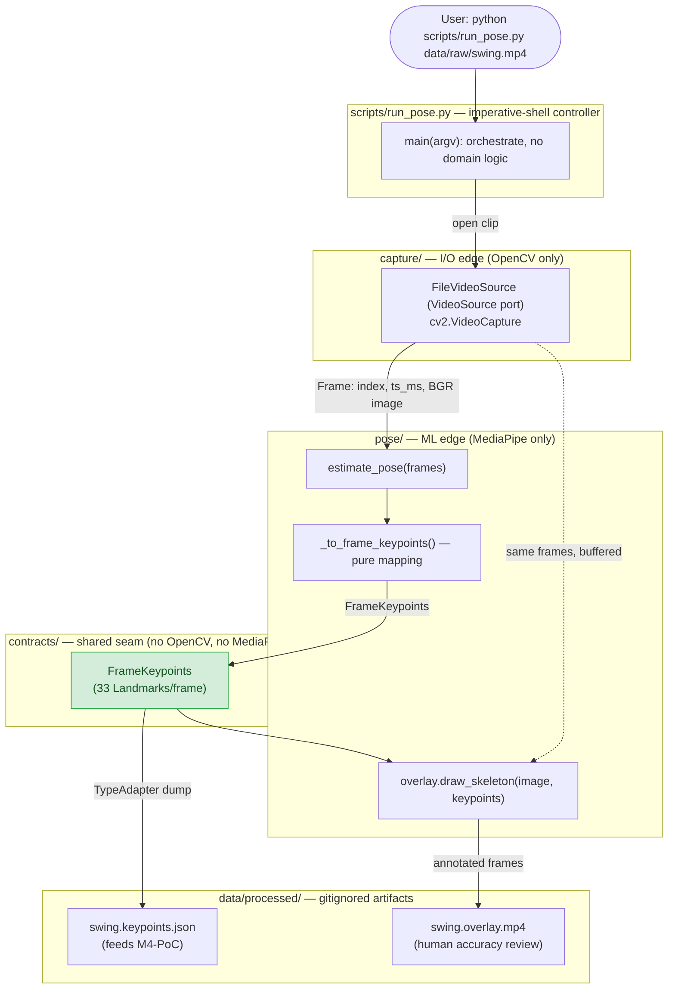
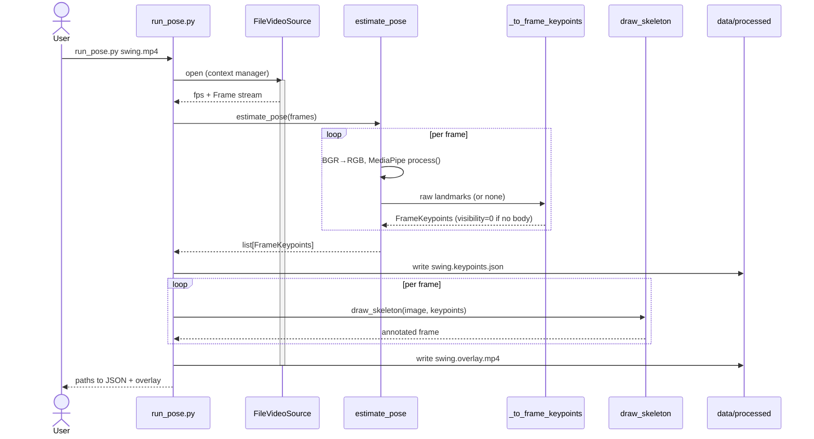

# M1: Capture & Skeleton — Feature Flow (PROPOSED)

> ✅ **Implemented & verified (2026-06-28).** The M1 pipeline below is built and runs
> end-to-end: `capture/file.py`, `pose/estimator.py`, `pose/overlay.py`, and
> `scripts/run_pose.py` all exist. See [Pose model (reference)](#pose-model-reference) for
> exactly what model we use and where it comes from, and
> [M1 findings](#m1-findings-accuracy-review-2026-06-28) for the first real-clip review.

## Why this milestone exists
M1 is the first milestone with real, running code. Its job is to prove that a consumer
camera + MediaPipe can track a golf-swing skeleton, and — just as importantly — to
**produce `FrameKeypoints`**, the contract every downstream milestone consumes. The M4-PoC
tempo analysis ([ADR-009](decisions/009-swing-scoring-model.md)) cannot start until this
stream exists. No hardware is required: we bootstrap on a phone/sample clip
([ADR-007](decisions/007-decouple-software-from-hardware.md)).

This milestone fills in adapters behind interfaces the scaffolding already defines — it is
not new architecture:
- `VideoSource` Protocol + `Frame` dataclass — `src/golf_coach/capture/source.py`
- `FrameKeypoints` / `Landmark` / `PoseLandmark` contracts — `src/golf_coach/contracts/keypoints.py`
- `estimate_pose(frames) -> list[FrameKeypoints]` fixed signature — `src/golf_coach/pose/estimator.py`
- Reference adapter pattern — `MockShotDataSource` in `src/golf_coach/launch_monitor/mock.py`
- `vision` extra (numpy, opencv, mediapipe) — already declared in `pyproject.toml`

## Goal
`python scripts/run_pose.py data/raw/<swing>.mp4` →
1. reads the clip frame-by-frame,
2. runs MediaPipe Pose to get 33 landmarks/frame,
3. writes `FrameKeypoints` to `data/processed/<name>.keypoints.json`, and
4. renders a skeleton-overlay `data/processed/<name>.overlay.mp4` for accuracy review.

**Exit criteria** (ROADMAP M1): the overlay tracks the body through address →
follow-through.

---

## Feature flow

### 1. Data flow — how a clip moves through the program
Each labeled arrow crossing a module boundary is a typed shape. `Frame` is an internal
I/O-edge type (carries raw pixels, deliberately kept out of `contracts/`); `FrameKeypoints`
is the cross-module **contract** every downstream milestone consumes.

### 2. Runtime sequence — one clip

**Reading it:** the controller only wires things together; `capture/` knows OpenCV but not
MediaPipe, `pose/` knows MediaPipe but not files, and both meet only at the `FrameKeypoints`
contract. Swapping in `LiveCameraSource` later (real camera) changes nothing upstream of the
contract — the same `estimate_pose` and outputs apply.

---

## Design — applied SWE / GRASP (without over-engineering)
- **Ports & adapters / Low coupling:** `FileVideoSource` is one more adapter behind the
  existing `VideoSource` port. OpenCV stays inside `capture/`; MediaPipe stays inside
  `pose/`. `contracts/` imports neither (pixels and ML are I/O-edge details, per ADR-008).
- **Information Expert + Creator:** `FileVideoSource` owns the video handle, so it *creates*
  `Frame`s and is the source of timing truth (`timestamp_ms` from frame index / fps).
  `estimate_pose` consumes `Frame`s and produces `FrameKeypoints` — each does only its job.
- **High cohesion / Controller:** `run_pose.py` is the thin imperative-shell controller that
  *coordinates* capture → pose → serialize → render but holds no domain logic itself.
- **Pure Fabrication + testability:** the MediaPipe-result → `FrameKeypoints` mapping is
  extracted into a small pure helper (`_to_frame_keypoints`) so it can be unit-tested
  without running MediaPipe — isolating the heavy/flaky part from the part with logic.
- **Reuse over new code:** drawing works off our own `FrameKeypoints` contract (denormalize
  x,y → pixels), proving the contract is self-sufficient and not re-importing MediaPipe to
  render. Pydantic's `TypeAdapter` handles serialization — no custom format.
- **Not over-engineering:** no new abstraction layers, no DI framework, no premature config.
  Four small units, each behind an interface that already exists.

## Files
**New**
- `src/golf_coach/capture/file.py` — `FileVideoSource`: a `VideoSource` adapter wrapping
  `cv2.VideoCapture`. Context manager (`__enter__/__exit__` release the handle), `fps`
  property (sane fallback if the container reports 0), `frames()` generator yielding
  `Frame(index, timestamp_ms, image)` where `timestamp_ms = index / fps * 1000`.
- `src/golf_coach/pose/overlay.py` — `draw_skeleton(image, keypoints) -> image`: pure
  drawing on a BGR frame from our contract; denormalizes landmark x,y to pixels, draws
  joints + a small hardcoded bone-connection list, dims low-visibility landmarks.
- `tests/pose/test_mapping.py` — unit-tests the pure result→`FrameKeypoints` mapping with a
  fake landmark object (no MediaPipe needed).
- `tests/capture/test_file_source.py` — writes a tiny synthetic clip via `cv2.VideoWriter`,
  then asserts `FileVideoSource` yields ordered frames with correct count/timestamps.
  Guarded with `pytest.importorskip("cv2")` so the base suite still runs without the extra.

**Modified**
- `src/golf_coach/pose/estimator.py` — implement `estimate_pose`: create a
  `PoseLandmarker` (Tasks API, VIDEO mode) from a `.task` model bundle, iterate frames,
  BGR→RGB → `mp.Image` → `detect_for_video(image, ts_ms)`, map via `_to_frame_keypoints(...)`.
  A `_ensure_model()` helper downloads the lite bundle into `data/models/` on first use.
- `scripts/run_pose.py` — implement `main(argv)`: parse the input path, open
  `FileVideoSource`, run `estimate_pose`, serialize keypoints to
  `data/processed/<name>.keypoints.json`, and write `data/processed/<name>.overlay.mp4` via
  `cv2.VideoWriter` using `draw_skeleton`. Frames are consumed once, so buffer them (or
  re-open the source) to have both pixels and keypoints for the overlay.

## Confirmed decisions
- **Frames where MediaPipe finds no body:** emit a `FrameKeypoints` with 33 placeholder
  landmarks at `visibility=0.0` (do **not** skip) — keeps exactly one record per frame so
  the timeline stays aligned for M4-PoC phase/tempo segmentation.
- **Sample clip:** a real swing clip is dropped at `data/raw/` for the accuracy review.
- **Pose model & API:** MediaPipe **Tasks API** (`PoseLandmarker`), **lite** model — the
  legacy `mp.solutions` API was removed in current mediapipe, so Tasks is the only option.
  Full details in [Pose model (reference)](#pose-model-reference) below. *(corrected during
  implementation — the original plan assumed the classic Solutions API)*
- **Outputs land in** `settings.processed_dir` (`data/processed/`, already gitignored).

## Pose model (reference)

Everything about the model M1 uses, in one place (the "why" and the variant trade-offs live
in [ADR-002](decisions/002-pose-estimation-mediapipe.md)):

| | |
|---|---|
| Library | **MediaPipe** (Google) — installed via the `vision` extra (`mediapipe>=0.10`) |
| API | **Tasks API** — `mediapipe.tasks.python.vision.PoseLandmarker`, `RunningMode.VIDEO`. (The older `mp.solutions.pose` API was removed in current mediapipe builds, e.g. 0.10.35.) |
| Model name | **Pose Landmarker**, **lite** variant — file `pose_landmarker_lite.task` (~5 MB) |
| Where it's from | Google MediaPipe model storage: `https://storage.googleapis.com/mediapipe-models/pose_landmarker/pose_landmarker_lite/float16/latest/pose_landmarker_lite.task` |
| Stored at | `data/models/` (gitignored — `.gitignore` has `data/models/*.task`) |
| Downloaded by | `_ensure_model()` in `pose/estimator.py`, automatically on first run |
| Produces | 33 normalized body landmarks per frame → mapped to our `FrameKeypoints` contract |

**Variants (speed ↔ accuracy):** lite *(default)* / full / heavy. We stay on **lite** — the
M1 review (below) showed our lower-body weakness is a *picture* problem, and the heavy model
didn't help while being 3–5× slower. To switch, change `_MODEL_FILENAME` / `_MODEL_URL` in
`pose/estimator.py` (the contract is unaffected). See ADR-002 for the full comparison table.

---

## M1 findings (accuracy review, 2026-06-28)

First real swing clip: `data/raw/golf_swing-aaron-1.mov` — 480×854, **58.9 fps**, 674 frames
(~11.4 s), run with the lite model.

**What worked**
- **100% detection** — a body was found in all 674 frames; average landmark visibility 0.78.
- **Upper body tracks well** throughout (shoulders, arms, torso) — it sits against a plain,
  well-lit wall with good contrast.
- **59 fps is more than enough** — answers an M1 question; 30 fps would suffice, and 59
  helps the fast through-impact frames.

**Weak spots**
- **Lower body / knees unreliable during the swing**, recovering only when standing upright
  at the end. Knee confidence by clip decile (lite): `0.62 0.63 0.62 0.60 0.63 → 0.77 0.75
  0.84 0.79 0.87`.
- **Jitter** — per-frame landmark noise (the Tasks API does less built-in smoothing than the
  old Solutions API did).

**Diagnosis — lite vs heavy experiment**
Re-ran the *same clip* with the heavy model to separate model-capacity from picture quality.
Heavy did **not** improve the knees (and is 3–5× slower); inspecting matched frames showed
the lower body is lost because of the **recording**, not the model:
- dim/uneven lighting, especially low down;
- dark shorts against a dark wood floor + shadow → no contrast on the legs right at the knees;
- cluttered background (golf bag, boxes, shoes, dark doorway) competing for the body fit.

**Conclusion:** keep the lite model; the fix is a better picture.

**Fixes for the next recording**
- Add light aimed at the lower body; brighter overall.
- Declutter; shoot against the plain wall.
- Contrast the legs (lighter shorts / step off the dark floor).
- Full body framed with margin, tripod at hip height. Keep 59 fps.

**Open refinements (later — pose-setup work continues)**
- Temporal smoothing (One-Euro / EMA over landmark tracks) to reduce jitter — code-side,
  independent of the re-shoot.
- Re-record with the improvements above and re-review the lower body.

---

## Verification
1. `pip install -e '.[vision,dev]'`
2. Place a swing clip at `data/raw/swing.mp4` (golfer fully in frame, side / down-the-line).
3. `python scripts/run_pose.py data/raw/swing.mp4`
4. Confirm `data/processed/swing.overlay.mp4` shows the skeleton tracking through the full
   swing, and `data/processed/swing.keypoints.json` has one record/frame with 33 landmarks.
5. `pytest -q` — existing contract tests stay green; new capture/pose tests pass (or skip
   cleanly if the vision extra isn't installed).
6. `ruff check` clean.

## Out of scope (later milestones)
- `LiveCameraSource` (needs the ELP camera) — M2 / hardware track.
- Club/ball detection overlay — M2.
- Any analysis / scoring — M4-PoC, which consumes this JSON.
