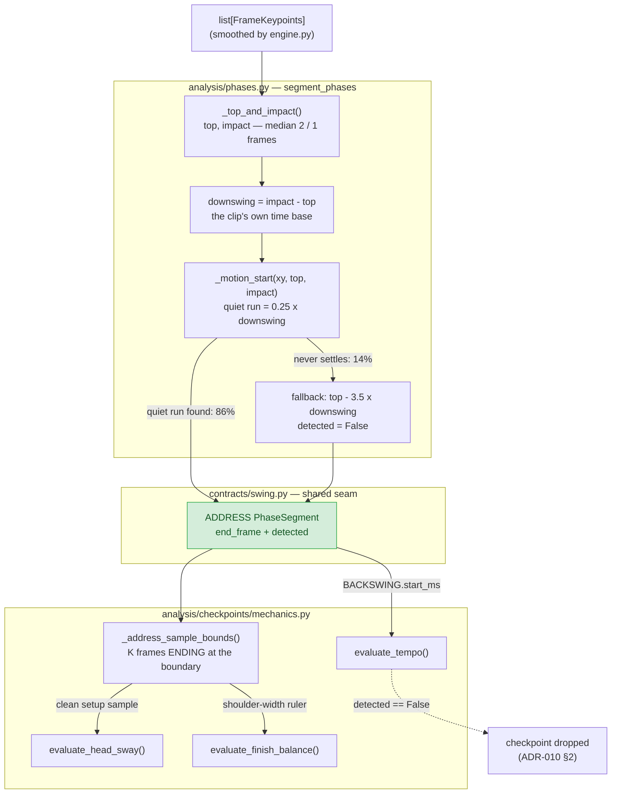
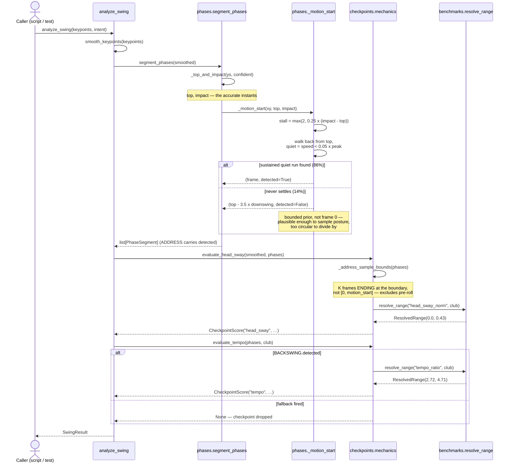
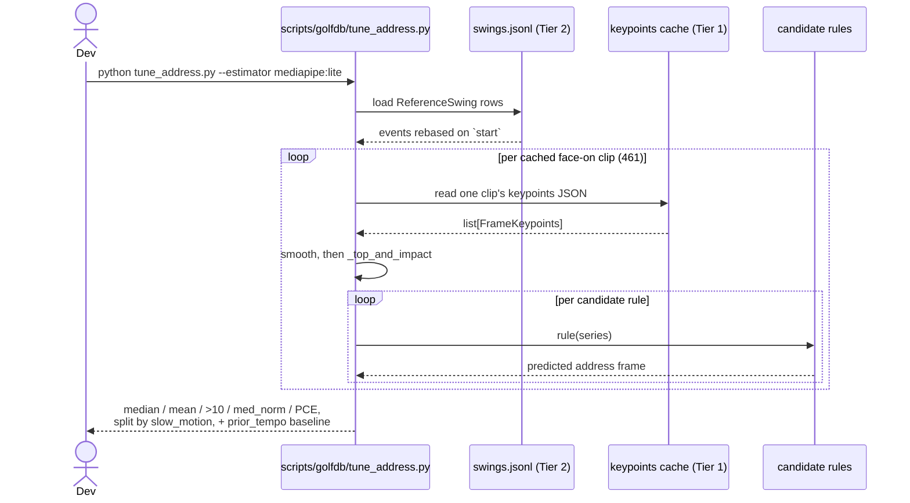

# M4-REF: Address Detection — Feature Flow

> **Tier: AS-BUILT.**
> ✅ **Implemented & verified (2026-08-02).** The rule below ships in `analysis/phases.py` and
> `analysis/checkpoints/mechanics.py`, validated against all 461 hand-annotated GolfDB face-on
> clips. Median address error **9 → 7 frames**; `head_sway` on `golf_swing-aaron-1` corrected from
> a false 1.21 to 0.36 shoulder-widths. Decisions in
> [ADR-013](decisions/013-clip-relative-detection.md); measurements in
> [M4_POSE_BAKEOFF.md](M4_POSE_BAKEOFF.md) Phase B6.

## Why this milestone exists

Of the three instants the analysis spine detects, two were finished by
[ADR-012](decisions/012-golfdb-reference-data.md): top lands within a median of 2 frames and impact
within 1. **Address was at 9, with 46% of clips more than 10 frames out** — the last unvalidated
number in the pipeline and the one open item on the M4-REF exit criteria.

It matters twice over, which is why this is one piece of work and not two:

- **Tempo divides by it.** `BACKSWING.start_ms` *is* the address boundary, so its error propagates
  1:1 into the backswing duration.
- **Posture averaged over it.** `head_sway` and `finish_balance` sampled the whole ADDRESS phase —
  and that phase starts at frame 0, which is not address, it is wherever the clip begins.

[Phase B5](M4_POSE_BAKEOFF.md) had already swept the two constants to the centre of their plateau,
so the ROADMAP recorded the only remaining option: a *different rule*.

## Goal

`segment_phases` locates the takeaway onset in a way that does not depend on the frame rate, says
so when it fails, and stops posture measurement from depending on it being right.

**Exit criteria** (ROADMAP M4-REF): address error materially below 9 frames on the GolfDB face-on
corpus, with top and impact unchanged, and every band still traceable to an inspectable
distribution.

---

## Feature flow

### 1. Data flow — how a clip becomes a boundary and a posture sample

**Reading it:** the boundary is derived *from* top and impact, so the two accurate instants supply
the time base the inaccurate one is measured in — that dependency is the whole mechanism, not an
implementation detail. Posture consumes a window anchored to the boundary rather than the boundary
itself, which is why it survives a 7-frame error; tempo divides by the boundary, so it is dropped
rather than guessed when the fallback fired.

### 2. Runtime sequence — one `analyze_swing`

**Reading it:** one flag decides two different answers. The same estimated boundary is good enough
for `evaluate_head_sway` and not good enough for `evaluate_tempo`, because only one of them divides
by it. Nothing else in the sequence changed — `engine.py` is untouched.

### 3. Offline validation loop — how the rule was chosen

**Reading it:** no video is touched. Tier 1 caching ([ADR-012](decisions/012-golfdb-reference-data.md)
§3) makes a rule change a one-second experiment, which is what made sweeping ~60 variants across six
signal families affordable at all.

---

## Design — applied SWE / GRASP (without over-engineering)

- **Information Expert:** `_motion_start` already held the only knowledge of whether it succeeded;
  it now *returns* that instead of discarding it. The `detected` flag is not new state, it is state
  that was being thrown away.
- **Low coupling via the contract:** the flag travels on `PhaseSegment`, so `phases.py` and
  `mechanics.py` still meet only at the contract. `engine.py` needed no change at all.
- **Protected Variations:** the clip's own downswing duration is the *variation point* — frame rate,
  capture speed and player tempo all vary, and expressing windows as a fraction of it is what keeps
  every consumer stable across them. This is the reusable idea; see ADR-013 §1.
- **Pure Fabrication:** `_address_sample_bounds` exists so two checkpoints share one definition of
  "where the golfer is set up" instead of each re-deriving it from a phase boundary that does not
  mean what its name suggests.
- **Reuse over new code:** the winning rule is the *existing* quiet-run walk with one constant
  re-expressed. Six genuinely different signals were tried and all lost; the harness keeps them
  runnable rather than deleting the evidence.
- **Not over-engineering:** no new module, no new dependency, no learned model. One constant
  changed kind, one fallback got bounded, one helper was added.

## Files

**New**
- `scripts/golfdb/tune_address.py` — the address sweep, and the record of what was tried. Carries
  all six rejected families as named rules plus two permanent reference rows: the pre-B6 rule and
  `prior_tempo`, the no-pose baseline that any future candidate must beat.
- `docs/decisions/013-clip-relative-detection.md` — the decision, as three principles.

**Modified**
- `src/golf_coach/analysis/phases.py` — `_MOTION_STALL_FRAMES` → `_MOTION_STALL_FRACTION`;
  `_motion_start` gains `impact` and returns `(frame, detected)`; the frame-0 fallback becomes the
  bounded `_FALLBACK_TEMPO_RATIO` estimate.
- `src/golf_coach/contracts/swing.py` — `PhaseSegment.detected`, defaulted `True` so it is
  non-breaking.
- `src/golf_coach/analysis/checkpoints/mechanics.py` — `_address_sample_bounds`, used by
  `evaluate_head_sway` and `evaluate_finish_balance`; `_tempo_timings` returns `None` on an
  undetected boundary.
- `src/golf_coach/analysis/benchmarks/ranges.json` + `golfdb_v1.json` — bands re-derived under
  metric definitions **v3** (`head_sway_norm` 0.42 → 0.43, `finish_balance_norm` 0.28 → 0.29).
- `scripts/golfdb/ingest_labels.py` — `METRIC_DEFINITIONS_VERSION` 2 → 3.
- `scripts/golfdb/bakeoff.py` — reports `med_err_frames_by_speed`.

## Confirmed decisions

- **Detection windows are clip-relative, never absolute frame counts.** The quiet run is 0.25 of the
  detected downswing duration. ADR-013 §1.
- **A detector that fails says so.** `detected=False` plus a bounded estimate, rather than a
  plausible-looking frame 0. ADR-013 §2.
- **Tempo is dropped, not estimated, when the boundary was guessed** — the estimate is derived from
  an assumed tempo ratio, so scoring it would report the assumption back as an observation
  (ADR-010 §2). Costs ~14% of clips their tempo reading; this is the most contestable call here.
- **Posture windows are anchored to the boundary, not bounded by it.** ADR-013 §3.
- **The lead wrist stays the signal.** Torso, hips and shoulder rotation were all tried and are all
  worse at this resolution.

## Findings

Full tables in [M4_POSE_BAKEOFF.md](M4_POSE_BAKEOFF.md) Phase B6. The three that changed the design:

1. **The pooled median was measuring the corpus.** Real-time clips scored 5 frames, slow-motion 17,
   and the corpus is 47% slow-motion. Splitting that number is what exposed the fixed frame count as
   the culprit.
2. **A rule using no pose signal at all scores 11 frames.** `top - 3.5 x (impact - top)`. The shipped
   rule reaches 7. That gap is the honest measure of what the lead wrist contributes, and it is why
   this is documented as a bounded improvement rather than a fix.
3. **The posture half mattered more than the boundary half.** Fixing the sampling window corrected a
   real false-positive fault on our own footage — `golf_swing-aaron-1` was being told it had 1.21
   shoulder-widths of head sway, nearly 3x the tour p90, when the number was mostly the golfer
   walking up to the ball.

## Verification

1. `pytest` — 75 pass (67 before this change).
2. `python scripts/golfdb/tune_address.py` — `clip_relative bounded` at median 7.0 / mean 22.9 /
   40% over 10 / med_norm 0.122 / PCE 15.8%, against the `current (fixed stall)` row at
   9.0 / 27.2 / 46% / 0.133 / 14.3%.
3. `python scripts/golfdb/bakeoff.py --merge` — top and impact unchanged at 2 and 1 frames.
4. `python scripts/golfdb/ingest_labels.py && python scripts/golfdb/derive_pose_metrics.py
   --estimator mediapipe:lite && python scripts/golfdb/derive_reference.py` — re-derives the bands
   under v3; `ranges.json` must match the recommended output.
5. `python scripts/analyze_swing.py data/processed/<clip>.keypoints.json` on both own clips —
   `aaron-swing-2` ADDRESS @ 319, tempo 3.52; `golf_swing-aaron-1` ADDRESS @ 458, tempo 2.92.
6. `ruff check` clean.

## Out of scope

- **A learned model.** SwingNet reaches 31.7% PCE against our 15.8%, but it conflicts with ADR-008's
  stdlib-only analysis core and ADR-012 §2's commitment not to run their weights. Its own ADR.
- **Club/shaft detection as an address signal** — M2 has not landed.
- **The 584 labelled down-the-line clips**, never pose-extracted. Spine tilt and the depth
  checkpoints need that view plus [ADR-011](decisions/011-camera-synchronization.md) sync; that is
  the Hardware Re-Validation gate.
- **Re-tuning the smoothing window** (`smoothing.py`'s 5 frames) — now the one remaining absolute in
  the address path, but changing it globally moves top and impact too, so it stays a separate item.
