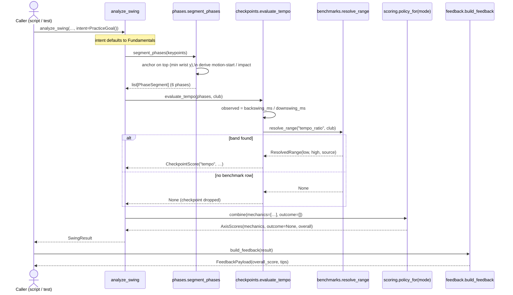

# M4-PoC: Fundamentals Analysis — Feature Flow (pose-only)

> ✅ **Implemented & verified (2026-07-03).** The pose-only Fundamentals spine below is built
> and runs end-to-end: `analysis/{phases,scoring}.py`, `analysis/benchmarks/`,
> `analysis/checkpoints/mechanics.py`, `analysis/engine.py`, and `feedback/rules.py` all exist
> and are exercised by the base-install test suite. Implements the agreed
> [M4-PoC plan](M4_POC_PLAN.md); scoped by [ADR-009](decisions/009-swing-scoring-model.md)
> (dual-axis scoring) and [ADR-010](decisions/010-benchmark-ranges.md) (benchmark provenance).
> See [M4-PoC findings](#m4-poc-findings-2026-07-03) for the first real-clip result.

## Why this milestone exists
M1 produces `FrameKeypoints`; M4-PoC is the first milestone that *analyzes* them. Its job is
to prove the **whole analysis spine — phases → checkpoint → score → tip — end-to-end on pose
data alone**, with no club detection and no launch monitor. It also lays the
intent/dual-axis seam (ADR-009) so full M4 adds the outcome axis *additively* rather than
reworking `SwingResult` or `analyze_swing`.

Deliberately scoped to a **single tempo checkpoint** (backswing:downswing ~3:1, "Tour
Tempo") and a **single scoring policy** (Fundamentals). What is intentionally *not* here —
`merge.py`, outcome checkpoints, the other practice modes, SQLite — are full-M4 items left as
named seams, not stubs to trip over (see the plan's anti-over-engineering guardrails).

## Goal
`analyze_swing(swing_id, session_id, keypoints, intent=PracticeGoal()) → SwingResult`, then
`build_feedback(result) → FeedbackPayload` — producing a real tempo score and a plain-English
tip from a swing, on the **base install** (`pip install -e .`, no vision/ML extras).

**Exit criteria** (ROADMAP M4-PoC): a real `SwingResult` + `FeedbackPayload` from a sample
swing clip with a tempo score and a plain-English tip, with the intent/dual-axis seam in
place so M2/M3 add the outcome axis without reworking contracts.

---

## Feature flow

### 1. Data flow — how a swing becomes a scored tip
Each labeled arrow crossing a module boundary is a typed contract. The analysis core is a
**pure functional core** (ADR-008): contracts in, `SwingResult` out, no I/O.

```mermaid
flowchart TD
    subgraph IN["inputs (contracts)"]
        KP["list[FrameKeypoints]\n(from M1 pose)"]
        GOAL["PracticeGoal\n(intent; defaults to Fundamentals)"]
    end

    subgraph ENG["analysis/engine.py — analyze_swing (orchestrator)"]
        ORCH["default intent → segment → evaluate → combine → assemble"]
    end

    subgraph CORE["analysis/ — pure functional core (stdlib only)"]
        PH["phases.segment_phases()\n→ 6 PhaseSegment"]
        CHK["checkpoints.evaluate_tempo()\n→ CheckpointScore | None"]
        BENCH["benchmarks.resolve_range('tempo_ratio')\n→ ResolvedRange | None"]
        SCORE["scoring.policy_for(mode).combine()\n→ AxisScores"]
    end

    subgraph OUT["outputs (contracts)"]
        RES["SwingResult\n(intent, mechanics/outcome/overall,\n phases, checkpoint_scores)"]
        FB["FeedbackPayload\n(overall_score + Tips)"]
    end

    KP --> ORCH
    GOAL --> ORCH
    ORCH --> PH
    PH -->|PhaseSegment[]| CHK
    CHK -->|checkpoint key + club| BENCH
    BENCH -->|low, high, source| CHK
    CHK -->|mechanics: CheckpointScore[]| SCORE
    ORCH -->|outcome: [] pose-only| SCORE
    SCORE --> RES
    RES -->|feedback.build_feedback| FB

    classDef seam fill:#d4edda,stroke:#28a745,color:#155724;
    class RES,FB seam;
```

### 2. Runtime sequence — one `analyze_swing → build_feedback`
The engine is a thin orchestrator; each step is an independent pure function meeting only at
contracts. The two `resolve_range → None` exits are the ADR-010 rule: a missing benchmark
yields *no* score, never a wrong one. (Same diagram as the plan doc, kept here as the
milestone record.)



**Reading it:** `capture/` and `pose/` never appear — analysis consumes only the
`FrameKeypoints` contract, so it is trivially testable on a fabricated swing with no
MediaPipe. Swapping the pose backend or feeding stored keypoints changes nothing here.

---

## Design — applied SWE / GRASP (without over-engineering)
- **Pure functional core / testability (ADR-008):** every analysis unit is a pure function on
  contracts — no I/O, no numpy, no MediaPipe. The whole spine and its tests run on the base
  install. A fabricated lead-wrist trajectory (`tests/analysis/conftest.py`) drives phases,
  the tempo checkpoint, and the engine deterministically.
- **Strategy / Protocol (ADR-009):** `ScoringPolicy` is a `Protocol`; `policy_for(mode)`
  selects the concrete policy. Adding a practice mode = adding a policy, not editing the
  checkpoint evaluators. Same shape as the `VideoSource` / `ShotDataSource` ports elsewhere.
- **Information Expert:** the benchmark **store** owns range resolution and its fallback rules
  (`resolve_range`); the checkpoint owns turning phase timings into an observed ratio and a
  `CheckpointScore`; the policy owns blending. Each does one job.
- **Data with provenance, not magic numbers (ADR-010):** thresholds live in `ranges.json`,
  each row carrying its `source`/`source_date`. Changing a benchmark is a data edit; the
  resolver and schema don't move. A missing band → `None` → no score (never a wrong one).
- **Named seams, not premature abstraction:** `outcome=[]`, `outcome_score=None`,
  `checkpoints/outcome.py` (absent), and the `detections`/`shot` parameters are the exact
  points where full M4 grows — visible, but empty until M2/M3.
- **Not over-engineering:** one checkpoint, one policy, one seeded benchmark row, JSON not
  YAML (keeps the core stdlib-only). No `merge.py` — pose-only is one stream, nothing to
  align (YAGNI).

## Files
**New**
- `src/golf_coach/contracts/intent.py` — `PracticeGoal` + `PracticeMode` / `TargetShape` /
  `ClubCategory` / `PlayerProfile`. Intent as an input contract (imports nothing from the
  rest of `contracts`, so `swing.py` can import it without a cycle).
- `src/golf_coach/analysis/benchmarks/` — `ranges.json` (seeded with the single Tour Tempo
  row + provenance) and `store.py` (`resolve_range`, `ResolvedRange`), loading the packaged
  JSON via `importlib.resources`, most-specific → least-specific fallback.
- `src/golf_coach/analysis/phases.py` — `segment_phases`: lead-wrist-`y` heuristic, anchored
  on the top of the backswing (global min `y`), deriving motion-start/impact relative to it.
- `src/golf_coach/analysis/checkpoints/mechanics.py` — `evaluate_tempo`: phase timings →
  observed ratio → `CheckpointScore` against the resolved band (`+ _score_within_range`).
  `checkpoints/outcome.py` intentionally absent (full-M4 seam).
- `src/golf_coach/analysis/scoring.py` — `AxisScores`, `ScoringPolicy` (Protocol),
  `FundamentalsPolicy`, `policy_for` (other modes raise `NotImplementedError`).
- `tests/analysis/` (+ `conftest.py`) and `tests/feedback/test_rules.py` — the synthetic-swing
  fixture and unit + end-to-end tests, all on the base install.

**Modified**
- `src/golf_coach/contracts/swing.py` — `SwingResult` gains `intent`, `mechanics_score`,
  `outcome_score`; `overall_score` is now the policy-weighted blend.
- `src/golf_coach/contracts/__init__.py` — export the intent public surface.
- `src/golf_coach/analysis/engine.py` — `analyze_swing` implemented (was a stub), new
  `intent` parameter.
- `src/golf_coach/feedback/rules.py` — `build_feedback` implemented (was a stub): each
  `CheckpointScore` → `Tip`, severity from `passed`/`score`.

## Confirmed decisions
- **Benchmark store ships as JSON, not YAML.** ADR-010 permits either; JSON keeps the
  analysis core on the stdlib (no PyYAML in the base install). Noted as an
  [ADR-010 addendum](decisions/010-benchmark-ranges.md#addendum-2026-07-03-poc-ships-json-not-yaml).
- **Phase segmentation anchors on the top of the backswing**, not on "first motion." The top
  (highest hands = global minimum lead-wrist `y`) is the least ambiguous instant; motion-start
  and impact are derived relative to it. This was a *correction made during the real-clip
  eyeball* — see findings below.
- **Empty mechanics → 0.0**, not an error: a swing with no scorable checkpoint still returns a
  valid `SwingResult` (overall 0), it just has no tips to rank.

---

## M4-PoC findings (2026-07-03)

**Synthetic + real, both green.** 27 tests pass on the base install (`ruff` + `mypy` clean).
The end-to-end path is proven twice: deterministically on the fabricated swing
(`test_engine.py`), and by eyeball on the real face-on M1 clip.

**Real-clip eyeball** — fed the existing `data/processed/aaron-swing-2.keypoints.json`
(face-on, 656 frames, ~11 s) straight into `analyze_swing → build_feedback`:

| Phase | Frames | ms |
|---|---|---|
| address | 0–342 | 0–5805 |
| backswing | 342–381 | 5805–6467 |
| transition | 381–387 | 6467–6569 |
| downswing | 387–423 | 6569–7180 |
| impact | 423–425 | 7180–7214 |
| follow-through | 425–655 | 7214–11118 |

→ tempo **observed ≈ 1.1:1**, fails the 2.7–3.3 band, tip: *"Tempo too quick…"*.

**The finding that changed the code.** The first pass used a forward "first frame the wrist
moves" heuristic for motion-start. On this clip the golfer **sets up / waggles for ~5.8 s**
before swinging, so that heuristic put motion-start at frame 8 and swallowed the entire setup
into the "backswing" → a nonsense **9.6:1** ratio. Anchoring instead on the *top of the
backswing* (the global wrist-`y` minimum, frame 381) and walking backward to the start of the
final rise collapsed the address phase correctly (0–342) and yielded a real measurement.

**Honest read of the 1.1:1 number.** This is a *believable amateur* tempo (backswing ~660 ms
≈ downswing ~700 ms), not a bug — many amateurs are much quicker than tour 3:1, and the tip is
exactly the right coaching cue. But it is a **single heuristic on one clip**: the top/impact
detection is still simple (no smoothing, one landmark), and the address/impact brackets are
fixed-width windows. Good enough to prove the spine; the accuracy of the *number* is the thing
to harden next. Tempo only needed start/top/impact timing, and that is now robust to a long
setup — which was the real risk.

**What's proven vs. deferred.**
- ✅ Spine end-to-end on pose alone: `FrameKeypoints → SwingResult → FeedbackPayload`.
- ✅ Intent + dual-axis seam in the contracts (`outcome_score=None`, Fundamentals policy).
- ✅ Benchmark provenance + fallback + "missing → no score."
- ⏭️ Segmentation accuracy (smoothing, validating top/impact against the overlay video),
  more checkpoints (posture/hip rotation), the outcome axis and other policies — full M4.

---

## Verification
1. `pip install -e ".[dev]"` then `pytest` — the analysis + feedback suite passes on the
   **base install** (no vision/ML extras). 27 passed.
2. Deterministic end-to-end: `tests/analysis/test_engine.py` (`FrameKeypoints → SwingResult`
   with a tempo score) + `tests/feedback/test_rules.py` (`SwingResult → FeedbackPayload`).
3. Real-clip eyeball: the face-on `data/processed/aaron-swing-2.keypoints.json` through
   `analyze_swing → build_feedback` (table above).
4. `ruff check` + `mypy src/golf_coach/analysis src/golf_coach/feedback` — clean.

## Out of scope (full M4 and later)
- `merge.py` (align keypoints + detections + shot) — needs M2/M3 streams.
- Outcome checkpoints (shape, start line, distance, dispersion) + shot-shaping / performance /
  drill policies — need the launch monitor / club detection.
- More mechanics checkpoints (posture, hip rotation, X-factor) — several need down-the-line or
  synced 3D ([ADR-011](decisions/011-camera-synchronization.md)).
- Temporal smoothing of the landmark tracks; validating segmentation against the overlay video.
- Persisting `SwingResult` to SQLite (M4 storage).
