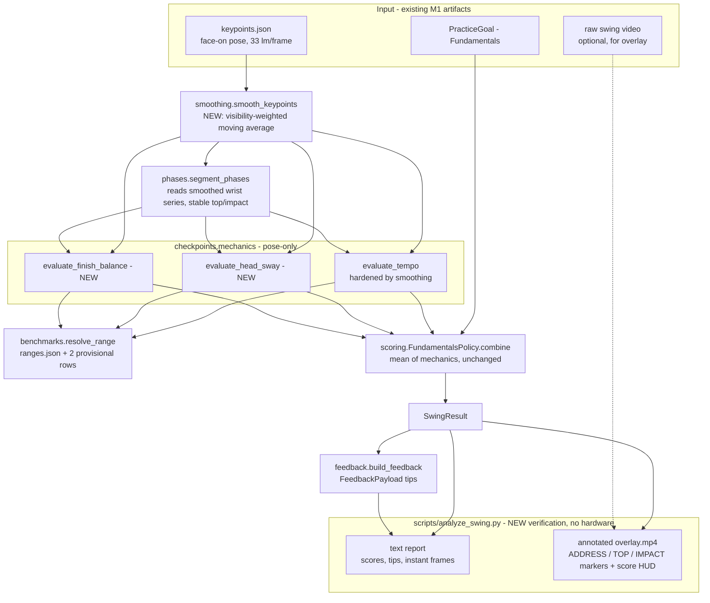
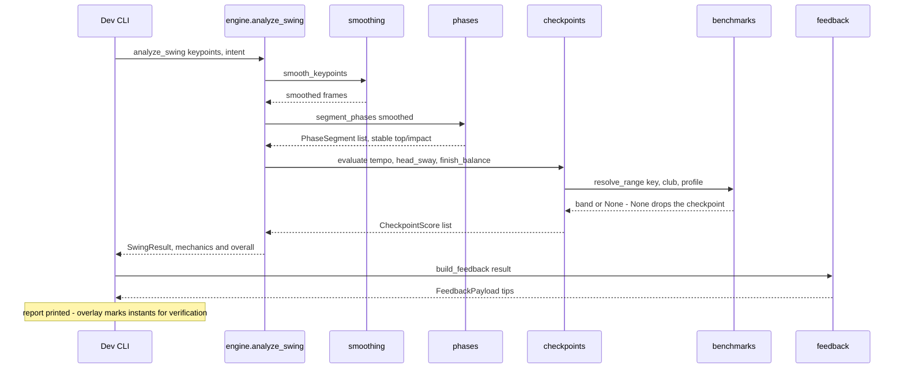

# M4-PoC+ — Hardened Fundamentals Panel (pose-only)

> **Status: IMPLEMENTED (2026-07-16).** Builds directly on the M4-PoC spine
> ([M4_ANALYSIS_POC.md](M4_ANALYSIS_POC.md)). Verified end-to-end — **39 tests** on the base
> install, `ruff`/`mypy` clean, plus a real-clip run + annotated overlay on the face-on
> `aaron-swing-2` clip. No hardware, no M1.5, stdlib-only analysis core.

## Why this exists

M4-PoC proved the analysis spine but produced **one noisy tempo heuristic on one clip** — the
three instants tempo depends on (motion start, top, impact) were read from **raw** MediaPipe
lead-wrist `y`, so landmark jitter could move the detected "top" by several frames (the ~1.1:1
misread noted in the M4-PoC worklog).

This iteration makes the pose analysis **trustworthy in the two senses available without
hardware**:

1. **Precision / robustness** — a temporal **smoothing pass** denoises the landmark timeline
   once, up front, so the phase instants and every checkpoint read a stable signal.
2. **Visual verification** — a new CLI renders an **annotated overlay** stamping the detected
   address / top / impact frames onto the video, so a human can *see* the instants land on the
   right moments. This is the no-hardware substitute for ground-truth accuracy.

It also widens the panel with two checkpoints **face-on 2D pose measures well** — head sway and
finish balance — deliberately leaving the depth-dependent ones deferred (see table below).

## What face-on 2D pose can and cannot measure

| Reliable from face-on pose (built here) | Deferred — needs a second view / detection / launch monitor |
|---|---|
| **tempo** — backswing:downswing timing (angle-independent) | spine tilt / forward bend — projection artifact face-on (ADR-011) |
| **head sway** — lateral head travel; face-on is the ideal view | hip rotation / X-factor / kinematic sequence — needs 3D / down-the-line |
| **finish balance** — how still the body settles post-impact | swing plane / club path — needs club detection (M2) |
| | face angle, attack angle, ball flight/outcome — needs launch monitor (M3) |

The point: we picked checkpoints that live in the data this single camera actually captures —
not a compromise, but the angle a coach uses for exactly these cues.

## Feature data flow



## Runtime sequence



## Design notes (SOLID / GRASP, applied not over-applied)

- **Pure functional core, stdlib-only** (ADR-008) preserved — `smoothing`, `phases`, and the
  checkpoints import no numpy / MediaPipe; the whole spine + tests run on `pip install -e .`.
- **Single Responsibility** — smoothing is its own module; the checkpoints stay co-located in
  `mechanics.py`; the shared `_score_within_range` was extracted to a real shared helper only
  now that a second and third caller exist (the file's own prior TODO), not speculatively.
- **Open/Closed** — adding checkpoints touched only the checkpoint list in `engine.py`. Scoring
  (`FundamentalsPolicy`), the policy selector, and `feedback/rules.py` are **unchanged**; new
  tips flow through the existing generic `CheckpointScore.message` mapping.
- **Benchmark-as-data** (ADR-010) — the two new bands are rows in `ranges.json`; the store and
  resolver needed no code change. Their provenance is labelled `PROVISIONAL / UNCALIBRATED`.
- **Scale-invariance** — sway/balance are normalized by shoulder width so they don't depend on
  the golfer's distance from the camera.
- **Deliberately NOT built** (anti-over-engineering) — no numpy / Kalman / Savitzky-Golay, no
  checkpoint plugin-registry, no config framework, no new scoring policy, no outcome axis, no
  SQLite. All remain named seams for full M4.

## Files

| File | Change |
|------|--------|
| `analysis/smoothing.py` | **new** — `smooth_keypoints(keypoints, window=5)` |
| `analysis/phases.py` | expects smoothed input; impact detection factored into `_impact_frame` |
| `analysis/checkpoints/mechanics.py` | `evaluate_head_sway`, `evaluate_finish_balance`, shared helpers |
| `analysis/checkpoints/__init__.py` | export the two new evaluators |
| `analysis/benchmarks/ranges.json` | +2 provisional rows (`head_sway_norm`, `finish_balance_norm`) |
| `analysis/engine.py` | smooth once; run the three checkpoints |
| `pose/overlay.py` | **new** `annotate_frame(...)` — phase banner + score HUD |
| `scripts/analyze_swing.py` | **new** verification CLI (report + `--overlay`) |
| `tests/analysis/{test_smoothing,test_phases,test_checkpoints}.py`, `conftest.py` | +12 tests |

## Findings (real-clip run, `aaron-swing-2`)

Ran `scripts/analyze_swing.py … --overlay` on the 656-frame face-on clip:

```
Overall score: 67/100  (mechanics 67/100)
Detected instants (frame): ADDRESS @ 341, TOP OF BACKSWING @ 383, IMPACT @ 423
  tempo            observed=1.05  band=[2.7 - 3.3]  score=0%    MISS
  head_sway        observed=0.04  band=[0.0 - 0.5]  score=100%  PASS
  finish_balance   observed=0.53  band=[0.0 - 0.6]  score=100%  PASS
```

- **The overlay did its job — it localized the remaining error.** Eyeballing the marked
  frames: **TOP @ 383** (club genuinely at the top) and **IMPACT @ 423** (hands down at the
  ball) are both visually correct. But the **ADDRESS / motion-start marker @ 341 lands
  mid-takeaway**, not at setup — so the backswing is measured from too late a start (~42
  frames), collapsing the ratio to ~1:1. Top/impact are right; **motion-start is the culprit**
  behind the low tempo. This is exactly the kind of insight the no-hardware overlay was built
  to surface.
- **Smoothing improved *stability*, not the tempo *value* here** — the reading barely moved
  from the M4-PoC ~1.1:1, which is honest: the value is set by the (still-heuristic)
  instant detection, and the overlay now shows *which* instant to fix next.
- head sway (0.04) and finish balance (0.53) both produced sensible scores + plain-English
  tips against their provisional bands.

## Next (not in this iteration)
- **Harden motion-start detection** — the located error above. Candidates: anchor the
  takeaway on the last stable-setup frame (low wrist velocity) before the final rise, rather
  than the last frame at/above address height.
- Recalibrate the provisional sway/balance bands against captured data, and revisit the
  deferred depth checkpoints — both tracked in the ROADMAP **Hardware Re-Validation Gate**.
