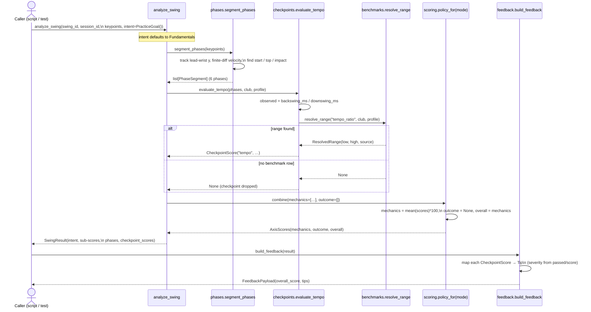

# M4-PoC Implementation Plan — Fundamentals Analysis Spine (pose-only)

> **Status: IMPLEMENTED (2026-07-03).** This plan has been built and verified end-to-end —
> 27 tests on the base install, `ruff`/`mypy` clean, plus a real-clip eyeball. All 10
> change-sets below landed as written, with one correction found during the eyeball (phase
> segmentation anchors on the top of the backswing, not "first motion" — see the milestone
> doc). For the as-built write-up, findings, and file list see
> **[M4_ANALYSIS_POC.md](M4_ANALYSIS_POC.md)**. This plan is retained as the record of the
> agreed design.

## Context

**Why:** M1 (capture + MediaPipe pose) is done and verified on real face-on clips. The next
value step is the *analysis engine* — turning `FrameKeypoints` into a scored, phase-segmented
`SwingResult` plus a plain-English tip. The ROADMAP splits this into **M4-PoC** (prove the whole
spine on pose data alone, no hardware) and **full M4** (adds the outcome axis, which depends on
M2 club detection and M3 launch-monitor hardware).

**This plan targets M4-PoC only**, with a **single tempo checkpoint**. The design is dictated by
two accepted ADRs:
- **[ADR-009](decisions/009-swing-scoring-model.md)** — dual-axis scoring (`mechanics_score` +
  `outcome_score`) selected by an intent-driven **ScoringPolicy** (Strategy). PoC implements the
  *Fundamentals* policy only.
- **[ADR-010](decisions/010-benchmark-ranges.md)** — benchmark ranges live as **versioned data
  with provenance**, resolved by `resolve_range(...)` with most-specific→least-specific fallback.
  PoC seeds one row: Tour Tempo.

**Intended outcome:** `analyze_swing(...)` produces a real `SwingResult` (tempo checkpoint +
overall score) and `build_feedback(...)` produces a `FeedbackPayload` with a tempo tip — all on a
synthetic/M1 sample swing, with the intent + dual-axis seam in place so full M4 is *additive*.

**Anti-over-engineering guardrails (deliberate PoC scoping):**
- **No `merge.py` yet.** Pose-only = one stream, nothing to align (YAGNI). Deferred to full M4.
- **No `checkpoints/outcome.py`, no extra policies, no SQLite.** Full-M4 items; named seams only.
- **Pure-Python / stdlib analysis core.** Phase segmentation + checkpoints use only lists and
  finite-difference math — no numpy, no MediaPipe. The whole spine and its tests run on the base
  install (`pip install -e .`), per ADR-008's "analysis is a pure functional core."
- **Benchmark store as JSON, not YAML.** ADR-010 permits either; JSON keeps the core on stdlib.

## Data flow (this PoC)

```
FrameKeypoints[]  ─┐
PracticeGoal ──────┤→ analyze_swing()
                   │     ├─ phases.segment_phases(keypoints)      → PhaseSegment[]
                   │     ├─ checkpoints.evaluate_tempo(phases,…)   → CheckpointScore
                   │     │     └─ benchmarks.resolve_range("tempo_ratio",…)
                   │     └─ scoring.policy_for(mode).combine(mech, outcome=[])
                   │            → (mechanics_score, outcome_score=None, overall)
                   └──────────────────────────────────────────→ SwingResult
                                                                     ↓
                                          feedback.build_feedback(result) → FeedbackPayload
```

## Runtime sequence (this PoC)

One `analyze_swing → build_feedback` call, pose-only. Mirrors the data flow above but shows
the call order and the two "no benchmark → no score, never a wrong one" bail-out points
(ADR-010 §2). Everything here is a pure function on contracts — no I/O, no hardware.



**Reading it:** the engine is a thin orchestrator; each analysis step is an independent pure
function meeting only at contracts. The two dashed exits (`resolve_range → None`) are the
ADR-010 rule that a missing benchmark yields *no* score rather than a wrong one — the tempo
checkpoint simply drops out and the overall score reflects only what could be judged. The
`outcome=[]` list and `outcome_score=None` are the named seam where full M4 adds the outcome
axis without reshaping this call.

## Changes

### 1. New contract: `src/golf_coach/contracts/intent.py`
Per ADR-009 §Concepts. Keep minimal:
- `PracticeMode(StrEnum)`: `FUNDAMENTALS`, `SHOT_SHAPING`, `PERFORMANCE`, `DRILL`.
- `TargetShape(StrEnum)`: `STRAIGHT`, `DRAW`, `FADE`.
- `ClubCategory(StrEnum)`: driver / wood / hybrid / long_iron / mid_iron / short_iron / wedge /
  putter / `ALL` (keys benchmark rows; ADR-010 §3).
- `PlayerProfile(BaseModel)`: `skill_level: str = "all"` (thin; height/limits deferred).
- `PracticeGoal(BaseModel)`: `mode: PracticeMode = FUNDAMENTALS`, `target_shape: TargetShape | None`,
  `club: ClubCategory = ALL`, `focus_checkpoint: str | None`.

Export the public names from `contracts/__init__.py` alongside the others.

### 2. Extend `src/golf_coach/contracts/swing.py`
Add to `SwingResult`:
- `intent: PracticeGoal | None = None`
- `mechanics_score: float | None = None`
- `outcome_score: float | None = None`

(`overall_score` stays; becomes the policy-weighted blend.) Import `PracticeGoal` from
`contracts.intent` (no cycle: intent imports nothing from swing).

### 3. Benchmark store: `src/golf_coach/analysis/benchmarks/`
- `ranges.json` — seeded with the single Tour Tempo row (ADR-010 example), each row:
  `checkpoint, club_category, skill_level, low, high, source, source_date, added`.
  Seed: `tempo_ratio / all / all / 2.7 / 3.3 / "Tour Tempo (Novosel) ~3:1" / "2004" / "2026-07-02"`.
- `store.py` — internal `BenchmarkRange(BaseModel)`, loads `ranges.json` via
  `importlib.resources`, and:
  `resolve_range(checkpoint: str, club: ClubCategory = ALL, profile: PlayerProfile | None = None)
   -> ResolvedRange | None` where `ResolvedRange = NamedTuple(low, high, source)`.
  Fallback most-specific → least-specific per ADR-010 §2 (`(club, skill)` → `(all, all)`);
  missing → `None` (no score, never a wrong one). `benchmarks/__init__.py` exports
  `resolve_range`, `ResolvedRange`.

### 4. Phase segmentation: `src/golf_coach/analysis/phases.py`
`segment_phases(keypoints: list[FrameKeypoints]) -> list[PhaseSegment]` — pure, stdlib only.
Heuristic from the lead-wrist (`PoseLandmark.LEFT_WRIST`) vertical trajectory (face-on):
- Track wrist `y` per frame; frame-to-frame velocity (finite difference).
- Detect **motion start** (address→backswing), **top of backswing** (y apex / velocity sign
  change), **impact** (return to ~address height with peak downward speed), giving the six
  `SwingPhase` spans (`ADDRESS, BACKSWING, TRANSITION, DOWNSWING, IMPACT, FOLLOW_THROUGH`).
- Named module-level constants for thresholds (motion epsilon, transition window). Skip
  low-visibility frames defensively (visibility < 0.5). Heuristic + noisy is fine for the PoC;
  tempo only needs start/top/impact timing.

### 5. Tempo checkpoint: `src/golf_coach/analysis/checkpoints/mechanics.py`
- `checkpoints/__init__.py` (seam; `outcome.py` intentionally absent until full M4).
- `evaluate_tempo(phases, club=ALL, profile=None) -> CheckpointScore | None`:
  compute `backswing_ms / downswing_ms` from phase timings → `observed`; call
  `resolve_range("tempo_ratio", club, profile)`; if no range → return `None`. Build the
  `CheckpointScore` (name `"tempo"`, `observed`, `expected_low/high`, `passed`, `message`).
- Shared helper `_score_within_range(observed, low, high) -> float` (1.0 inside band, smoothly
  decaying outside) — keep in `mechanics.py` for now (one caller).

### 6. Scoring policy: `src/golf_coach/analysis/scoring.py`
Strategy per ADR-009:
- `AxisScores = NamedTuple(mechanics: float | None, outcome: float | None, overall: float)`.
- `ScoringPolicy(Protocol)`: `combine(mechanics: list[CheckpointScore],
  outcome: list[CheckpointScore]) -> AxisScores`.
- `FundamentalsPolicy`: `mechanics_score = mean(mechanics scores) * 100`, `outcome_score = None`,
  `overall = mechanics_score`. Engine passes mechanics/outcome lists separately, so no `axis`
  field is needed on `CheckpointScore`.
- `policy_for(mode: PracticeMode) -> ScoringPolicy` — `FUNDAMENTALS → FundamentalsPolicy`;
  other modes raise `NotImplementedError("full M4")` (documented seam).

### 7. Wire the engine: `src/golf_coach/analysis/engine.py`
Replace the stub. New signature (ADR-009):
`analyze_swing(swing_id, session_id, keypoints, detections=None, shot=None,
 intent: PracticeGoal | None = None) -> SwingResult`.
Orchestrate: default `intent` to `PracticeGoal()` (Fundamentals) → `segment_phases` →
`evaluate_tempo` (collect into `mechanics` list, drop `None`) → `outcome = []` →
`policy_for(intent.mode).combine(mechanics, outcome)` → assemble and return `SwingResult`
(intent, sub-scores, `overall_score`, phases, checkpoint_scores; echo source streams).

### 8. Rule-based tip: `src/golf_coach/feedback/rules.py`
Implement the minimal `build_feedback(result) -> FeedbackPayload`: map each `CheckpointScore` →
`Tip` (severity from `passed`/`score`; too-quick vs too-slow tempo wording), pass through
`overall_score`. Docstring notes the fuller rules catalogue is M5.

### 9. Tests (mirror `src/`, all on base install — deterministic, no hardware)
Key enabler: a **synthetic-swing fixture** fabricating `FrameKeypoints` with a lead wrist going
up then down (`tests/analysis/conftest.py`), reused across tests.
- `tests/contracts/test_contracts.py` — extend: `PracticeGoal` + extended `SwingResult` round-trip.
- `tests/analysis/test_benchmarks.py` — Tour Tempo band resolves; fallback to `all`; missing → `None`.
- `tests/analysis/test_phases.py` — synthetic swing → six phases in order, frames monotonic.
- `tests/analysis/test_checkpoints.py` — ideal ~3:1 passes; too-quick/too-slow score lower/fail.
- `tests/analysis/test_scoring.py` — `FundamentalsPolicy`: `overall == mechanics`, `outcome is None`.
- `tests/analysis/test_engine.py` — end-to-end `analyze_swing` on the synthetic swing → `SwingResult`
  with a `"tempo"` checkpoint and a plausible `overall_score`.
- `tests/feedback/test_rules.py` — `build_feedback` yields a `FeedbackPayload` with a tempo `Tip`.

### 10. Docs (do on implementation)
- **New** `docs/M4_ANALYSIS_POC.md` — the milestone flow doc (Why / Goal / mermaid data+sequence
  flow / GRASP callouts / Files / findings), matching `docs/M1_CAPTURE_FLOW.md` conventions.
  Note the JSON-vs-YAML and merge-deferral decisions there.
- **Modified** `ROADMAP.md` — check off completed M4-PoC boxes.
- **Modified** `WORKLOG.md` — new reverse-chron entry.
- *Optional:* one-paragraph ADR-010 addendum: "PoC ships JSON (not YAML) to keep the analysis
  core stdlib-only."

## Reused existing pieces (do not re-create)
- Contracts: `SwingResult`, `PhaseSegment`, `SwingPhase`, `CheckpointScore` (`contracts/swing.py`);
  `FrameKeypoints`, `PoseLandmark.LEFT_WRIST`, `Landmark` (`contracts/keypoints.py`);
  `FeedbackPayload`, `Tip`, `Severity` (`contracts/feedback.py`).
- Patterns to imitate: Protocol/Strategy style like `VideoSource`/`ShotDataSource`
  (`capture/source.py`, `launch_monitor/source.py`); deterministic-fixture testing like
  `MockShotDataSource` + `_FakeLandmark` (`launch_monitor/mock.py`, `tests/pose/test_mapping.py`);
  module `__init__` exporting only the public surface.

## Verification (end-to-end, no hardware)
1. `pip install -e ".[dev]"` then `pytest -q` — the whole new analysis spine + feedback tests pass
   on the **base install** (no vision/ML extras).
2. Deterministic end-to-end: `test_engine.py` proves `FrameKeypoints → SwingResult` with a tempo
   score; `test_rules.py` proves `SwingResult → FeedbackPayload` with a tip.
3. Real-clip eyeball: feed the existing M1 keypoints JSON (`data/processed/` from
   `aaron-swing-2.mov`, face-on) into `analyze_swing` → `build_feedback`, sanity-check the tempo
   ratio (~3:1) and tip text — the M4-PoC exit criterion.
4. `ruff check` + `mypy src/golf_coach/analysis src/golf_coach/feedback` clean.
